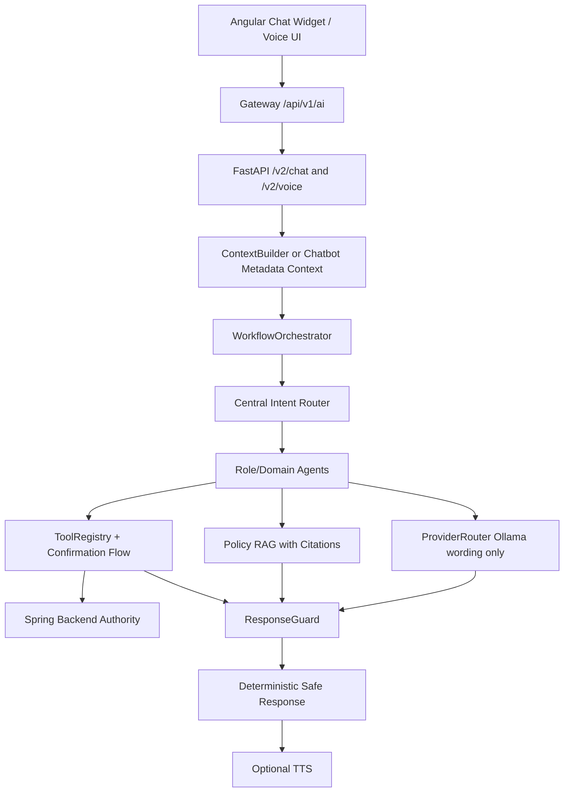

# AI_SERVICE_IMPLEMENTATION_PLAN.md

## 1. Executive Summary

This plan fixes and improves the WeenTime AI service, chatbot agents, STT/TTS, multilingual routing, Ollama usage, RAG citations, ToolRegistry-backed actions, and Angular chatbot UX without changing the authority model.

Core decisions:

- LLM output is never authority.
- Spring backend plus ToolRegistry remain authority.
- Write actions always require confirmation.
- RAG answers require citations.
- Missing backend capability returns `capability_unavailable`, not fake data and not unsafe fallback.
- Public chatbot metadata context is allowed only for chatbot endpoints and test/demo mode.
- Voice/STT/TTS failures must preserve text responses.

Analysis inputs:

- Filesystem MCP read the existing chatbot/STT/TTS reports and inspected AI, frontend, and backend code.
- Postgres MCP was attempted read-only but failed authentication for user `postgres`; no DB reads or writes occurred.
- Playwright inspected the running Angular UI at `http://127.0.0.1:4200`; landing page rendered with no console warnings/errors.
- `Pasted text(109).txt` was not found under the project tree.
- `python -c "import main; print('ok')"` passed, with an optional-router warning for missing `app.api.document_generation`.
- Current dirty worktree contains unrelated untracked files only.

## 2. Current Architecture Summary

- Frontend: Angular standalone app, current chatbot UI in `weentime-frontend/angular-weentime/src/app/shared/chat-widget`.
- Gateway: Spring Cloud Gateway on `http://localhost:8322`, AI route `/api/v1/ai/**` strips to FastAPI.
- Backend services: auth `8181`, organisation `8190`, RH `8192`, presence `8193`, communication `8194`.
- AI service: FastAPI on `8000`, modern `/v2/chat` and `/v2/voice`, plus intentional legacy compatibility routes.
- Context: strict JWT context via `ContextBuilder`, plus chatbot metadata context for chatbot-only public/demo mode.
- Runtime: `WorkflowOrchestrator`, `RouterAgent`, deterministic agents, role copilots, Role Intelligence, Voice Intelligence.
- Authority: `ToolRegistry` and `ToolExecutor` call backend endpoints; LLM cannot execute tools.
- Safety: `ResponseGuard`, deterministic fallback, confirmation store, request correlation, Braintrust metrics.
- Provider: Ollama provider is present, CPU local defaults are configured around `qwen2.5:3b`, coder model, and `phi3` fallback.
- RAG: local keyword and optional ChromaDB policy retriever exist; citations and tenant filters are required.
- Voice: finalized upload flow through `/v2/voice`; FFmpeg WebM to WAV; `faster-whisper`; Coqui TTS fallback to text.

## 3. Problems Found

- Public chatbot context is implemented but must be hardened and regression-protected so JWT issues do not block chatbot test/demo endpoints.
- Router priority still needs a centralized matrix to prevent domain prompts from being swallowed by broad role summaries or legacy fallback.
- Several unsupported feature areas need explicit `capability_unavailable` contracts: planning writes, meeting creation, advanced analytics, recruitment/training, predictive HR, DB backup/restore, service restart.
- ResponseGuard can still reject safe new output kinds unless every supported no-data/capability/digest/tool-backed response is covered.
- Voice pipeline is functional but needs stronger multilingual and short-command validation for FR/EN/AR/TN.
- TTS currently depends on local Coqui models and must never fail the whole response.
- Current config contains legacy cloud-provider settings and a hardcoded provider key value in `ai-service/config.py`; this must be removed/neutralized in a security cleanup task.
- Production Angular environment still contains localhost URLs; acceptable for local PFE only, but must be corrected before SaaS deployment.
- Optional router warning for missing `app.api.document_generation` remains; it is non-blocking but should be tracked.
- Full role-chat Playwright validation requires gateway/AI/backend services running together.

## 4. Target Architecture



Target stack decisions:

- STT: `faster-whisper`, target `large-v3-turbo` only if CPU latency is acceptable; safe CPU fallback remains smaller models.
- LID: keep current detector now; add fastText LID only if tests prove current detector misses FR/EN/AR/TN.
- Transcript cleaning: regex plus custom Tunisian/French/Arabic/English normalization.
- LLM: Ollama local; primary `qwen2.5:3b`; optional `qwen2.5:7b`; `qwen3:8b` only after manual CPU benchmark.
- RAG: current ChromaDB remains; future upgrade path is Docling, BGE-M3 embeddings, pgvector, and BGE reranker.
- Memory: start with Redis session state and PostgreSQL summaries; Mem0 is later only if justified.
- TTS: current Coqui is acceptable; evaluate Piper/XTTS-v2 as optional local replacements.
- Monitoring: Braintrust remains primary; Langfuse is optional only if Braintrust coverage becomes insufficient.

## 5. Role Capability Matrix

| Role | Supported now or planned via existing tools | Must return `capability_unavailable` unless verified |
|---|---|---|
| EMPLOYEE | Leave, pointage, telework, documents, policy RAG, communication, personal digest, meetings read if endpoint exists | meeting creation, advanced productivity analytics, notes/tasks/reminders without backend tool |
| MANAGER | Employee personal tools, pending approvals, approve/refuse with confirmation, team presence, team communication, manager digest | autonomous approvals, raw SQL search, unverified team analytics, report/PDF generation without endpoint |
| RH | Employee personal tools, RH backlog, validations, stats, document workload, organisation assignment if tool exists, global presence reads | recruitment/training, predictive risk, contract workflows unless backend endpoint/tool exists |
| ADMIN | Admin read tools, users/enterprises/roles where tools exist, provider/Redis/RAG/Braintrust health, platform diagnostics | service restart, DB backup/restore, AI config mutation, RAG admin mutation unless explicit confirmed tool exists |

## 6. Task Roadmap Table

| Order | Task | Commit |
|---:|---|---|
| 1 | AI-01 Public chatbot context and no JWT blocking | `fix(ai): stabilize public chatbot context` |
| 2 | AI-02 Central intent routing priority | `fix(ai): centralize chatbot intent routing` |
| 3 | AI-03 EmployeeAgent stabilization | `fix(ai): stabilize employee chatbot agent` |
| 4 | AI-04 ManagerAgent stabilization | `fix(ai): stabilize manager chatbot agent` |
| 5 | AI-05 RHAgent stabilization | `fix(ai): stabilize rh chatbot agent` |
| 6 | AI-06 AdminAgent stabilization | `fix(ai): stabilize admin chatbot agent` |
| 7 | AI-07 STT multilingual stabilization FR/EN/AR/TN | `fix(ai): stabilize multilingual stt routing` |
| 8 | AI-08 TTS multilingual fallback strategy | `fix(ai): harden multilingual tts fallback` |
| 9 | AI-09 Ollama/LLM response enhancement | `feat(ai): improve safe ollama response wording` |
| 10 | AI-10 RAG policy/document upgrade plan | `feat(ai): harden policy rag citations` |
| 11 | AI-11 Session memory and slot filling reliability | `fix(ai): stabilize chatbot session slot filling` |
| 12 | AI-12 Braintrust observability completion | `feat(ai): complete chatbot observability coverage` |
| 13 | AI-13 Frontend chatbot UX stabilization | `fix(frontend): stabilize ai chatbot ux states` |
| 14 | AI-14 Full E2E validation matrix | `test(ai): add full chatbot e2e validation matrix` |

## 7. Detailed Task Specs

### TASK AI-01 — Public chatbot context and no JWT blocking for chatbot test mode

Objective:
- Ensure `/v2/chat`, `/v2/voice`, `/v2/chat/confirm`, `/v2/chat/reset`, and any used chat history endpoint can run in chatbot public/demo mode when metadata opts in.

Why needed:
- Chatbot testing is blocked when JWT is missing/invalid.
- Existing reports show metadata context exists, but this needs a dedicated hardening task and tests.

Current evidence:
- `chat_v2.py` and `voice_v2.py` already check `chatbotPublicContext`.
- Angular `AiCopilotService` and `VoiceAssistantService` send `chatbotPublicContext`.
- Gateway only bypasses chatbot endpoints when `CHATBOT_PUBLIC_MODE=true`.
- `BackendClient` can mint short-lived chatbot backend tokens when configured.

Files likely affected:
- `ai-service/app/api/chat_v2.py`
- `ai-service/app/api/voice_v2.py`
- `ai-service/app/context/anonymous_context.py`
- `ai-service/app/context/chatbot_backend_token.py`
- `weentime-frontend/angular-weentime/src/app/core/services/ai-copilot.service.ts`
- `weentime-frontend/angular-weentime/src/app/shared/chat-widget/voice-assistant.service.ts`

Backend endpoints/tools involved:
- AI only for public context.
- Backend calls remain protected through normal JWT or minted chatbot backend token when explicitly configured.

Implementation steps:
- Keep verified JWT as priority when valid Authorization exists.
- If Authorization missing/invalid and metadata contains `chatbotPublicContext=true`, build metadata context.
- Preserve `source="chatbot_metadata"` and `chatbot_public_context=true`.
- Ensure public mode cannot inject arbitrary permissions.
- Confirm write tools still require confirmation.
- Add safe error if backend rejects public-mode backend token.

Tests to add/update:
- `tests/test_chatbot_public_context.py`
- `tests/test_chatbot_public_mode.py`
- Confirm missing JWT with metadata reaches normal agent routing.
- Confirm invalid JWT with metadata reaches normal agent routing.
- Confirm write action creates confirmation, not execution.
- Confirm no public context for non-chatbot routes.

Validation commands:
```powershell
cd C:\Users\DELL\Documents\GitHub\weentime_project\ai-service
python -c "import main; print('ok')"
python -m pytest tests/test_chatbot_public_context.py tests/test_chatbot_public_mode.py tests/test_chat_v2.py tests/test_voice_v2.py -v
```

Risks:
- If public mode is enabled in production, metadata can impersonate roles at the AI layer.
- Backend still blocks protected endpoints unless chatbot backend token is configured.

Rollback strategy:
- Revert only AI-01 files.
- Set `CHATBOT_PUBLIC_MODE=false`.
- Keep verified JWT path unaffected.

Expected commit message:
- `fix(ai): stabilize public chatbot context`

### TASK AI-02 — Central intent routing priority

Objective:
- Create one deterministic routing priority for greetings, role digests, pointage, planning, documents, authorization, telework, leave, communication, RAG, manager/RH/admin workflows, capability unavailable, and fallback.

Why needed:
- Current routing is spread across `RouterAgent`, domain `can_handle`, role copilots, NLP patterns, and legacy fallback.
- Prior issues included document prompts routing to leave, RH/Admin direct prompts being swallowed by role copilots, and safe unsupported prompts reaching guard fallback.

Current evidence:
- `RouterAgent` has explicit domain and role-action routing.
- `intent_patterns.py` covers some multilingual pointage/leave/document/telework patterns.
- `capability_matrix.py` exists but is limited.
- Role copilots and role intelligence are broad and can overmatch.

Files likely affected:
- `ai-service/app/agents/router_agent.py`
- `ai-service/app/nlp/intent_patterns.py`
- `ai-service/app/capabilities/capability_matrix.py`
- `ai-service/app/agents/*_agent.py`
- `ai-service/tests/test_multilingual_chatbot_routing.py`
- `ai-service/tests/test_meeting_planning_intents.py`

Backend endpoints/tools involved:
- No new backend endpoints.
- Routing must target existing ToolRegistry tools only.

Implementation steps:
- Define `CENTRAL_ROUTING_PRIORITY` in one module.
- Make `RouterAgent` use this priority before scoring broad role agents.
- Route unsupported planning/meetings/reporting/predictive/recruitment/admin mutation prompts to `capability_unavailable`.
- Ensure `je veux une demande de document` routes to document, not leave.
- Ensure pointage status questions beat check-in/check-out substring matches.
- Ensure direct admin/RH health/backlog prompts beat broad copilot summaries.

Tests to add/update:
- `tests/test_multilingual_chatbot_routing.py`
- `tests/test_pointage_intents.py`
- `tests/test_meeting_planning_intents.py`
- `tests/test_role_routing.py`
- Role-specific prompts for Employee/Manager/RH/Admin.

Validation commands:
```powershell
python -m pytest tests/test_multilingual_chatbot_routing.py tests/test_pointage_intents.py tests/test_meeting_planning_intents.py tests/test_role_routing.py -v
python -m pytest tests/test_response_guard_chatbot_outputs.py tests/test_chat_v2.py -v
```

Risks:
- Overly strict priority can reduce useful fallback behavior.
- Broad unsupported matching can hide newly supported tools.

Rollback strategy:
- Revert routing module and related tests.
- Fall back to previous `RouterAgent` scoring.

Expected commit message:
- `fix(ai): centralize chatbot intent routing`

### TASK AI-03 — EmployeeAgent stabilization

Objective:
- Stabilize all employee chatbot flows: leave, pointage, telework, documents, policy RAG, communication, personal digest, planning unavailable, and personal analytics unavailable.

Why needed:
- Employee prompts are the largest demo surface.
- Current visible problems include pointage/planning/telework follow-ups and unsafe fallback cards.

Current evidence:
- Employee tools exist for attendance, leave, telework, authorization, documents, communication, policy, role intelligence.
- Planning has reunion read tools but not full personal planning/horaire AI tooling.
- Frontend quick prompts include employee daily summary, leave balance, forgot checkout, document request, pointage, meetings, planning.

Files likely affected:
- `ai-service/app/agents/employee_agent.py`
- `ai-service/app/agents/attendance_agent.py`
- `ai-service/app/agents/leave_agent.py`
- `ai-service/app/agents/telework_agent.py`
- `ai-service/app/agents/document_agent.py`
- `ai-service/app/agents/reunion_agent.py`
- `ai-service/app/intelligence/employee_digest_builder.py`

Backend endpoints/tools involved:
- `get_pointage_status`, `check_in`, `check_out`, `get_week_hours`, `get_presence_history`
- `leave.get_balance`, `leave.list_my_requests`, `leave.create_request`
- `telework.list_my_requests`, `telework.get_status`, `telework.create_request`
- `document.list_my_requests`, `document.create_request`, `document.open`
- `reunion.list_mine`, `reunion.next`
- `policy.search`, `policy.explain_rule`
- `communication.list_channels`, `communication.get_channel_messages`, `communication.send_message`

Implementation steps:
- Add employee capability map with supported and unavailable flows.
- For read tools, return `read_result` or no-data with tool evidence.
- For writes, return confirmation with details.
- For unsupported planning/task/reminder/analytics, return `capability_unavailable`.
- Ensure telework/leave follow-up `pour demain` resolves pending flow.
- Ensure policy answers include citations.

Tests to add/update:
- `tests/test_employee_agent_chatbot.py`
- `tests/test_employee_chatbot_intelligence.py`
- `tests/test_employee_copilot.py`
- `tests/test_slot_filling_followups.py`
- `tests/test_response_guard_chatbot_outputs.py`

Validation commands:
```powershell
python -m pytest tests/test_employee_agent_chatbot.py tests/test_employee_chatbot_intelligence.py tests/test_employee_copilot.py tests/test_slot_filling_followups.py -v
python -m pytest tests/test_response_guard_chatbot_outputs.py tests/test_chat_v2.py -v
```

Risks:
- Backend 401/403 in public mode can look like agent failure.
- No-data responses must carry safe evidence for ResponseGuard.

Rollback strategy:
- Revert EmployeeAgent and related tests.
- Keep generic role digest available.

Expected commit message:
- `fix(ai): stabilize employee chatbot agent`

### TASK AI-04 — ManagerAgent stabilization

Objective:
- Stabilize manager personal capabilities plus pending approvals, team presence, team workload summaries, and team communication.

Why needed:
- Manager prompts must distinguish personal employee actions from manager approval/team reads.
- Writes must create confirmations only.

Current evidence:
- `ManagerAgent`, manager role copilot, manager digest builder, leave/telework/authorization manager tools exist.
- Presence backend has `/presence/team/today`, `/presence/team/history`, and compatibility team endpoints.
- Current frontend quick prompts include pending approvals and team attendance anomalies.

Files likely affected:
- `ai-service/app/agents/manager_agent.py`
- `ai-service/app/agents/role_copilots/manager_copilot.py`
- `ai-service/app/intelligence/manager_digest_builder.py`
- `ai-service/app/intelligence/team_insight_engine.py`
- `ai-service/app/tools/leave_tools.py`
- `ai-service/app/tools/telework_tools.py`
- `ai-service/app/tools/authorization_tools.py`

Backend endpoints/tools involved:
- `leave.list_manager_requests`, `leave.manager_decide`
- `telework.list_manager_requests`, `telework.manager_decide`
- `authorization.list_manager_requests`, `authorization.manager_decide`
- `get_team_presence`
- communication tools

Implementation steps:
- Ensure manager “pending approvals” aggregates modern manager reads.
- Ensure approve/refuse resolves request details before confirmation.
- Return choices on ambiguous employee/request references.
- Deny RH final validation for Manager.
- Return `capability_unavailable` for reports/meetings/performance if no tool exists.

Tests to add/update:
- `tests/test_manager_agent_chatbot.py`
- `tests/test_manager_approbations_routing.py`
- `tests/test_manager_copilot.py`
- `tests/test_manager_digest_builder.py`
- `tests/test_team_insight_engine.py`

Validation commands:
```powershell
python -m pytest tests/test_manager_agent_chatbot.py tests/test_manager_approbations_routing.py tests/test_manager_copilot.py tests/test_manager_digest_builder.py tests/test_team_insight_engine.py -v
python -m pytest tests/test_tool_registry.py tests/test_response_guard.py -v
```

Risks:
- Some manager analytics are not backend-supported.
- Employee personal prompts from a manager must still use personal scope.

Rollback strategy:
- Revert manager agent/c Copilot changes.
- Keep ToolRegistry rules intact.

Expected commit message:
- `fix(ai): stabilize manager chatbot agent`

### TASK AI-05 — RHAgent stabilization

Objective:
- Stabilize RH backlog, validations, stats, document workload, global presence reads, organisation assignment, and clear unsupported RH features.

Why needed:
- RH has the broadest HR operations surface and must not fake counts or accidentally create employee personal requests.

Current evidence:
- Modern RH tools exist: `rh.get_stats`, `document.rh_workload`, RH pending leave/telework/authorization reads.
- `RHCopilot` and `InsightTools` were previously modernized away from legacy stats/backlog.
- RH backend exposes `rh/stats`, `rh/dashboard`, document RH endpoints, global telework/history endpoints, presence company endpoints.

Files likely affected:
- `ai-service/app/agents/rh_agent.py`
- `ai-service/app/agents/role_copilots/rh_copilot.py`
- `ai-service/app/tools/rh_tools.py`
- `ai-service/app/tools/document_tools.py`
- `ai-service/app/tools/insight_tools.py`
- `ai-service/app/intelligence/digest_builder.py`

Backend endpoints/tools involved:
- `rh.get_stats`
- `leave.list_rh_pending`, `leave.rh_decide`
- `telework.list_rh_pending`, `telework.rh_decide`
- `authorization.list_rh_requests`, `authorization.rh_decide`
- `document.rh_workload`, `document.rh_generate`, `document.rh_reject`
- company presence reads

Implementation steps:
- Route `RH backlog`, `Pending validations`, `Presence aujourd'hui`, `Document workload`, `RH stats` directly to RH agent/tools.
- For employee creation prompt, return admin-reserved message unless an RH tool is verified.
- For organisation assignment, use existing organisation tools only if role permits.
- For contracts/recruitment/training/predictive analytics, return `capability_unavailable`.
- Ensure all RH writes require confirmation.

Tests to add/update:
- `tests/test_rh_agent_chatbot.py`
- `tests/test_rh_agent.py`
- `tests/test_rh_tools.py`
- `tests/test_role_copilots.py`
- `tests/test_insight_tools.py`

Validation commands:
```powershell
python -m pytest tests/test_rh_agent_chatbot.py tests/test_rh_agent.py tests/test_rh_tools.py tests/test_role_copilots.py tests/test_insight_tools.py -v
python -m pytest tests/test_response_guard.py tests/test_chat_v2.py -v
```

Risks:
- Backend endpoint shape differences may surface as unavailable sections.
- RH tools must not use legacy reads when modern endpoints exist.

Rollback strategy:
- Revert RH agent/tool changes.
- Keep prior modern RH stats tool.

Expected commit message:
- `fix(ai): stabilize rh chatbot agent`

### TASK AI-06 — AdminAgent stabilization

Objective:
- Stabilize admin diagnostics, user/enterprise/role prompts, provider/Redis/RAG/Braintrust health, and unsupported admin operations.

Why needed:
- Admin prompts must be useful for PFE/demo without exposing secrets or mutating config automatically.

Current evidence:
- Admin tools exist: `admin.list_users`, `admin.create_user`, `admin.update_user_role`, `admin.assign_manager`, `admin.assign_rh_owner`, `admin.list_enterprises`, `admin.system_health`, provider/Redis/Braintrust/RAG status.
- Health endpoint includes provider, Redis, RAG, Braintrust, and AI monitoring.
- Config contains a hardcoded cloud provider key value that must not be exposed.

Files likely affected:
- `ai-service/app/agents/admin_agent.py`
- `ai-service/app/agents/role_copilots/admin_copilot.py`
- `ai-service/app/intelligence/admin_diagnostics.py`
- `ai-service/app/intelligence/admin_digest_builder.py`
- `ai-service/app/tools/admin_tools.py`
- `ai-service/app/api/health_v2.py`
- `ai-service/app/observability/redaction.py`

Backend endpoints/tools involved:
- Admin/organisation user and enterprise endpoints.
- Local health/provider/RAG/Redis/Braintrust reads.
- No direct DB mutation.

Implementation steps:
- Route direct health/provider/Redis/Braintrust/RAG prompts to AdminAgent.
- Ensure admin writes require confirmation and missing fields are requested.
- Return `capability_unavailable` for service restart, DB backup/restore, AI config mutation, destructive RAG admin actions unless explicit tool exists.
- Redact secrets in all diagnostics and health summaries.
- Add a task note to remove/rotate hardcoded cloud-provider key in config.

Tests to add/update:
- `tests/test_admin_agent_chatbot.py`
- `tests/test_admin_agent.py`
- `tests/test_admin_tools.py`
- `tests/test_admin_diagnostics.py`
- `tests/test_admin_monitoring.py`

Validation commands:
```powershell
python -m pytest tests/test_admin_agent_chatbot.py tests/test_admin_agent.py tests/test_admin_tools.py tests/test_admin_diagnostics.py tests/test_admin_monitoring.py -v
python -m pytest tests/test_response_guard.py tests/test_chat_v2.py -v
```

Risks:
- Health checks can leak implementation details if redaction is incomplete.
- Admin create-user flow can be confused with RH create employee flow.

Rollback strategy:
- Revert AdminAgent/admin diagnostics changes.
- Disable unsafe diagnostics fields by redaction.

Expected commit message:
- `fix(ai): stabilize admin chatbot agent`

### TASK AI-07 — STT multilingual stabilization FR/EN/AR/TN

Objective:
- Stabilize multilingual STT and transcript normalization for French, English, Arabic, and Tunisian/Franco-Arabic.

Why needed:
- Voice reliability is critical and historical issues include “Je n’ai rien entendu”, aggressive filtering, partial chunk instability, and Tunisian command misses.

Current evidence:
- `/v2/voice` uses finalized upload flow.
- `voice/stt.py` uses FFmpeg, VAD, `faster-whisper`, cleaner, language detection, and fallback statuses.
- Current min input is `5000` bytes and duration `1.5s`; short commands may be rejected if capture is small.
- `intent_patterns.py` includes multilingual pointage/leave patterns but needs broader coverage.

Files likely affected:
- `ai-service/voice/stt.py`
- `ai-service/voice/cleaner.py`
- `ai-service/voice/vad.py`
- `ai-service/voice/whisper_service.py`
- `ai-service/app/nlp/language_detector.py`
- `ai-service/app/nlp/normalization.py`
- `ai-service/app/api/voice_v2.py`

Backend endpoints/tools involved:
- No backend changes.
- Voice output still routes through existing agents/tools.

Implementation steps:
- Add language detection fixtures for FR/EN/AR/TN.
- Expand Tunisian normalization: `nheb`, `ghodwa`, `baad ghodwa`, `npointi`, `pointit ou nn`, `aandi meeting`.
- Ensure `did I check in` and equivalents route to status, not check-in.
- Lower thresholds only if tests prove valid commands rejected.
- Preserve finalized blob flow; do not reintroduce partial invalid WebM transcription.
- Return voice error payloads instead of server errors on STT unavailable/conversion failure/cancellation.

Tests to add/update:
- `tests/test_stt_multilingual.py`
- `tests/test_stt_multilingual_chatbot.py`
- `tests/test_audio_pipeline.py`
- `tests/test_audio_chunking.py`
- `tests/test_voice_v2.py`
- `tests/test_voice_contract.py`

Validation commands:
```powershell
python -m pytest tests/test_stt_multilingual.py tests/test_stt_multilingual_chatbot.py tests/test_audio_pipeline.py tests/test_audio_chunking.py -v
python -m pytest tests/test_voice_v2.py tests/test_voice_contract.py -v
```

Risks:
- Larger STT models may be too slow on CPU.
- Arabic/Tunisian detection may be inconsistent without dedicated LID model.

Rollback strategy:
- Revert STT threshold/normalization changes.
- Keep current `base` STT model.

Expected commit message:
- `fix(ai): stabilize multilingual stt routing`

### TASK AI-08 — TTS multilingual fallback strategy

Objective:
- Make TTS safe and multilingual without making audio mandatory.

Why needed:
- TTS model availability differs by machine.
- Voice response must succeed as text if TTS fails.

Current evidence:
- `voice/tts_service.py` maps `fr`, `en`, `ar`; TN falls back to French.
- `/v2/voice` returns `audioStatus` generated/unavailable/skipped.

Files likely affected:
- `ai-service/voice/tts_service.py`
- `ai-service/voice/tts.py`
- `ai-service/app/api/voice_v2.py`
- `ai-service/app/voice/voice_response_optimizer.py`
- `weentime-frontend/angular-weentime/src/app/shared/chat-widget/voice-response-normalizer.ts`

Backend endpoints/tools involved:
- None.

Implementation steps:
- Normalize TTS language routing for FR/EN/AR/TN.
- If Arabic model unavailable, return text with `audioStatus=unavailable`.
- Cap spoken response length.
- Avoid repeated citations in TTS text while keeping citations in text response.
- Add safe metadata for TTS failures.

Tests to add/update:
- `tests/test_tts_multilingual.py`
- `tests/test_tts_chatbot.py`
- `tests/test_voice_localization.py`
- `tests/test_voice_contract.py`

Validation commands:
```powershell
python -m pytest tests/test_tts_multilingual.py tests/test_tts_chatbot.py tests/test_voice_localization.py tests/test_voice_contract.py -v
```

Risks:
- Coqui model downloads/imports may be heavy.
- Arabic TTS availability may be poor locally.

Rollback strategy:
- Disable TTS with `TTS_ENABLED=false`.
- Preserve text response path.

Expected commit message:
- `fix(ai): harden multilingual tts fallback`

### TASK AI-09 — Ollama/LLM response enhancement

Objective:
- Use Ollama only to improve wording, summaries, and multilingual reformulation after deterministic/tool-backed content is available.

Why needed:
- Current deterministic responses are safe but can be terse.
- User wants qwen2.5 local usage without allowing LLM authority.

Current evidence:
- `ProviderRouter` and `OllamaProvider` exist.
- `config.py` defaults `AI_PROVIDER_MODE=ollama`, `OLLAMA_MODEL=qwen2.5:3b`, coder model, `phi3`.
- `ProviderRouter.generate_agent_response` runs provider output through ResponseGuard.
- Tool-like provider output is not executed.

Files likely affected:
- `ai-service/app/providers/router.py`
- `ai-service/app/providers/ollama_provider.py`
- `ai-service/app/workflows/workflow_orchestrator.py`
- `ai-service/app/agents/response_composer.py`
- `ai-service/app/guards/response_guard.py`
- `ai-service/config.py`

Backend endpoints/tools involved:
- None directly; provider only receives sanitized prompts and safe summaries.

Implementation steps:
- Add post-tool “style enhancement” hook only for safe response kinds.
- Do not call provider for write confirmations unless wording-only and existing structured confirmation remains source of truth.
- Add provider timeout fallback to deterministic text.
- Remove/neutralize legacy cloud provider defaults and hardcoded provider key.
- Add safe model metadata: provider, model, fallback used.

Tests to add/update:
- `tests/test_provider_usage_chatbot.py`
- `tests/test_provider_router.py`
- `tests/test_ollama_provider.py`
- `tests/test_response_guard_chatbot_outputs.py`

Validation commands:
```powershell
python -m pytest tests/test_provider_usage_chatbot.py tests/test_provider_router.py tests/test_ollama_provider.py tests/test_response_guard_chatbot_outputs.py -v
```

Risks:
- Provider-enhanced text can trigger ResponseGuard.
- Ollama unavailable must not degrade core chatbot flows.

Rollback strategy:
- Set `AI_PROVIDER_MODE=disabled`.
- Revert provider enhancement hook only.

Expected commit message:
- `feat(ai): improve safe ollama response wording`

### TASK AI-10 — RAG policy/document upgrade plan

Objective:
- Harden current policy RAG and define future document ingestion upgrades without indexing private/live HR data.

Why needed:
- Policy/FAQ answers must cite approved sources and never use RAG for live balances/status/users/payroll.
- User wants future Docling, BGE-M3, pgvector, reranker path.

Current evidence:
- `PolicyRetriever` supports local keyword and optional ChromaDB.
- `ChromaPolicyRetriever` filters tenant, `approved=true`, and language metadata.
- `RAG_PROVIDER`, `CHROMA_ENABLED`, and citation settings exist.
- Ingestion scripts and source registry exist.

Files likely affected:
- `ai-service/app/policy/*`
- `ai-service/app/tools/policy_tools.py`
- `ai-service/app/agents/hr_policy_agent.py`
- `ai-service/scripts/ingest_policy_sources.py`
- `ai-service/tests/test_policy_*`
- `ai-service/tests/test_chromadb_policy_retriever.py`

Backend endpoints/tools involved:
- None for RAG indexing.
- RAG must not read live DB rows.

Implementation steps:
- Enforce `policy.answer` cannot succeed without citations.
- Improve unavailable answer for no source/no citation.
- Add manifest validation for approved static HR docs.
- Add future design note for Docling extraction, BGE-M3 embeddings, pgvector, BGE reranker.
- Keep keyword fallback when Chroma unavailable.
- Do not auto-index at startup.

Tests to add/update:
- `tests/test_policy_agent.py`
- `tests/test_policy_retriever.py`
- `tests/test_policy_ingestion.py`
- `tests/test_policy_ingestion_cli.py`
- `tests/test_chromadb_policy_retriever.py`
- `tests/test_response_guard.py`

Validation commands:
```powershell
python -m pytest tests/test_policy_agent.py tests/test_policy_retriever.py tests/test_policy_ingestion.py tests/test_policy_ingestion_cli.py tests/test_chromadb_policy_retriever.py tests/test_response_guard.py -v
```

Risks:
- Empty source store can make policy demo unavailable until seeded.
- Chroma/Ollama embedding dependencies may be unavailable on local machine.

Rollback strategy:
- Set `RAG_PROVIDER=local_keyword` and `CHROMA_ENABLED=false`.
- Keep policy unavailable response.

Expected commit message:
- `feat(ai): harden policy rag citations`

### TASK AI-11 — Session memory and slot filling reliability

Objective:
- Stabilize pending flows, follow-ups, cancel, why/explain-last-error, and session recovery.

Why needed:
- Follow-ups like `pour demain` must continue telework/leave/document flows.
- Memory should support session state without autonomous long-term decisions.

Current evidence:
- `WorkflowOrchestrator` uses `SessionStore`, `ConversationStateStore`, `capture_pending_flow`, `continue_pending_flow`.
- Redis-backed session store exists when enabled.
- Confirmation session recovery exists.

Files likely affected:
- `ai-service/app/core/slot_filling.py`
- `ai-service/app/core/conversation_state.py`
- `ai-service/app/workflows/session_store.py`
- `ai-service/app/workflows/session_recovery.py`
- `ai-service/app/workflows/workflow_orchestrator.py`
- `ai-service/app/agents/*`

Backend endpoints/tools involved:
- Existing tools only.
- No new backend state.

Implementation steps:
- Add deterministic state machine for leave, telework, authorization, document request.
- Persist pending flow by session/user/tenant/channel.
- Make cancel clear pending flow and pending confirmation.
- Make `pourquoi` explain last error without exposing stack traces.
- Use Redis only as optional ephemeral session store.

Tests to add/update:
- `tests/test_slot_filling_followups.py`
- `tests/test_slot_filling_flows.py`
- `tests/test_chat_v2.py`
- `tests/test_voice_v2.py`
- Role-specific flow tests.

Validation commands:
```powershell
python -m pytest tests/test_slot_filling_followups.py tests/test_slot_filling_flows.py tests/test_chat_v2.py tests/test_voice_v2.py -v
```

Risks:
- Session state can accidentally consume unrelated next prompt.
- Public/demo users with same default user id can collide if session id is absent.

Rollback strategy:
- Revert session-state changes.
- Use stateless agent behavior.

Expected commit message:
- `fix(ai): stabilize chatbot session slot filling`

### TASK AI-12 — Braintrust observability completion

Objective:
- Complete safe observability coverage for chatbot, tools, provider, RAG, voice, role intelligence, confirmations, and request lifecycle.

Why needed:
- Braintrust already exists and should remain primary monitoring.
- Need enough traces to debug fallback/guard/provider/STT issues.

Current evidence:
- `app/observability` includes Braintrust logger, tracing, metrics, request trace, redaction.
- Metrics exist for provider, tools, role intelligence, RAG, voice, confirmations.
- Tests exist for Braintrust and evals.

Files likely affected:
- `ai-service/app/observability/*`
- `ai-service/app/workflows/workflow_orchestrator.py`
- `ai-service/app/tools/executor.py`
- `ai-service/app/providers/router.py`
- `ai-service/app/policy/policy_retriever.py`
- `ai-service/app/voice_pipeline/voice_request_processor.py`
- `ai-service/app/api/health_v2.py`
- `ai-service/evaluations/*`
- `ai-service/tests/test_braintrust_tracing.py`

Backend endpoints/tools involved:
- No backend mutation.
- Admin health reads metrics only.

Implementation steps:
- Ensure nested spans are consistent: Request, ContextBuilder, ProviderRouter, ToolRegistry, Role Intelligence, RAG, Voice.
- Redact JWT/API keys/passwords/DB URLs.
- Add evaluation datasets for chat, role, RAG, voice, multilingual.
- Add scorers for hallucination, tenant leak, citation, role, confirmation, routing, multilingual.
- Expose safe monitoring snapshot in admin diagnostics.
- Remove/neutralize hardcoded cloud provider key from config as part of observability security.

Tests to add/update:
- `tests/test_braintrust_tracing.py`
- `tests/test_observability.py`
- `tests/test_eval_chat.py`
- `tests/test_eval_rag.py`
- `tests/test_eval_voice.py`
- `tests/test_scorers.py`
- `tests/test_admin_monitoring.py`

Validation commands:
```powershell
python -m pytest tests/test_braintrust_tracing.py tests/test_observability.py tests/test_eval_chat.py tests/test_eval_rag.py tests/test_eval_voice.py tests/test_scorers.py tests/test_admin_monitoring.py -v
```

Risks:
- Observability code must never break runtime.
- Logging too much input can leak private data.

Rollback strategy:
- Disable Braintrust with `BRAINTRUST_ENABLED=false`.
- Keep local metrics snapshot.

Expected commit message:
- `feat(ai): complete chatbot observability coverage`

### TASK AI-13 — Frontend chatbot UX stabilization

Objective:
- Ensure Angular chat widget renders safe states for normal answers, digests, read results, confirmations, capability unavailable, fallback warnings, citations, audio unavailable, and no-data.

Why needed:
- User reports repeated red fallback cards and generic/wrong role responses.
- Frontend must not crash on object/undefined text.

Current evidence:
- `safeDisplayText` exists.
- `ChatService.fromV2Envelope` maps v2 envelopes.
- Current quick prompts are role-specific.
- Playwright landing page loads with no console warnings, but full role chat needs backend stack.

Files likely affected:
- `weentime-frontend/angular-weentime/src/app/shared/chat-widget/chat-widget.component.ts`
- `chat-widget.component.html`
- `chat-widget.component.scss`
- `chat.service.ts`
- `voice-assistant.service.ts`
- `voice-response-normalizer.ts`
- `safe-text.util.ts`
- `ai-copilot.service.ts`

Backend endpoints/tools involved:
- Calls `/api/v1/ai/v2/chat`, `/v2/chat/confirm`, `/v2/chat/reset`, `/v2/voice`.
- Uses legacy `/chat/history` and `/tts` until v2 replacements exist.

Implementation steps:
- Add renderer branches for capability unavailable and no-data.
- Show fallback as neutral warning unless true error.
- Preserve confirmation cards and disabled states.
- Add citations block for policy answers.
- Prevent repeated red cards for guarded/capability-unavailable responses.
- Confirm quick prompts by role match the final matrix.
- Keep mobile responsive layout.

Tests to add/update:
- Angular unit tests if configured.
- Typecheck.
- Playwright role prompt smoke test when services are running.

Validation commands:
```powershell
cd C:\Users\DELL\Documents\GitHub\weentime_project\weentime-frontend\angular-weentime
npx tsc --noEmit -p tsconfig.app.json
npm run build
```

Risks:
- Backend schema drift can break renderer assumptions.
- Production environment has localhost URLs and must be fixed before deployment.

Rollback strategy:
- Revert widget-only changes.
- Keep backend API unchanged.

Expected commit message:
- `fix(frontend): stabilize ai chatbot ux states`

### TASK AI-14 — Full E2E validation matrix

Objective:
- Build a repeatable end-to-end validation matrix for all roles, text, voice, ToolRegistry calls, RAG citations, confirmations, and UI rendering.

Why needed:
- Current tests are broad but full browser role validation requires all services running.
- PFE demo needs deterministic confidence.

Current evidence:
- Many pytest files exist for chatbot, role agents, STT/TTS, RAG, provider, response guard, observability.
- Playwright only validated landing page because backend/gateway/AI were not all running.
- Gateway `8322` and AI `8000` were offline during inspection.

Files likely affected:
- `ai-service/tests/*chatbot*.py`
- `ai-service/tests/test_voice_*.py`
- `ai-service/tests/test_response_guard*.py`
- `ai-service/tests/test_policy*.py`
- `weentime-frontend/angular-weentime` E2E tests if present
- Optional validation docs/scripts

Backend endpoints/tools involved:
- All role-specific tools listed above.
- Compile affected Spring services only if code changed.

Implementation steps:
- Add a validation matrix document or test parametrization by role/prompt/expected intent.
- Add mocked backend responses for AI tests.
- Add Playwright checklist for Employee/Manager/RH/Admin once services run.
- Validate no 401 blocking in public chatbot mode.
- Validate writes create confirmations, not direct execution.
- Validate unsupported features return `capability_unavailable`.

Tests to add/update:
- `tests/test_employee_agent_chatbot.py`
- `tests/test_manager_agent_chatbot.py`
- `tests/test_rh_agent_chatbot.py`
- `tests/test_admin_agent_chatbot.py`
- `tests/test_stt_multilingual_chatbot.py`
- `tests/test_tts_chatbot.py`
- `tests/test_provider_usage_chatbot.py`
- `tests/test_response_guard_chatbot_outputs.py`

Validation commands:
```powershell
cd C:\Users\DELL\Documents\GitHub\weentime_project\ai-service
python -c "import main; print('ok')"
python -m pytest tests/test_chatbot_public_context.py tests/test_multilingual_chatbot_routing.py tests/test_employee_agent_chatbot.py tests/test_manager_agent_chatbot.py tests/test_rh_agent_chatbot.py tests/test_admin_agent_chatbot.py tests/test_pointage_intents.py tests/test_meeting_planning_intents.py tests/test_slot_filling_followups.py tests/test_stt_multilingual_chatbot.py tests/test_tts_chatbot.py tests/test_response_guard_chatbot_outputs.py tests/test_provider_usage_chatbot.py -v
python -m pytest tests/test_chat_v2.py tests/test_voice_v2.py tests/test_response_guard.py tests/test_role_intelligence.py tests/test_tool_registry.py -v

cd C:\Users\DELL\Documents\GitHub\weentime_project\weentime-frontend\angular-weentime
npx tsc --noEmit -p tsconfig.app.json
npm run build
```

Risks:
- E2E browser validation depends on seeded users and all services being reachable.
- Voice browser validation depends on microphone/browser permissions.

Rollback strategy:
- Keep tests as non-production artifacts.
- Revert validation-only scripts/docs if they block CI.

Expected commit message:
- `test(ai): add full chatbot e2e validation matrix`

## 8. Recommended Order of Implementation

1. AI-01 because context/JWT blocking prevents reliable chatbot testing.
2. AI-02 because routing priority prevents false fixes in individual agents.
3. AI-03 to AI-06 by role, starting with Employee, then Manager, RH, Admin.
4. AI-07 and AI-08 after text routing is stable.
5. AI-09 after deterministic responses and guard coverage are stable.
6. AI-10 after provider behavior is safe.
7. AI-11 to stabilize multi-turn flows.
8. AI-12 to complete observability after behavior is stable enough to measure.
9. AI-13 to clean UI around final response contracts.
10. AI-14 as final cross-role regression and demo validation.

## 9. Validation Baseline

Current observed baseline during planning:

```text
AI import: passed
Warning: optional API router app.api.document_generation unavailable
Frontend 4200: reachable
Gateway 8322: not reachable
AI service 8000: not reachable
Postgres MCP: authentication failed for user postgres
Playwright landing page: rendered, no console warnings/errors
Git status: unrelated untracked files only
```

## 10. Risks and Non-Goals

Risks:

- Enabling public chatbot mode in production is unsafe.
- LLM wording can still trigger ResponseGuard unless constrained to safe output kinds.
- Chroma and TTS dependencies may be heavy on CPU-only local machines.
- Some role capabilities depend on backend endpoints that exist but may not have seeded data.
- Full browser validation requires running gateway, backend services, AI service, and seeded role users.
- Hardcoded provider key material in current config must be removed and rotated without exposing the value.

Non-goals:

- No LangGraph.
- No autonomous agents.
- No agent-to-agent execution.
- No direct DB reads/writes from chatbot.
- No LLM tool execution.
- No bypass of ToolRegistry, ResponseGuard, confirmation flow, or backend authorization.
- No fake leave balances, pointage statuses, users, approvals, meetings, or system health.
- No frontend API keys or provider secrets.

## 11. NEXT_TASK_PROMPT_AI_01

```text
TASK AI-01 — Public chatbot context and no JWT blocking for chatbot test mode

Project root:
C:\Users\DELL\Documents\GitHub\weentime_project

Main focus:
ai-service and Angular chatbot request metadata

Read first:
- AI_SERVICE_IMPLEMENTATION_PLAN.md
- WEENTIME_CHATBOT_STT_TTS_ANALYSIS_PLAN.md
- WEENTIME_CHATBOT_STT_TTS_FIX_REPORT.md
- CHATBOT_CLEANUP_01_REPORT.md

Goal:
Stabilize public/demo chatbot context for chatbot endpoints only:
- POST /v2/chat
- POST /v2/voice
- POST /v2/chat/confirm
- POST /v2/chat/reset
- GET /chat/history/{userId} only if current widget still uses it

Behavior:
1. If Authorization header exists and is valid, use verified JWT context.
2. If Authorization is missing/invalid and metadata contains chatbotPublicContext=true, build chatbot metadata context and continue through normal copilot runtime.
3. Metadata context must set:
   - source="chatbot_metadata"
   - chatbot_public_context=true
   - role one of EMPLOYEE, MANAGER, RH, ADMIN
   - user_id default 1 if missing
   - entreprise_id default 1 if missing
   - permissions derived from role only
4. ToolRegistry still enforces role permissions.
5. Write tools still require confirmation.
6. Backend remains authority.
7. Do not open Spring backend APIs publicly.
8. Do not weaken strict verified JWT runtime for normal authenticated requests.

Inspect/update only if needed:
- ai-service/app/api/chat_v2.py
- ai-service/app/api/voice_v2.py
- ai-service/app/context/anonymous_context.py
- ai-service/app/context/chatbot_backend_token.py
- ai-service/app/context/context_builder.py
- ai-service/app/workflows/workflow_orchestrator.py
- ai-service/tests/test_chatbot_public_context.py
- ai-service/tests/test_chatbot_public_mode.py
- weentime-frontend/angular-weentime/src/app/core/services/ai-copilot.service.ts
- weentime-frontend/angular-weentime/src/app/shared/chat-widget/voice-assistant.service.ts

Do NOT:
- disable JWT verification
- bypass ToolRegistry
- bypass ResponseGuard
- remove confirmations
- expose backend services publicly
- add Ollama/RAG/Redis/LangGraph changes
- use git add .

Tests:
- missing JWT + chatbotPublicContext routes through normal copilot
- invalid JWT + chatbotPublicContext routes through normal copilot
- no metadata public marker still returns auth error unless CHATBOT_PUBLIC_MODE=true
- valid JWT always wins over metadata
- write prompt returns confirmation, not execution
- confirm endpoint works with public metadata context
- reset endpoint works with public metadata context
- frontend sends chatbotPublicContext for chat, confirm, reset, voice

Validation:
cd C:\Users\DELL\Documents\GitHub\weentime_project\ai-service
python -c "import main; print('ok')"
python -m pytest tests/test_chatbot_public_context.py tests/test_chatbot_public_mode.py tests/test_chat_v2.py tests/test_voice_v2.py -v

Frontend:
cd C:\Users\DELL\Documents\GitHub\weentime_project\weentime-frontend\angular-weentime
npx tsc --noEmit -p tsconfig.app.json
npm run build

Output report:
Create AI_01_PUBLIC_CHATBOT_CONTEXT_REPORT.md with:
- files changed
- context behavior
- frontend metadata behavior
- security guarantees preserved
- tests added/updated
- validation results
- exact staged files
- commit hash

Git:
Stage only AI-01 files.
Never use git add .
Commit:
git commit -m "fix(ai): stabilize public chatbot context"

Stop after commit.
Do not start AI-02.
```
