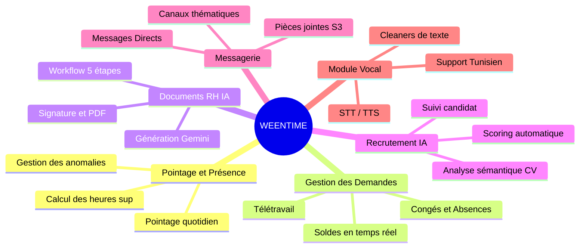
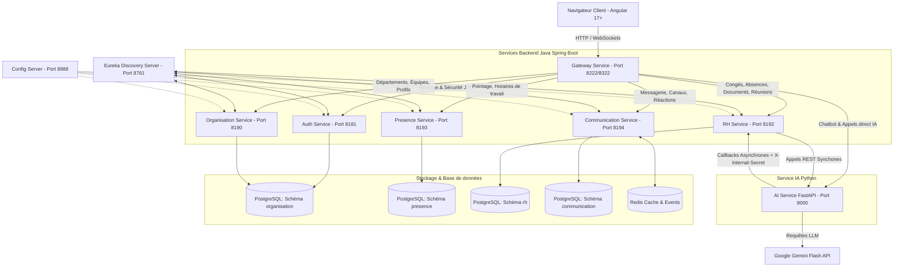
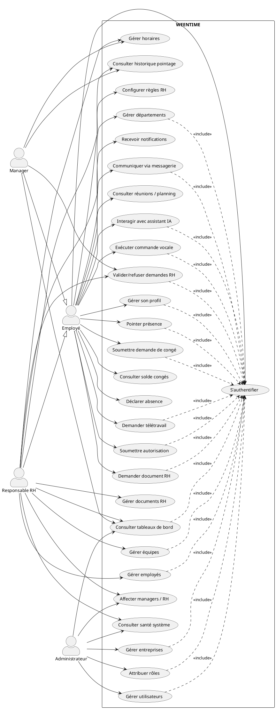

# 🏢 Documentation Officielle du Projet de Fin d'Études : WEENTIME

## Plateforme SaaS de Gestion des Ressources Humaines (SIRH) Multi-Tenant Assistée par Intelligence Artificielle

---

## 1. Contexte Général du Projet

Le projet **WEENTIME** est une plateforme SaaS (Software as a Service) multi-tenant de gestion des ressources humaines (SIRH). Dans le paysage des entreprises modernes, la gestion des processus administratifs (congés, télétravail, attestations, recrutement, pointage) est souvent fragmentée entre différents outils obsolètes ou gérée manuellement via des fichiers Excel et des e-mails. Cela entraîne des pertes de temps significatives, des risques d'erreurs juridiques et un manque de visibilité pour les managers et les collaborateurs.

### Objectifs Clés de WEENTIME
*   **Centralisation & Unification** : Rassembler dans une seule application web tous les outils indispensables au quotidien des RH, des managers et des employés.
*   **Automatisation intelligente (IA)** : Intégrer des agents d'intelligence artificielle basés sur les grands modèles de langage (LLM Google Gemini / Qwen en local) pour assister la rédaction de documents RH complexes, analyser/scorer intelligemment les candidatures lors des recrutements, et répondre en langage naturel.
*   **SaaS Multi-Tenant** : Permettre à plusieurs entreprises d'utiliser la même infrastructure logicielle tout en garantissant un cloisonnement et une isolation hermétique de leurs données via un identifiant unique d'entreprise (`entreprise_id`).
*   **Collaboration en temps réel** : Fournir un espace de communication instantané (canaux de discussion et messagerie directe) intégré directement aux flux de travail RH.

---

## 2. Méthodologie de Projet (Scrum) et Organisation

Pour concevoir et développer WEENTIME, la méthodologie agile **Scrum** a été adoptée. Cette approche itérative a permis de s'adapter rapidement aux évolutions fonctionnelles et d'assurer une livraison continue de fonctionnalités de haute qualité.

### 2.1 Équipe Projet Scrum
La gouvernance du projet est assurée par l'équipe suivante :
*   **Product Owner (PO)** : Mme Imen Chikha
*   **Scrum Master (SM)** : Mme Ferihane Kboubi
*   **Scrum Team / Développeur** : Essia Sannen

### 2.2 Rituels Scrum implémentés
1.  **Sprint Planning** : Au début de chaque sprint, l'équipe sélectionne les User Stories prioritaires du Product Backlog et les découpe en tâches techniques pour constituer le Sprint Backlog.
2.  **Daily Standup Meeting** : Une réunion quotidienne de 15 minutes permet de faire le point sur les réalisations de la veille, les objectifs du jour et les obstacles techniques.
3.  **Sprint Review** : À la fin de chaque sprint, une démonstration en direct des fonctionnalités développées est présentée afin de valider l'incrément de produit.
4.  **Sprint Retrospective** : Une réunion d'analyse permet à l'équipe de réfléchir sur le fonctionnement du sprint passé et de définir des axes d'amélioration.

### 2.3 Planification Détaillée des Sprints

Le cycle de développement a été découpé en 6 sprints structurés par valeur métier progressive :

| Sprint | Titre | Objectif Principal | Modules Principaux | Livrables Attendus | Durée |
| :--- | :--- | :--- | :--- | :--- | :--- |
| **Sprint 0** | Analyse & Spécification | Cadrage du projet, identification des acteurs et modélisation UML. | Analyse, Scrum, UML, Architecture | Backlog priorisé, planification, diagrammes UML, environnement | 1 à 2 sem. |
| **Sprint 1** | Sécurité & Organisation | Mettre en place les accès sécurisés et les bases de l'organisation. | Auth, JWT, 2FA, Entreprises, Utilisateurs, Rôles | Connexion sécurisée, gestion profils/utilisateurs/entreprises | 2 à 3 sem. |
| **Sprint 2** | Structure RH & Pointage | Structurer les collaborateurs et suivre la présence. | Départements, Équipes, Employés, Pointage, Horaires | Structure RH opérationnelle, pointage personnel/équipe/global | 3 sem. |
| **Sprint 3** | Demandes RH & Validations | Gérer les requêtes administratives et leur circuit décisionnel. | Congés, absences, autorisations, télétravail, documents | Workflows de demande, validations manager/RH, documents RH | 3 à 4 sem. |
| **Sprint 4** | Supervision & Messagerie | Suivre l'activité globale et fluidifier les échanges internes. | Dashboards, notifications, messagerie, reporting, audit | Tableaux de bord par rôle, communication WebSocket temps réel | 3 sem. |
| **Sprint 5** | Assistant IA & Vocal | Ajouter une interface conversationnelle intelligente texte/voix. | Chatbot textuel, voice, STT/TTS, multilingue, RAG, observability | Chatbot rôle-aware, commande vocale, RAG citant, monitoring | 3 à 4 sem. |

### 2.4 Synthèse du Product Backlog & Statut des User Stories

Le tableau suivant présente le backlog de WEENTIME et l'état d'implémentation constaté dans le dépôt :

| ID | Module | User Story | Acteur | Priorité | Complexité (Points) | Statut | Sprint |
| :--- | :--- | :--- | :--- | :---: | :---: | :---: | :---: |
| **US-01** | Auth | Connexion utilisateur saine avec JWT | Employé | Haute | 5 | **Réalisé** | Sprint 1 |
| **US-02** | Auth | Double authentification (2FA) | Employé | Moyenne | 5 | **Réalisé** | Sprint 1 |
| **US-03** | Sécurité | Gestion des rôles applicatifs | Admin | Haute | 8 | **Réalisé** | Sprint 1 |
| **US-04** | Sécurité | Attribution de rôle à un utilisateur | Admin | Haute | 5 | **Réalisé** | Sprint 1 |
| **US-05** | Organisation | Gestion des entreprises (tenants) | Admin | Haute | 8 | **Réalisé** | Sprint 1 |
| **US-06** | Organisation | Affecter un responsable RH par tenant | Admin | Haute | 8 | **Réalisé** | Sprint 1 |
| **US-07** | Utilisateurs | CRUD des utilisateurs et statuts | Admin | Haute | 13 | **Réalisé** | Sprint 1 |
| **US-08** | Structure | Gestion des départements d'entreprise | RH | Haute | 8 | **Réalisé** | Sprint 2 |
| **US-09** | Structure | Gestion des équipes de travail | RH | Haute | 8 | **Réalisé** | Sprint 2 |
| **US-10** | Employés | Gestion des fiches employés et profils | RH | Haute | 13 | **Réalisé** | Sprint 2 |
| **US-11** | Organisation | Affecter un employé à une équipe | RH | Haute | 5 | **Réalisé** | Sprint 2 |
| **US-12** | Organisation | Affecter un manager à une équipe | RH/Admin | Haute | 5 | **Réalisé** | Sprint 2 |
| **US-13** | Pointage | Pointage d'arrivée (check-in) et de départ (check-out) | Employé | Haute | 8 | **Réalisé** | Sprint 2 |
| **US-14** | Pointage | Consulter son historique personnel de pointage | Employé | Haute | 5 | **Réalisé** | Sprint 2 |
| **US-15** | Pointage | Consulter la présence de son équipe en temps réel | Manager | Haute | 8 | **Réalisé** | Sprint 2 |
| **US-16** | Pointage | Consulter la présence globale de l'entreprise | RH | Haute | 8 | **Réalisé** | Sprint 2 |
| **US-17** | Horaires | Configurer les modèles horaires et affectations | RH | Haute | 13 | **Réalisé** | Sprint 2 |
| **US-18** | Heures Sup | Calcul et validation des heures supplémentaires | Manager/RH| Moyenne | 8 | **En cours** | Sprint 2 |
| **US-19** | Congés | Soumettre une demande de congés | Employé | Haute | 8 | **Réalisé** | Sprint 3 |
| **US-20** | Congés | Consulter ses soldes de congés | Employé | Haute | 5 | **Réalisé** | Sprint 3 |
| **US-21** | Congés | Approuver/refuser une demande de congés | Manager | Haute | 8 | **Réalisé** | Sprint 3 |
| **US-22** | Congés | Validation finale RH des congés | RH | Haute | 8 | **Réalisé** | Sprint 3 |
| **US-23** | Absences | Déclarer et documenter une absence | Employé | Haute | 8 | **En cours** | Sprint 3 |
| **US-24** | Autorisations | Demande et validation d'autorisation d'absence | Employé | Haute | 8 | **Réalisé** | Sprint 3 |
| **US-25** | Télétravail | Demande de télétravail avec contrôle de quota | Employé | Moyenne | 8 | **Réalisé** | Sprint 3 |
| **US-26** | Documents | Soumettre une demande de document RH officiel | Employé | Moyenne | 8 | **Réalisé** | Sprint 3 |
| **US-27** | Documents | Traitement, édition et génération IA de documents | RH | Haute | 13 | **Réalisé** | Sprint 3 |
| **US-28** | Réunions | Consulter ses réunions planifiées | Employé | Moyenne | 8 | **Réalisé** | Sprint 3 |
| **US-29** | Planning | Consulter et modifier le planning d'entreprise | RH | Moyenne | 8 | **En cours** | Sprint 3 |
| **US-30** | Dashboards | Consulter les diagnostics et métriques système | Admin | Moyenne | 8 | **Réalisé** | Sprint 4 |
| **US-31** | Dashboards | Consulter le dashboard opérationnel RH | RH | Haute | 8 | **Réalisé** | Sprint 4 |
| **US-32** | Dashboards | Consulter le dashboard de suivi d'équipe | Manager | Moyenne | 8 | **Réalisé** | Sprint 4 |
| **US-33** | Dashboards | Consulter son résumé quotidien (Daily Digest) | Employé | Moyenne | 5 | **Réalisé** | Sprint 4 |
| **US-34** | Notifications | Recevoir des alertes de statut et de pointage | Employé | Haute | 8 | **Réalisé** | Sprint 4 |
| **US-35** | Messagerie | Discuter dans des canaux ou messages directs | Employé | Moyenne | 13 | **Réalisé** | Sprint 4 |
| **US-36** | Reporting | Analyser l'évolution des congés, présence et docs | RH/Admin | Moyenne | 8 | **Réalisé** | Sprint 4 |
| **US-37** | Audit | Historiser et tracer les actions d'administration | Admin | Moyenne | 8 | **En cours** | Sprint 4 |
| **US-38** | Assistant IA | Consulter l'assistant par chat avec ResponseGuard | Employé | Moyenne | 13 | **Réalisé** | Sprint 5 |
| **US-39** | Vocal | Piloter l'assistant par commandes vocales | Employé | Moyenne | 13 | **Réalisé** | Sprint 5 |
| **US-40** | STT/TTS | Transcription vocale (STT) et lecture audio (TTS) | Employé | Moyenne | 13 | **Réalisé** | Sprint 5 |
| **US-41** | Multilingue | Interagir en Français, Anglais, Arabe et Tunisien | Employé | Moyenne | 8 | **Réalisé** | Sprint 5 |
| **US-42** | RAG RH | Poser des questions sur le règlement intérieur | Employé | Moyenne | 8 | **Réalisé** | Sprint 5 |
| **US-43** | Observabilité | Tracer et auditer les performances IA sur Braintrust | Admin | Faible | 8 | **Réalisé** | Sprint 5 |
| **US-44** | Supervision | Consulter l'état de Redis, RAG, Ollama et Gemini | Admin | Moyenne | 5 | **Réalisé** | Sprint 5 |
| **US-45** | Sécurité IA | Empêcher la fuite de secrets ou l'accès non autorisé | Admin | Haute | 8 | **Réalisé** | Sprint 5 |
| **US-46** | Recrutement | Gérer les offres d'emploi et les CV | RH | Faible | 13 | **Partiel** | Hors-sprint |
| **US-47** | Signature El. | Signer électroniquement avec certificat légal | RH | Faible | 13 | **À faire** | Hors-sprint |
| **US-48** | Backups DB | Sauvegarde et restauration de la base de données | Admin | Faible | 13 | **À faire** | Hors-sprint |

---

## 3. Acteurs du Système et Analyse des Besoins

### 3.1 Les Acteurs et Rôles
La plateforme WEENTIME structure l'accès aux fonctionnalités selon quatre rôles principaux, définissant ainsi une matrice de permissions précise :
*   **Collaborateur (Employee)** : Salarié. Il utilise la plateforme pour pointer (check-in/check-out), consulter ses soldes, déposer ses requêtes, et communiquer.
*   **Manager** : Responsable d'une équipe. Il supervise son équipe en temps réel, valide/refuse les demandes de premier niveau et suit les indicateurs.
*   **Responsable RH (RH)** : Administrateur des processus RH d'entreprise. Il gère le planning, traite le backlog des documents avec l'IA, valide les dossiers de recrutement, et configure les règles d'attribution.
*   **Administrateur (Admin)** : Super-utilisateur de la plateforme SaaS. Il gère la création des entreprises (tenants), configure les paramètres globaux, et surveille l'infrastructure.

### 3.2 Besoins Fonctionnels (par Module)

#### A. Module "Congés & Absences"
*   Dépôt de demandes de congés (payés, maladie, événements familiaux) par les collaborateurs.
*   Workflow de validation à double niveau : approbation par le Manager direct, puis validation finale par le Responsable RH.
*   Mise à jour en temps réel des soldes de congés individuels, avec un mécanisme d'audit log pour tracer chaque ajustement.
*   Gestion des conflits d'accès concurrents sur les soldes grâce au verrouillage optimiste JPA (`@Version`).

#### B. Module "Télétravail & Autorisations"
*   Demande de jours de télétravail ponctuels ou récurrents avec suivi des quotas autorisés par l'entreprise.
*   Demandes d'autorisations d'absence de courte durée avec calcul de la durée restante sur le mois.

#### C. Module "Documents RH intelligents"
*   Workflow strict en 5 étapes pour la génération de documents administratifs (ex. : attestation de travail, lettre de recommandation) :
    1.  **DEMANDE_RECUE** : L'employé dépose sa demande.
    2.  **EN_REVISION** : Le RH lance une génération assistée par l'IA Gemini ou importe un fichier manuellement.
    3.  **VALIDE** : Le RH valide le contenu textuel généré.
    4.  **SIGNE** : Le RH appose sa signature numérique (via canvas de dessin ou image enregistrée).
    5.  **ENVOYE** : Le système génère le PDF final, l'archive et l'envoie automatiquement à l'employé par e-mail et notification.
*   Éditeur WYSIWYG interactif permettant de corriger, formaliser ou reformuler le texte grâce à des actions IA contextuelles.

#### D. Module "Recrutement Assisté par IA"
*   Espace carrières public permettant aux candidats extérieurs de postuler.
*   Pipeline de recrutement structuré par statuts : `RECEIVED` → `AI_ANALYZING` → `AI_ANALYZED` → `SHORTLISTED` → `REJECTED/HIRED`.
*   Analyse sémantique automatique du CV importé par un agent IA (FastAPI + Gemini) qui extrait les compétences, l'expérience et attribue un score d'adéquation (0-100%) par rapport à la fiche de poste.

#### E. Module "Pointage & Présence"
*   Pointage quotidien (check-in / check-out) avec détection de la localisation géographique et de la source.
*   Session de pointage moderne structurée autour d'états de session (`OPEN`, `CLOSED`) et de statuts quotidiens (`IDLE`, `WORKING`, `LATE` en cas de retard sur le planning officiel).
*   Calcul automatique des heures supplémentaires et des anomalies (ex. : oubli de check-out en fin de journée).

#### F. Module "Communication Collaborative"
*   Création de canaux de discussion thématiques (publics ou privés) par département ou équipe.
*   Messagerie directe entre collaborateurs (DMs) avec support de threads, de réactions emojis et de pièces jointes (stockées sur MinIO/S3).

#### G. Module Vocal Intelligent Multilingue (STT/TTS)
*   Interaction vocale avec l'assistant IA de WEENTIME (check-in/check-out de présence, demande de solde de congés ou d'autorisations) via commandes parlées.
*   Support natif et fluide de plusieurs langues et dialectes : Français, Anglais, Arabe Standard et Dialectal Tunisien (**Tounsi** / franco-arabe).
*   Algorithmes de nettoyage et de normalisation STT (Speech-To-Text) adaptés pour interpréter correctement le franco-arabe et le dialectal (ex : normalisation de *"nheb npointi"* ou *"aandi conge"*).
*   Génération de réponses vocales en retour via synthèse TTS (Text-To-Speech).

### 3.3 Besoins Non Fonctionnels
*   **Multi-tenancy** : Isolation complète des données par entreprise (filtre dynamique par `entreprise_id`).
*   **Sécurité** : Chiffrement des mots de passe (BCrypt), JWT global au niveau de la Gateway, et secret partagé (`X-Internal-Secret`) pour sécuriser les appels inter-services (Java - Python).
*   **Performance & Évolutivité** : Architecture orientée microservices permettant de faire évoluer chaque composant indépendamment.
*   **Temps réel** : Communication instantanée basée sur des WebSockets et le protocole STOMP.

---

## 4. Architecture Logicielle Générale

WEENTIME repose sur une **architecture orientée microservices** hautement découplée. Cette architecture garantit l'évolutivité, la résilience et permet de déployer et de mettre à l'échelle chaque service indépendamment.

### 4.1 Topologie de l'Infrastructure et des Services

### 4.2 Description des Composants Techniques

#### A. Les Services Infrastructurels (Spring Cloud)
*   **Discovery Service (Netflix Eureka - Port 8761)** : Serveur d'enregistrement sur lequel tous les microservices s'enregistrent au démarrage. Il permet la communication inter-services sans coder en dur les adresses IP.
*   **Config Server (Port 8988)** : Centralise les fichiers de configuration YAML/properties pour tous les microservices.
*   **Gateway Service (Port 8222 ou 8322)** : Passerelle d'entrée unique de la plateforme. Il utilise un filtre global de sécurité (`JwtGlobalFilter`) pour valider les jetons JWT. En mode démo publique, il gère une liste d'exemptions JWT pour que le chatbot soit accessible sans authentification préalable.

#### B. Les Microservices Métier (Java Spring Boot)
*   **Auth Service (Port 8181)** : Gère l'authentification sécurisée, la génération de tokens JWT signés cryptographiquement, et l'authentification à double facteur (2FA via TOTP Google Authenticator ou e-mail de sécurité).
*   **Organisation Service (Port 8190)** : Gère l'arbre organisationnel de l'entreprise (départements, équipes, utilisateurs, rôles et permissions, manager direct).
*   **Presence Service (Port 8193)** : Gère le suivi du temps de travail. Il compare les sessions de pointage actives (`attendance_sessions`) avec les horaires assignés (`work_schedules`) pour déterminer les heures effectives et les retards.
*   **RH Service (Port 8192)** : Service principal métier. Gère les congés, le télétravail, les absences, les soldes, les réunions, les jours fériés et le workflow des documents.
*   **Communication Service (Port 8194)** : Gère la messagerie collaborative en temps réel. Pour garantir des performances élevées sous forte charge, il intègre un bus Redis et utilise une table d'Outbox d'événements (`comm_events_outbox`) pour assurer la livraison fiable des messages.

#### C. Le Microservice d'Intelligence Artificielle (Python FastAPI)
*   Développé en Python pour s'intégrer naturellement avec l'écosystème de l'IA (port 8000).
*   Il sert de passerelle d'orchestration (RAG, validation de prompts) vers l'API Google Gemini Flash.
*   Gère le traitement de CV (parsing PDF, extraction JSON structurée) et la génération/correction de texte à la volée.
*   Contient les routes vocales (`/v2/voice`) réalisant le nettoyage des transcriptions STT, la détection linguistique automatique, le routage intelligent vers l'agent adéquat, et la conversion de la réponse en synthèse vocale (TTS).

#### D. Le Client Web (Angular 17+ / Angular 21)
*   Développé avec Angular en version moderne (Standalone Components, pas de modules lourds).
*   Utilise les **Signals** pour une gestion fine et réactive de l'état sans surcharge mémoire.
*   La communication en temps réel pour le tchat et les alertes RH est assurée par un client WebSocket utilisant le protocole applicatif **STOMP**.

---

## 5. Schéma et Modèle de Base de Données (Conception UML)

WEENTIME utilise une base de données relationnelle **PostgreSQL 15**. L'étanchéité multi-tenant est assurée par le champ `entreprise_id` sur toutes les tables métiers critiques.

### 5.1 Diagramme de Cas d'Utilisation Global (PlantUML)

### 5.2 Diagramme de Classes Global (PlantUML)

```plantuml
@startuml weentime_global_class_diagram
skinparam packageStyle rectangle
skinparam classAttributeIconSize 0
hide circle

package "Organisation" {
  class Entreprise {
    +id : Long
    +nom : String
    +adresse : String
    +email : String
    +siret : String
    +siteWeb : String
    +telephone : String
    +codeInvitation : String
    +maxUsers : Integer
    +currentUsers : Integer
    +secteur : String
    +createdAt : LocalDateTime
    +updatedAt : LocalDateTime
  }

  class Utilisateur {
    +id : Long
    +nom : String
    +prenom : String
    +email : String
    +motDePasse : String
    +telephone : String
    +poste : String
    +avatarUrl : String
    +statut : StatutUtilisateurEnum
    +dateCreation : LocalDateTime
    +dateModification : LocalDateTime
  }

  class Role {
    +id : Long
    +nom : RoleNom
    +description : String
  }

  class Departement {
    +id : Long
    +nom : String
    +description : String
    +codeInterne : String
  }

  class Equipe {
    +id : Long
    +nom : String
    +description : String
    +effectifMaximum : Integer
    +estActive : Boolean
    +createdAt : LocalDateTime
  }

  class "Notification" as OrgNotification {
    +id : Long
    +title : String
    +message : String
    +type : NotificationType
    +isRead : Boolean
    +createdAt : LocalDateTime
    +readAt : LocalDateTime
    +actionUrl : String
  }

  class UserAuditLog {
    +id : Long
    +action : String
    +performedBy : String
    +targetUser : String
    +details : String
    +createdAt : LocalDateTime
  }
}

package "RH" {
  abstract class Demande {
    +id : Long
    +utilisateurId : Long
    +managerId : Long
    +entrepriseId : Long
    +motif : String
    +commentaire : String
    +statut : StatutDemandeEnum
    +typeDemande : TypeDemandeEnum
    +dateCreation : LocalDateTime
    +dateDecision : LocalDateTime
    +commentaireValidateur : String
    +version : Long
  }

  class Conge {
    +dateDebut : LocalDate
    +dateFin : LocalDate
    +nombreJours : Integer
    +typeCongeId : Long
    +justificatifFourni : Boolean
  }

  class Autorisation {
    +typeAutorisation : TypeAutorisation
    +heureDebut : LocalTime
    +heureFin : LocalTime
    +duree : Integer
  }

  class Teletravail {
    +dateDebut : LocalDate
    +dateFin : LocalDate
    +nombreJours : Double
    +adresse : String
    +etapeActuelle : String
    +commentaireManager : String
    +commentaireRH : String
  }

  class Document {
    +typeDocument : TypeDocument
    +moisConcerne : String
    +documentUrl : String
    +generatedByAI : boolean
    +contenuIA : String
    +commentaireRH : String
    +aiModelUsed : String
    +tokensUsed : Integer
  }

  class TypeConge {
    +id : Long
    +entrepriseId : Long
    +libelle : String
    +nombreJoursMax : Integer
    +decompteJours : Boolean
    +requireJustificatif : Boolean
  }

  class SoldeConge {
    +id : Long
    +utilisateurId : Long
    +entrepriseId : Long
    +typeCongeId : Long
    +annee : Integer
    +joursAcquis : Double
    +joursUtilises : Double
    +joursRestants : Double
    +joursEnAttente : Double
  }

  class TypeAutorisation {
    +id : Long
    +entrepriseId : Long
    +libelle : String
    +maxHeuresMois : Integer
    +requireJustificatif : Boolean
  }

  class TypeDocument {
    +id : Long
    +entrepriseId : Long
    +libelle : String
    +code : String
    +categorie : String
    +modeGeneration : String
    +contentTemplate : String
    +aiPromptTemplate : String
  }

  class Reunion {
    +id : Long
    +titre : String
    +description : String
    +dateReunion : LocalDate
    +heureDebut : LocalTime
    +heureFin : LocalTime
    +type : ReunionType
    +statut : ReunionStatut
    +organisateurId : Long
    +entrepriseId : Long
  }

  class ParticipantReunion {
    +id : ParticipantReunionId
    +utilisateurId : Long
    +reponse : RSVPResponse
    +present : boolean
    +rappelMinutes : Integer
  }
}

package "Présence" {
  class AttendanceSession {
    +id : Long
    +utilisateurId : Long
    +date : LocalDate
    +checkInTime : LocalDateTime
    +checkOutTime : LocalDateTime
    +duration : Long
    +status : AttendanceSessionStatus
    +source : PresenceSource
    +lateArrival : Boolean
    +dailyStatus : AttendanceDayStatus
  }

  class "Presence" as PresencePointage {
    +id : Long
    +utilisateurId : Long
    +date : LocalDate
    +heureEntree : LocalDateTime
    +heureSortie : LocalDateTime
    +totalHeuresTravaillees : BigDecimal
    +status : PresenceStatus
    +source : PresenceSource
    +localisation : String
  }

  class WorkSchedule {
    +id : Long
    +utilisateurId : Long
    +heureDebut : LocalTime
    +heureFin : LocalTime
    +toleranceRetardMinutes : Integer
  }

  class HoraireModele {
    +id : Long
    +nom : String
    +type : TypeHoraireModele
    +heuresHebdo : Double
    +isDefaut : Boolean
    +statut : StatutHoraireModele
    +entrepriseId : Long
  }

  class HoraireJour {
    +id : Long
    +jourSemaine : DayOfWeek
    +estTravaille : Boolean
  }

  class HorairePlage {
    +id : Long
    +type : TypePlageHoraire
    +heureDebut : LocalTime
    +heureFin : LocalTime
    +ordre : Integer
  }

  class AffectationHoraire {
    +id : Long
    +cibleType : CibleType
    +cibleId : Long
    +dateDebut : LocalDate
    +dateFin : LocalDate
    +motif : String
    +priorite : Integer
    +entrepriseId : Long
  }

  class Overtime {
    +id : Long
    +utilisateurId : Long
    +date : LocalDate
    +heuresSupplementaires : BigDecimal
    +approuvee : Boolean
  }
}

package "Communication" {
  class CommChannel {
    +id : UUID
    +entrepriseId : Long
    +type : ChannelType
    +visibility : ChannelVisibility
    +slug : String
    +name : String
    +description : String
    +equipeId : Long
    +isPrivate : boolean
    +isArchived : boolean
    +createdBy : Long
  }

  class CommChannelMember {
    +id : CommChannelMemberId
    +entrepriseId : Long
    +role : ChannelMemberRole
    +notificationLevel : String
    +lastReadMessageId : UUID
    +lastReadAt : Instant
    +isMuted : boolean
    +isPinned : boolean
  }

  class CommMessage {
    +id : UUID
    +entrepriseId : Long
    +channelId : UUID
    +senderId : Long
    +parentMessageId : UUID
    +type : MessageType
    +body : String
    +richBody : String
    +status : MessageStatus
    +createdAt : Instant
  }

  class CommReaction {
    +id : CommReactionId
    +entrepriseId : Long
    +createdAt : Instant
  }

  class CommAttachment {
    +fileName : String
    +contentType : String
    +fileSize : Long
    +storagePath : String
  }
}

Entreprise "1" o-- "0..*" Departement
Entreprise "1" o-- "0..*" Utilisateur
Departement "1" o-- "0..*" Equipe
Departement "1" o-- "0..*" Utilisateur
Equipe "1" o-- "0..*" Utilisateur
Utilisateur "0..1" --> "0..*" Utilisateur : manager
Utilisateur "*" -- "*" Role
Utilisateur "1" -- "0..*" OrgNotification
Utilisateur "1" -- "0..*" UserAuditLog

Demande <|-- Conge
Demande <|-- Autorisation
Demande <|-- Teletravail
Demande <|-- Document
TypeConge "1" -- "0..*" Conge
TypeConge "1" -- "0..*" SoldeConge
Utilisateur "1" -- "0..*" SoldeConge
TypeAutorisation "1" -- "0..*" Autorisation
TypeDocument "1" -- "0..*" Document
Reunion "1" o-- "0..*" ParticipantReunion

Utilisateur "1" -- "0..*" AttendanceSession
Utilisateur "1" -- "0..*" PresencePointage
Utilisateur "1" -- "0..*" WorkSchedule
HoraireModele "1" o-- "1..*" HoraireJour
HoraireJour "1" o-- "0..*" HorairePlage
HoraireModele "1" -- "0..*" AffectationHoraire
Utilisateur "1" -- "0..*" Overtime

CommChannel "1" o-- "0..*" CommChannelMember
CommChannel "1" o-- "0..*" CommMessage
CommMessage "1" o-- "0..*" CommReaction
CommMessage "1" o-- "0..*" CommAttachment
CommChannelMember "*" --> "1" Utilisateur
CommMessage "*" --> "1" Utilisateur : senderId
@enduml
```

### 5.3 Relations Transverses & Logiques de Base de Données
Pour éviter tout couplage fort entre bases de données dans une architecture en microservices, les contraintes de clés étrangères (FK) ne sont **pas physiques** mais **applicatives**. 
*   `rh.demandes.utilisateur_id` référence logiquement `organisation.utilisateurs.id`.
*   `presence.attendance_sessions.utilisateur_id` référence logiquement `organisation.utilisateurs.id`.
*   `communication.comm_channels.equipe_id` référence logiquement `organisation.equipes.id`.

---

## 6. Flux de Données et Communication Inter-services

Afin d'éviter tout couplage fort entre les microservices, WEENTIME utilise une combinaison judicieuse de protocoles de communication synchrones et asynchrones :

### 6.1 Flux Synchrone (Exemple : Génération de document assistée par IA)
1.  Le Responsable RH clique sur "Générer avec l'IA" dans son interface Angular.
2.  L'application envoie une requête HTTP POST à la Gateway sur `/api/v1/rh/documents/rh/generate-ai`.
3.  La Gateway valide le JWT et route la demande vers le **RH-Service** (port 8192).
4.  Le RH-Service prépare le contexte de l'employé et effectue une requête HTTP REST synchrone (`RestTemplate` ou `WebClient` dans `AiService.java`) vers le **AI-Service Python** (port 8000) sur l'endpoint `/v1/documents/rh/generate-ai`.
5.  Le AI-Service interroge l'API Gemini Flash, structure la réponse sous forme de texte propre (en évitant le formatage markdown technique), et la renvoie au RH-Service qui la retourne au client Angular pour affichage dans l'éditeur.

### 6.2 Flux Asynchrone avec Callback (Exemple : Analyse d'un CV de recrutement)
Pour les opérations lourdes risquant d'expirer en HTTP synchrone (comme l'analyse sémantique approfondie de CV et le scoring de candidats) :
1.  Le candidat soumet son CV (PDF) sur la page carrières Angular.
2.  La candidature est enregistrée dans le RH-Service avec le statut `RECEIVED`.
3.  Le RH-Service délègue la tâche au AI-Service de manière asynchrone (retour immédiat d'un accusé de réception). Le statut passe à `AI_ANALYZING`.
4.  Le AI-Service Python traite le CV en arrière-plan en extrayant les informations.
5.  Une fois l'analyse terminée, le AI-Service effectue un callback HTTP PATCH vers le **RH-Service** sur l'endpoint sécurisé `/api/v1/rh/recruitment/internal/callback`.
6.  Pour sécuriser cet appel direct de service à service, la Gateway rejette toute requête externe vers cet endpoint, et le RH-Service exige la présence d'un en-tête d'authentification secret partagé (`X-Internal-Secret`).
7.  Le RH-Service met à jour la candidature à `AI_ANALYZED` avec le score calculé et notifie le recruteur via une alerte WebSocket.

---

## 7. Technologies et Environnement de Développement

Le tableau ci-dessous synthétise les choix technologiques effectués pour l'implémentation de la plateforme WEENTIME :

| Composant | Technologie retenue | Rôle et Justification |
| :--- | :--- | :--- |
| **Backend Core** | Java 17 / Spring Boot 3.x | Fournit la robustesse, la sécurité de type, et l'écosystème Spring Cloud pour la gestion des microservices. |
| **Sécurité Backend** | Spring Security & JWT | Gestion des sessions sans état (stateless), authentification à double facteur (2FA TOTP). |
| **Frontend** | Angular 17+ / Angular 21 (TypeScript) | Développement structuré en composants autonomes, gestion de l'état ultra-rapide et réactive via les Signals. |
| **Styling** | Vanilla CSS / Tailwind CSS | Flexibilité de mise en page, implémentation fluide du Dark Mode et des transitions d'états. |
| **Service IA** | Python 3.10+ / FastAPI | Performance asynchrone, intégration naturelle avec les librairies d'analyse sémantique et l'API Gemini. |
| **Moteur d'IA** | Google Gemini Flash API / Qwen2.5:3b | Modèle de langage de pointe (LLM) en cloud et local (Ollama) offrant le meilleur rapport qualité/vitesse pour les tâches d'extraction et de génération. |
| **Module Vocal & NLP** | STT / TTS & Normaliseurs | Traduction phonétique et textuelle pour le dialectal tunisien (**Tounsi**), l'arabe et le français (`VoiceAssistantService`, faster-whisper, Coqui/Piper et regex de nettoyage STT). |
| **Base de Données** | PostgreSQL 15 | Base relationnelle puissante supportant le requêtage JSONB complexe pour la messagerie collaborative. |
| **Messagerie & Cache** | Redis (Redis Stack) | Cache de données partagé et bus de messagerie pour distribuer les événements WebSocket en temps réel. |
| **Migration DB** | Flyway | Versionnage automatique et incrémental des schémas de base de données à chaque démarrage de service (migrations V1 à V19). |
| **Conteneurisation** | Docker / Docker Compose | Déploiement unifié et iso-production de l'ensemble des services et des bases de données de dev. |

### 7.1 Outils de l'Environnement de Développement
*   **IDE** : Visual Studio Code (Frontend, Python/FastAPI) et IntelliJ IDEA (Microservices Spring Boot).
*   **Test des APIs** : Postman et curl.
*   **Qualité & Tests E2E** : Pytest (FastAPI), Vitest & Playwright (Frontend Angular), et Braintrust (évaluation LLM).

---

## 8. Synthèse de l'État du Projet : Réalisé, En Cours & À Compléter

L'analyse approfondie du dépôt permet de séparer précisément le périmètre fonctionnel livré de ce qui reste à implémenter :

### 8.1 Fonctionnalités Entièrement Réalisées et Validées
*   **Authentification & Sécurisation** : Connexion JWT, interception de tokens, validation 2FA (TOTP/Email), guards par rôles, et masquage des secrets.
*   **Gestion Administrative de Base** : CRUD des entreprises, utilisateurs, rôles, départements et équipes. Assignation hiérarchique des collaborateurs et affectation des RH owners.
*   **Présence & Pointage** : Sessions de pointage modernes (`attendance_sessions` V3) avec détection de retard, historique et présence équipe/globale. Gestion des horaires modèles et affectation d'horaires.
*   **Workflows de Demandes** : Congés, soldes associés, autorisations temporaires, télétravail avec quotas.
*   **Gestion Documentaire** : Demande de documents, génération assistée par IA Gemini Flash, et conversion PDF.
*   **Messagerie Collaborative** : Canaux, messages directs, threads, emojis et pièces jointes (MinIO/S3).
*   **IA Conversationnelle & Vocale** : Chatbot texte et commande vocale multilingue (avec normalisation robuste du dialectal tunisien **Tounsi**). RAG sur les politiques RH avec citations obligatoires. Health-check profond de la pile IA et traçage sur Braintrust.

### 8.2 Fonctionnalités Partiellement Implémentées (En Cours)
*   **Module Absences** : Les pages et services frontend existent mais l'intégration dans une entité JPA dédiée est en cours de consolidation (partiellement couplée avec les congés classiques).
*   **Heures Supplémentaires** : L'entité `Overtime` est définie au niveau PostgreSQL/JPA dans `presence-service`, mais son exposition fonctionnelle complète au manager reste partielle.
*   **Planning RH** : Les endpoints dans `rh-service` existent mais l'intégration complète avec l'interface graphique de planification et certains outils IA doit être finalisée.
*   **Audit Trail Transversal** : Les entités de log d'audit existent séparément (`UserAuditLog`, `CommAuditLog`), mais leur agrégation dans un tableau de bord d'audit unifié pour l'administrateur reste à consolider.

### 8.3 Fonctionnalités Non Réalisées (À Compléter pour la Release 3)
*   **Module Formation complet** : Aucun composant ou service actif dans le dépôt.
*   **Signature électronique légale qualifiée** : Actuellement simulée via un canvas HTML5 de dessin de signature pour le RH. Le workflow eIDAS avec autorité de certification reste à intégrer.
*   **Sauvegardes et Restauration DB via UI** : Aucune option d'administration dans l'interface de la plateforme.

---

## 9. Conclusion et Recommandations de Rédaction

La plateforme WEENTIME démontre la puissance d'une architecture distribuée unifiée. L'introduction intelligente de l'IA (Gemini/FastAPI) comme assistante, et non comme substitut décisionnel, respecte les exigences de conformité et de rigueur propres aux départements RH. Les actions critiques de modification de base de données restent toujours sous le contrôle et la validation stricte des microservices Spring Boot.

### Recommandations pour la Rédaction de Mémoire (UML et LaTeX)
1.  **Acteurs UML** : Limiter strictement les acteurs des diagrammes aux rôles humains réels (Employé, Manager, RH, Admin). Ne pas modéliser l'assistant IA ou le moteur vocal comme des acteurs, mais comme des composants d'infrastructure internes.
2.  **Mise en page LaTeX** : Utiliser le package `longtable` pour le Product Backlog complet afin d'éviter les débordements de page.
3.  **Présentation de Redis** : Préciser que Redis est utilisé comme bus d'événements et cache temps réel (outbox pattern), et non comme base de données persistante de référence.
4.  **Diagrammes de Classes** : Présenter le diagramme de classes global de manière synthétique par packages, puis détailler chaque package (Organisation, RH, Présence, Communication, IA) de manière isolée pour en faciliter la lecture.
