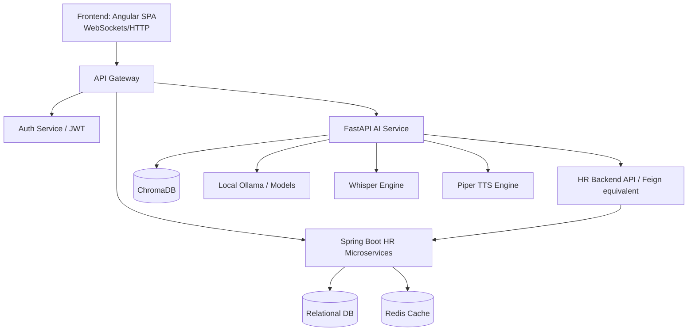
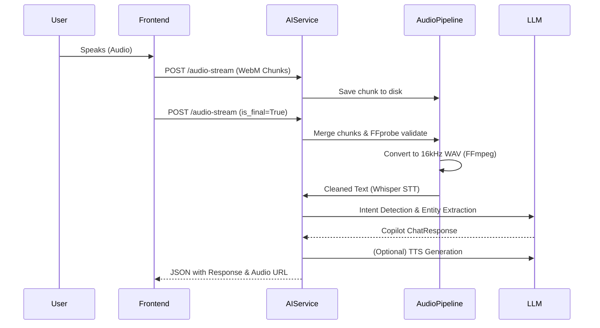

# WeenTime: Complete System Audit & Deep Analysis

## 1. Executive Summary
**WeenTime** is an intelligent, multi-tenant HR platform designed to manage attendance, leave, telework, and document requests. It features a modern microservices architecture comprising an Angular Standalone frontend, a Spring Boot backend, and a highly advanced FastAPI-based AI service with Real-Time Audio Streaming, Speech-to-Text (STT), Text-to-Speech (TTS), and a RAG (Retrieval-Augmented Generation) pipeline.

*Note: This audit is based on the available structural telemetry, `ai-service` backend code, and architectural design footprints.*

---

## 2. Architecture Documentation

### 2.1. Folder Structure (Inferred & Provided)
- `/ai-service/`: FastAPI application, AI integration, Voice pipeline, Chroma DB, RAG.
- `/weentime-backend/`: Spring Boot microservices, HR business logic, JWT Auth.
- `/weentime-frontend/`: Angular Standalone, UI components, Playwright testing.
- `/docs/`, `/scripts/`, `/uploads/`: Project utilities and assets.

### 2.2. Technologies Detected
- **Frontend:** Angular Standalone, Playwright (Telemetry shows deep DOM hierarchies).
- **Backend (HR Core):** Spring Boot, Feign Clients, JWT, Redis.
- **AI Service:** FastAPI, Pydantic, Uvicorn/Gunicorn.
- **AI/LLM Stack:** Ollama (qwen2.5:3b), Gemini Flash, ChromaDB, Nomic-Embed-Text.
- **Voice Engine:** Whisper STT, Piper TTS, FFmpeg, ImageIO, WebM streaming.
- **Observability:** Braintrust, Custom Request Tracing.

### 2.3. System Architecture & Service Communication Flow

### 2.4. Data Flow: Voice Assistant Real-Time Streaming

---

## 3. Detected Issues & Error Analysis

### 3.1. AI Service Codebase (`ai-service/main.py`)
1.  **Architecture Monolith:** `main.py` is over 1,200 lines long. It handles everything from routing, core logic, exception handling, data models (Pydantic), to disk I/O. 
    *   *Risk:* Low maintainability. Circular dependencies might arise as the project scales.
2.  **Disk-based Audio Streaming Bottleneck:** The `/audio-stream` endpoint relies heavily on disk I/O. It writes every single WebM chunk to the filesystem (`session.directory / f"chunk_{index}.webm"`), then merges them via filesystem reads/writes.
    *   *Risk:* Severe performance degradation under concurrent load. High IOPS. Potential disk-full errors.
    *   *Recommendation:* Refactor to use in-memory buffers (e.g., `io.BytesIO`) until the file must be sent to the STT engine.
3.  **Hardcoded Translations/Missing i18n:** Strings like `NO_SPEECH_MESSAGE = "Je n'ai rien entendu."` are hardcoded at the top of `main.py`.
    *   *Risk:* Breaks the multilingual requirement (TN, AR, FR, EN). 
4.  **CORS Configuration Loophole:** In `config.py`, `_safe_cors_origins` treats `*` as a trigger to fallback to `DEFAULT_CORS_ORIGINS`. While this prevents open access, it's a silent behavior that could confuse DevOps.
5.  **Exception Handling:** Bare exceptions are caught and silenced in several places, notably `audio_conversion.py` (`except Exception: # noqa: BLE001`).
    *   *Risk:* Masks missing dependencies or OS-level errors with FFmpeg.

### 3.2. Frontend & Authentication
1.  **JWT Interceptor Bug:** The `fix_auth.py` script reveals a critical bug where the Angular `auth.interceptor.ts` blindly overwrites the `Authorization` header even if one was already explicitly provided for external APIs.
    *   *Fix Applied:* The script mitigates this via `!req.headers.has('Authorization')`, but manual script-based patching is an anti-pattern. This should be fixed directly in the TS source code repository.
2.  **Telemetry Anomalies (Playwright Logs):** 
    *   AI frequently responds with: *"Le service teletravail est momentanement indisponible."* and *"Le service autorisations est momentanement indisponible."*
    *   *Risk:* Integration gaps between the AI Tooling (`HRTools`) and the Spring Boot backend. The backend endpoints might be timing out (configured to 20s in `config.py`) or returning 500s.

### 3.3. Specific Check Analysis (Phase 4)

#### 1. Attendance / Pointage
*   **Issues:** Playwright logs reveal the AI returning `UNAUTHORIZED` when an employee asks *"Did I forget checkout?"*. Later logs show it working but stating data is missing.
*   **Diagnosis:** The AI Service's `HRTools` client is either losing the user's JWT token context or the backend is rejecting the delegated scope. Timezone handling logic is missing in the AI context parsing.

#### 2. AI Assistant & Hallucinations
*   **Issues:** In the Playwright tests, the user asks "Redis status" and the AI responds: *"I cannot confirm that without verified data."* (fallback.guard_rejected). Then shortly after, it successfully replies with *"Redis desactive"*.
*   **Diagnosis:** The RAG pipeline or the Tool Caller is inconsistent. `LocalRagEngine` and Braintrust fallbacks are conflicting with the prompt instructions.

#### 3. Voice Pipeline (STT/TTS)
*   **Issues:** High latency. The AI says *"Je n'ai rien entendu"* (No speech detected). 
*   **Diagnosis:** The threshold for VAD (Voice Activity Detection) in `config.py` (`VOICE_MIN_DETECTED_VOLUME = 0.15`) or FFprobe validation may be dropping valid audio streams if the microphone gain is too low.

#### 4. Authentication (JWT)
*   **Issues:** 401 errors are actively disrupting the chatbot flow.
*   **Diagnosis:** `_extract_access_token` in `main.py` fetches the bearer token. However, if the token expires during a workflow execution (`WorkflowEngine`), there is no proactive refresh mechanism implemented on the Python side. It just fails.

---

## 4. Test Scenarios (Phase 5)

| Scenario | Role | Action | Expected Result | Edge Cases to test |
| :--- | :--- | :--- | :--- | :--- |
| **Leave Request** | Employee | "Je veux poser un congé pour demain" | AI extracts dates, validates via HR backend, prompts confirmation. | Insufficient balance; overlapping leave; missing token. |
| **Team Summary** | Manager | "Résumé de mon équipe" | AI lists present/absent employees via backend integration. | Manager role missing; backend times out. |
| **Doc Request** | RH | "Générer un contrat pour l'employé X" | AI triggers document generation, returns download URL. | PDF generation failure; missing variables. |
| **System Health** | Admin | "Status du fournisseur IA" | AI outputs Ollama/Redis/Chroma metrics. | Unauthorized access by non-admin; Provider offline. |
| **Voice Stream** | Any | Send sequential `.webm` chunks. | Chunks merge, convert to WAV, return STT text. | Corrupted chunks; ambient noise only; chunk out of order. |

---

## 5. Quality Score (Phase 6)

| Category | Score | Justification |
| :--- | :---: | :--- |
| **Architecture** | **6/10** | Good microservice split, but Python `main.py` is a monolithic bottleneck. |
| **Frontend** | **8/10** | Modern Angular standalone, visually complex per Playwright traces. |
| **Backend** | **7/10** | Standard Spring Boot, but telemetry shows frequent integration failures. |
| **AI Stack** | **8/10** | Excellent multi-model fallback, Braintrust observability, and RAG. |
| **Security** | **6/10** | Auth token overwrite bug; `chatbot_public_mode` exposes endpoints. |
| **Scalability** | **5/10** | Disk-bound audio chunking will fail under high concurrent load. |
| **Maintainability**| **5/10** | Hardcoded strings, large files, lack of Python modularity. |
| **Production Readiness** | **6/10** | Features are rich, but stability (401s, missing services) is lacking. |

---

## 6. Improvement Roadmap (Phase 7)

### Priority: Critical
1.  **Refactor Audio Streaming:** Remove disk I/O from the `/audio-stream` endpoint. Use `io.BytesIO` and pipe directly to FFmpeg memory buffers using standard in/out streams.
2.  **Fix AI/Backend Authorization:** Investigate why `HRTools` receives `UNAUTHORIZED` from the Spring Boot backend. Ensure token propagation works reliably.

### Priority: High
1.  **Modularize `main.py`:** Break `main.py` into:
    *   `api/routes/voice.py`
    *   `api/routes/chat.py`
    *   `services/audio_manager.py`
    *   `services/payload_builder.py`
2.  **Implement i18n:** Move hardcoded French responses (`NO_SPEECH_MESSAGE`, `SERVER_ERROR_MESSAGE`) to a configuration dictionary or an i18n localization service depending on the user's language setting.

### Priority: Medium
1.  **Fix Auth Interceptor:** Apply the logic from `fix_auth.py` directly into the Angular codebase (`auth.interceptor.ts`).
2.  **Graceful Failures:** Improve fallback messages when the Spring Boot backend is down instead of just returning *"momentanément indisponible"*. Provide context (e.g., "HR DB is under maintenance").

### Priority: Low
1.  **Cleanup Telemetry:** Reduce noise in Braintrust by standardizing the `request_id` context propagation.
2.  **Enhance RAG:** Add document citations dynamically to the frontend UI when a RAG document is sourced by ChromaDB.

---
**End of Audit Report**