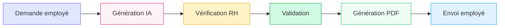
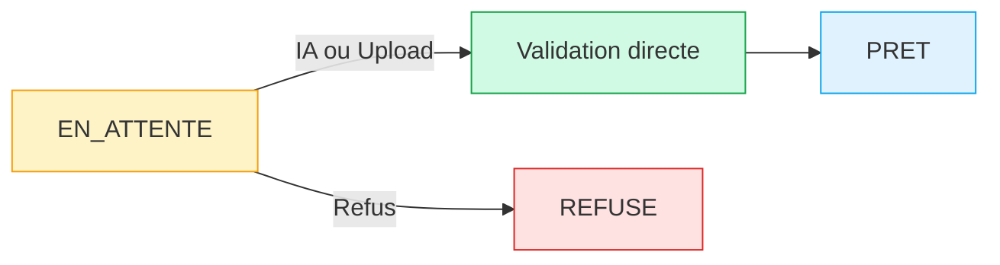
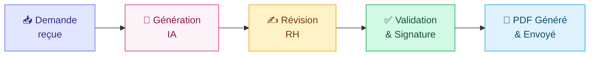
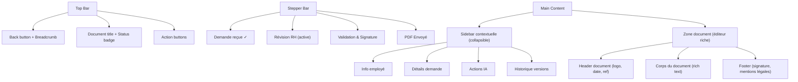
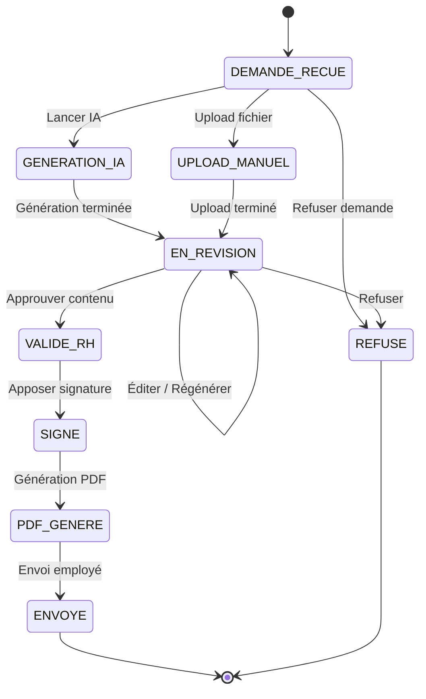
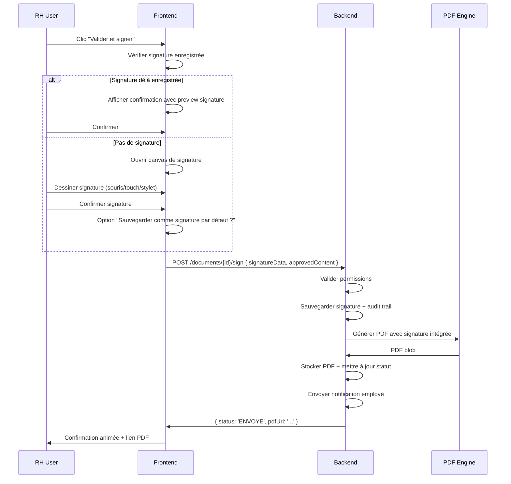

# 🏢 Analyse Produit — Module "Documents RH" WeenTime

> **Perspective** : Senior Product Designer × Product Manager Enterprise SaaS
> **Date** : 21 Mai 2026
> **Scope** : Analyse complète du concept, workflow, UX/UI, architecture et roadmap

---

## Table des matières

1. [Résumé exécutif](#1-résumé-exécutif)
2. [Audit du workflow actuel](#2-audit-du-workflow-actuel)
3. [Ce qui fonctionne bien](#3-ce-qui-fonctionne-bien)
4. [Critique UX/UI détaillée](#4-critique-uxui-détaillée)
5. [Incohérences produit & techniques](#5-incohérences-produit--techniques)
6. [Architecture UX proposée](#6-architecture-ux-proposée)
7. [Hiérarchie visuelle & Design System](#7-hiérarchie-visuelle--design-system)
8. [Améliorations SaaS Enterprise](#8-améliorations-saas-enterprise)
9. [Expérience utilisateur premium](#9-expérience-utilisateur-premium)
10. [Gap analysis vs. Notion/Linear/Stripe](#10-gap-analysis-vs-notionlinearstripe)
11. [Roadmap V1 → V2 → Future](#11-roadmap-v1--v2--future)
12. [Matrice effort/impact](#12-matrice-effortimpact)

---

## 1. Résumé exécutif

Le module Documents RH de WeenTime possède une **fondation solide** : un workflow logique (demande → IA → validation → PDF → envoi), une architecture frontend propre (Angular signals, standalone components, ChangeDetection.OnPush), et une intégration IA fonctionnelle avec Gemini.

**Cependant**, l'expérience utilisateur actuelle se situe au niveau d'un **MVP fonctionnel**, pas d'un **produit SaaS enterprise premium**. Les principaux gaps sont :

| Dimension | Niveau actuel | Niveau cible |
|-----------|:---:|:---:|
| Workflow clarity | ⭐⭐ | ⭐⭐⭐⭐⭐ |
| Document editing UX | ⭐⭐ | ⭐⭐⭐⭐⭐ |
| Trust & compliance | ⭐⭐ | ⭐⭐⭐⭐⭐ |
| Visual hierarchy | ⭐⭐⭐ | ⭐⭐⭐⭐⭐ |
| AI integration depth | ⭐⭐⭐ | ⭐⭐⭐⭐ |
| Status communication | ⭐⭐ | ⭐⭐⭐⭐⭐ |

> [!IMPORTANT]
> Le principal risque produit n'est pas technique — c'est la **perception de confiance**. Un document RH est juridiquement engageant. L'interface doit inspirer une confiance absolue, pas ressembler à un chatbot IA expérimental.

---

## 2. Audit du workflow actuel

### 2.1 Workflow déclaré vs. workflow implémenté



**Ce qui est réellement implémenté** dans le code :



> [!WARNING]
> **Gap critique** : Le workflow déclaré a 6 étapes, mais l'implémentation en a effectivement **3**. Il manque les étapes intermédiaires `EN_COURS` → `VERIFICATION_RH` → `VALIDATION` → `PDF_GENERE`. Le bouton "Valider et envoyer" fait tout d'un coup sans étapes de contrôle distinctes.

### 2.2 Analyse du workflow

| Aspect | Verdict | Commentaire |
|--------|---------|-------------|
| Logique métier | ✅ Bon | Le flux demande → IA → validation → envoi est le bon pattern |
| Étapes distinctes | ❌ Insuffisant | Pas de séparation claire entre révision, validation et génération PDF |
| Traçabilité | ❌ Absent | Aucun audit trail, pas d'historique des modifications |
| Rôles & permissions | ⚠️ Partiel | Le `isRh()` existe mais pas de granularité (viewer vs editor vs approver) |
| États documentaires | ⚠️ Incomplet | `EN_ATTENTE`, `EN_COURS`, `PRET`, `REFUSE` existent dans le modèle mais `EN_COURS` n'est pas exploité dans le workflow réel |
| Notification | ❌ Absent | Pas de notification lors des changements d'état |
| Délais & SLA | ⚠️ Partiel | L'urgence > 48h est calculée mais pas de SLA configurable |

### 2.3 Verdict workflow

Le workflow **conceptuel** est excellent et adapté à un SaaS RH moderne. Mais l'**implémentation** saute des étapes cruciales. Le RH clique "Valider et envoyer" et tout se passe en une seule action — ce qui est dangereux pour des documents juridiques.

**Recommandation** : Séparer explicitement **3 actions atomiques** :
1. **Approuver le contenu** (le RH confirme le texte)
2. **Signer** (le RH appose sa signature)
3. **Envoyer** (génération PDF + envoi employé)

---

## 3. Ce qui fonctionne bien

### ✅ Forces identifiées

| Élément | Détails |
|---------|---------|
| **Architecture frontend** | Excellent usage d'Angular signals, standalone components, `ChangeDetectionStrategy.OnPush`. Code propre et maintenable. |
| **Vue Kanban** | Bonne idée produit. Visualiser les demandes par colonnes de statut est le bon pattern pour un workflow RH. C'est un différenciateur vs. les SIRH classiques. |
| **Layout bi-panel de l'AI modal** | Sidebar contexte (employé + prompt) + zone éditeur. Ce split est le bon pattern, très proche de ce que font les meilleurs outils. |
| **Streaming simulé** | L'effet de typing character par character donne une impression de "l'IA travaille" qui est engageante. |
| **Prompt personnalisable** | Donner au RH la possibilité de modifier le prompt avant génération est un excellent choix. C'est du "AI-assisted" pas du "AI-replaced". |
| **Urgence auto-calculée** | Le flag `urgente` basé sur > 48h est intelligent et automatique. |
| **Badge IA** | Identifier visuellement les documents générés par IA est important pour la traçabilité. |
| **Dual mode Kanban/Liste** | Offrir 2 vues est un standard enterprise. |
| **Dark mode** | Implémenté au niveau CSS pour tous les composants. |
| **Type configurations** | Le modèle `TypeDocumentConfig` avec `modeGeneration`, `workflowType`, `niveauConfidentialite` montre une réflexion enterprise solide. |

### ✅ Bonnes décisions produit

1. **L'IA comme assistant, pas comme remplacement** — Le RH garde le contrôle final. C'est exactement ce qu'attend le marché enterprise.
2. **Multi-mode de génération** — `TEMPLATE_ONLY`, `AI_HYBRID`, `AI_FULL`, `MANUAL_UPLOAD`. Cette flexibilité est cruciale.
3. **Niveaux de confidentialité** — `PUBLIC`, `INTERNE`, `CONFIDENTIEL`. Bon réflexe compliance.
4. **L'onglet "Mes demandes" pour le RH lui-même** — Montre que le RH est aussi un employé. Bonne UX empathique.

---

## 4. Critique UX/UI détaillée

### 4.1 Page principale — Gestion des documents

**Fichiers** : [rh-documents.component.html](file:///c:/weentime_project/weentime_project/weentime-frontend/angular-weentime/src/app/features/rh/documents/rh-documents.component.html) + [rh-documents.component.scss](file:///c:/weentime_project/weentime_project/weentime-frontend/angular-weentime/src/app/features/rh/documents/rh-documents.component.scss)

| Problème | Sévérité | Détail |
|----------|:--------:|--------|
| Pas de workflow stepper visible | 🔴 Critique | L'utilisateur ne sait jamais où il se situe dans le processus global |
| Pas de CTA principal clair | 🟡 Moyen | La page n'a pas de bouton d'action primaire visible (ex: "Nouveau document") |
| Tabs inline avec Tailwind dans un composant SCSS | 🟡 Moyen | Mélange de Tailwind classes et SCSS custom — inconsistance de styling approach |
| Pas de feedback temps réel | 🟡 Moyen | Pas de WebSocket / polling pour les mises à jour de statut |
| Pas de bulk actions | 🟠 Mineur | Pour les gros volumes, pouvoir sélectionner et traiter plusieurs demandes |

### 4.2 Kanban Board

**Fichier** : [document-kanban.component.html](file:///c:/weentime_project/weentime_project/weentime-frontend/angular-weentime/src/app/features/rh/documents/components/document-kanban/document-kanban.component.html)

| Problème | Sévérité | Détail |
|----------|:--------:|--------|
| Pas de drag & drop | 🟡 Moyen | Un Kanban sans D&D est incomplet — c'est attendu en 2026 |
| Colonnes fixes | 🟡 Moyen | Les colonnes devraient refléter le vrai workflow (5-6 étapes, pas 3) |
| Pas de limite WIP | 🟠 Mineur | Pas de visual cue quand une colonne déborde |
| Actions inline trop nombreuses | 🟡 Moyen | 3 boutons (IA, Upload, Refuser) prennent trop de place sur la carte |
| Pas de priority sorting | 🟠 Mineur | Les cartes urgentes ne sont pas triées en haut |

### 4.3 Modal de génération IA — **Le composant le plus critique**

**Fichiers** : [ai-generation-modal.component.html](file:///c:/weentime_project/weentime_project/weentime-frontend/angular-weentime/src/app/features/rh/documents/components/ai-generation-modal/ai-generation-modal.component.html) + [ai-generation-modal.component.ts](file:///c:/weentime_project/weentime_project/weentime-frontend/angular-weentime/src/app/features/rh/documents/components/ai-generation-modal/ai-generation-modal.component.ts)

> [!CAUTION]
> Ce composant est le **cœur du produit** et concentre la majorité des problèmes UX identifiés.

| Problème | Sévérité | Détail |
|----------|:--------:|--------|
| **C'est un modal, pas une page** | 🔴 Critique | Un processus de validation de document juridique ne devrait **jamais** être un modal. C'est une page full-screen dédiée. Les modals sont pour les confirmations rapides, pas pour éditer des documents. |
| **Un simple `<textarea>` pour l'éditeur** | 🔴 Critique | Le document généré s'affiche dans un textarea brut. Pas de formatting, pas de sections, pas de typographie. Impossible d'avoir un rendu "document officiel". |
| **Le prompt IA brut est visible** | 🟡 Moyen | `"Génère une Attestation de travail officielle pour l'employé suivant..."` — Cela expose la machinerie interne. Un produit enterprise cache cela derrière une abstraction. |
| **Pas de workflow stepper** | 🔴 Critique | L'utilisateur ne sait pas s'il est en étape 2/5 ou 4/5 |
| **"Valider et envoyer" = 1 seul bouton** | 🔴 Critique | Un seul clic fait validation + envoi. Pas de confirmation, pas de preview PDF, pas de signature. Dangereux pour un document juridique. |
| **Streaming char-by-char simulé** | 🟡 Moyen | Le `setInterval` de 15ms est un fake streaming côté client. Si le vrai backend supporte le SSE/streaming, il faut l'utiliser. Sinon, un skeleton + reveal est plus honnête. |
| **Pas de preview PDF** | 🔴 Critique | Le RH ne voit jamais à quoi ressemblera le document final avant de l'envoyer |
| **Pas de régénération partielle** | 🟡 Moyen | On ne peut que tout régénérer, pas reformuler un paragraphe |
| **Pas d'historique de versions** | 🟡 Moyen | Si on régénère, l'ancienne version est perdue |
| **Pas de sauvegarde brouillon** | 🟡 Moyen | Si le RH ferme le modal par erreur, tout le travail est perdu |
| **Le titre dit "Générateur de documents IA"** | 🟡 Moyen | Le titre devrait refléter l'étape du workflow ("Révision et validation"), pas la technologie utilisée |

### 4.4 Modèle de données

**Fichier** : [rh-document.model.ts](file:///c:/weentime_project/weentime_project/weentime-frontend/angular-weentime/src/app/features/rh/documents/models/rh-document.model.ts)

| Problème | Sévérité | Détail |
|----------|:--------:|--------|
| Statuts dupliqués | 🟡 Moyen | `EN_ATTENTE` + `PENDING`, `PRET` + `READY`, `REFUSE` + `REJECTED` — FR + EN en double |
| `[key: string]: unknown` partout | 🟠 Mineur | Index signatures trop permissives — risque de type unsafety |
| Pas de `signatureRH` | 🔴 Critique | Le modèle ne prévoit aucun champ pour la signature |
| Pas de `versionHistory` | 🟡 Moyen | Pas de traçabilité des modifications |
| Pas de `pdfUrl` distinct de `documentUrl` | 🟡 Moyen | Confusion entre le contenu brut et le PDF final |
| Pas de `validatedBy` / `validatedAt` | 🔴 Critique | Aucune traçabilité de qui a validé quand |

---

## 5. Incohérences produit & techniques

### 5.1 Incohérences majeures

| # | Incohérence | Impact |
|---|-------------|--------|
| 1 | **Le workflow dit "6 étapes" mais l'implémentation en fait 2** (demande → validation directe). Il n'y a pas d'état `EN_COURS` réellement utilisé dans le flux principal. | L'utilisateur et le management ne peuvent pas suivre le processus |
| 2 | **`TypeDocumentConfig` a un `workflowType`** (`RH_VALIDATION`, `AUTO_APPROVE`, `MANAGER_VALIDATION`) **mais le frontend ne l'utilise jamais**. Tous les documents passent par le même flux. | Feature modèle non connectée à l'UI |
| 3 | **Le Kanban a une colonne `EN_COURS`** mais le code ne propose aucune action pour passer un document de `EN_ATTENTE` à `EN_COURS` de manière explicite. L'API `passerEnCours()` existe dans le service mais n'est jamais appelée dans le flow principal. | Colonne "fantôme" qui sera toujours vide |
| 4 | **`niveauConfidentialite`** est défini dans le modèle mais aucune UI ne le montre ni ne l'utilise pour contrôler l'accès. | Fausse promesse de sécurité |
| 5 | **L'employé peut demander un document mais ne peut pas voir le tracking en temps réel**. Le composant `EmployeeDocumentsComponent` charge l'historique mais pas de progress indicator du côté employé. | Frustration employé — "où en est ma demande ?" |
| 6 | **Le prompt personnalisable est pré-rempli avec des instructions techniques** ("Retourne uniquement le contenu du document sans balises markdown") — ce n'est pas une instruction RH, c'est une instruction technique pour le LLM. | Mélange de contexte utilisateur et technique |

### 5.2 Incohérences mineures

- Le `searchQuery` est un `signal('')` dans le `.ts` mais un `[(ngModel)]` dans le `.html` — potentiel conflit signal vs ngModel
- Le `mapToFrontend()` dans le service hardcode `entrepriseId: 0` et `dateEntree: ''` — données critiques manquantes
- L'`handleAIGeneration` n'a pas de `catchError` — les erreurs réseau ne sont pas gérées
- Le modal AI n'est pas accessible au clavier (pas de `trapFocus`, pas de `ESC` handler explicite)

---

## 6. Architecture UX proposée

### 6.1 Nouveau workflow en 5 phases distinctes



### 6.2 Nouvelle architecture de pages

> [!TIP]
> **Principe clé** : Chaque étape du workflow = un **état visuel distinct** de l'interface, pas un composant séparé. L'utilisateur voit une seule page fluide qui évolue.

```
/rh/documents                          → Page liste (Kanban / Table)
/rh/documents/:id                      → Page détail document (nouvelle)
/rh/documents/:id/review               → Page de révision/édition (full-screen)
/rh/documents/:id/preview              → Preview PDF (full-screen)
```

### 6.3 Remplacer le Modal par une Page Full-Screen

La transformation la plus importante :

````carousel
### ❌ Avant — Modal AI Generation

```
┌─────────────────────────────────────────┐
│  MODAL (overlay sur la page Kanban)     │
│ ┌─────────────┬───────────────────────┐ │
│ │  Sidebar    │   <textarea>          │ │
│ │  - Employé  │   contenu brut IA     │ │
│ │  - Prompt   │                       │ │
│ │             │                       │ │
│ │  [Générer]  │  [Annuler] [Valider]  │ │
│ └─────────────┴───────────────────────┘ │
└─────────────────────────────────────────┘
```

**Problèmes** : Espace contraint, pas de workflow visible, textarea brut, action unique.
<!-- slide -->
### ✅ Après — Page de Révision Full-Screen

```
┌─────────────────────────────────────────────────┐
│ ← Retour    Attestation de travail    Brouillon │
├─────────────────────────────────────────────────┤
│ ⚪ Demande ──── 🔵 Révision ──── ⚪ Signature ──── ⚪ Envoyé │
├──────────────────┬──────────────────────────────┤
│  📋 Contexte     │  📄 DOCUMENT PREVIEW          │
│                  │  ┌────────────────────────┐   │
│  👤 Jean Dupont  │  │  [Logo Entreprise]     │   │
│  Dev Senior      │  │                        │   │
│  IT Department   │  │  ATTESTATION DE TRAVAIL│   │
│                  │  │                        │   │
│  📄 Attestation  │  │  Je soussigné(e)...    │   │
│  🗓 21/05/2026   │  │                        │   │
│                  │  │  ──────────────         │   │
│  ─────────────   │  │  Signature RH          │   │
│  🤖 IA Actions   │  │  [Cachet entreprise]   │   │
│  ┌────────────┐  │  └────────────────────────┘   │
│  │ Reformuler │  │                               │
│  │ Corriger   │  │  ┌──────────────────────────┐ │
│  │ Régénérer  │  │  │ [Preview PDF] [Signer]   │ │
│  └────────────┘  │  └──────────────────────────┘ │
└──────────────────┴───────────────────────────────┘
```

**Gains** : Espace complet, workflow visible, rendu document, actions contextuelles IA.
````

### 6.4 Structure de la page de révision



---

## 7. Hiérarchie visuelle & Design System

### 7.1 Tokens de Design recommandés

```scss
// === STATUS COLORS (semantic, not generic) ===
$status-draft:      #f59e0b;  // Amber — brouillon
$status-review:     #6366f1;  // Indigo — en révision  
$status-approved:   #16a34a;  // Green — validé
$status-rejected:   #dc2626;  // Red — refusé
$status-sent:       #0ea5e9;  // Sky — envoyé
$status-generating: #db2777;  // Pink — IA en cours

// === DOCUMENT FEEL ===
$doc-bg:            #fafafa;  // Paper-like background
$doc-border:        #e5e7eb;  // Subtle border
$doc-shadow:        0 1px 3px rgba(0,0,0,0.08), 0 8px 24px rgba(0,0,0,0.04);
$doc-font:          'Source Serif 4', Georgia, serif;  // Document body
$ui-font:           'Inter', system-ui, sans-serif;    // UI elements

// === SPACING (8px grid) ===
$space-xs: 4px;
$space-sm: 8px;
$space-md: 16px;
$space-lg: 24px;
$space-xl: 32px;
$space-2xl: 48px;
```

### 7.2 Hiérarchie visuelle des éléments

```
NIVEAU 1 — NAVIGATION & ORIENTATION
├── Stepper workflow (toujours visible)
├── Status badge (couleur sémantique)
└── Breadcrumb

NIVEAU 2 — CONTENU PRINCIPAL
├── Zone document (priorité visuelle maximale)
│   ├── Header document (logo, référence, date)
│   ├── Corps (typographie serif, espacement aéré)
│   └── Footer (signature, mentions)
└── Actions primaires (CTA validé/signer)

NIVEAU 3 — CONTEXTE & OUTILS
├── Sidebar informations employé
├── Actions IA secondaires
└── Historique versions

NIVEAU 4 — MÉTADONNÉES
├── Timestamps
├── AI model info
└── Tokens utilisés
```

### 7.3 Le document doit "ressembler à un document"

> [!IMPORTANT]
> **Règle d'or** : La zone d'édition ne doit PAS ressembler à un textarea. Elle doit ressembler à une **feuille A4** avec une typographie serif, des marges, un header avec logo, et un footer avec signature.

**Inspiration** : Google Docs, Notion, mais avec un aspect plus "document officiel" :

| Élément | Implémentation |
|---------|---------------|
| Background | Fond légèrement gris (`#f8f9fa`) avec une "feuille" blanche au centre |
| Typographie corps | `Source Serif 4` ou `Noto Serif`, 15px, line-height 1.8 |
| Typographie UI | `Inter`, 13-14px |
| Marges document | 48px horizontal, 32px vertical |
| Header | Logo entreprise à gauche, date + référence à droite |
| Séparateur | Ligne fine (`1px solid #e5e7eb`) entre header et corps |
| Signature zone | Bloc en bas avec "Signature du responsable RH" + zone pointillée |
| Ombre | Subtle drop shadow pour l'effet "feuille flottante" |

---

## 8. Améliorations SaaS Enterprise

### 8.1 Système de statuts enrichi

Le modèle actuel a 5 statuts. Voici la proposition enrichie :



### 8.2 Audit Trail — Non négociable pour l'enterprise

Chaque action doit être tracée :

```typescript
interface DocumentAuditEntry {
  id: string;
  documentId: number;
  action: 'CREATED' | 'AI_GENERATED' | 'EDITED' | 'REGENERATED' | 
          'APPROVED' | 'SIGNED' | 'PDF_GENERATED' | 'SENT' | 'REJECTED';
  performedBy: { id: number; nom: string; role: string };
  timestamp: string;           // ISO 8601
  details?: string;            // "Regenerated section 2 with prompt: ..."
  previousContent?: string;    // Pour le diff
  ipAddress?: string;          // Compliance
}
```

### 8.3 Signature hybride — Workflow détaillé



### 8.4 Actions IA contextuelles post-génération

Au lieu d'exposer le prompt brut, proposer des **actions sémantiques** :

| Action | Description | Icône |
|--------|-------------|-------|
| 🔄 Régénérer tout | Relancer la génération complète | `refresh-cw` |
| ✏️ Reformuler | Rendre le texte sélectionné plus formel/simple | `pen-line` |
| 🔍 Vérifier | Détecter erreurs factuelles (dates, noms) | `scan-search` |
| 📝 Résumer | Créer un résumé du document | `text` |
| 🏛️ Formaliser | Rendre le ton plus juridique/officiel | `scale` |
| 🌐 Traduire | Traduire en arabe/anglais | `languages` |
| ➕ Ajouter section | Insérer une clause ou section | `plus-circle` |

Ces actions remplacent la zone "Personnaliser le prompt" visible et technique.

### 8.5 Notifications & temps réel

```typescript
// Côté employé — Notifications de progression
interface DocumentNotification {
  type: 'DOCUMENT_STATUS_CHANGED';
  documentId: number;
  oldStatus: StatutDocument;
  newStatus: StatutDocument;
  message: string;  // "Votre attestation de travail est prête !"
  actionUrl: string; // "/mes-documents/42"
}
```

---

## 9. Expérience utilisateur premium

### 9.1 Micro-interactions clés

| Moment | Animation |
|--------|-----------|
| Génération IA lancée | Orbe IA pulse + skeleton shimmer sur la zone document |
| Texte apparaît | Reveal progressif mot par mot (pas char par char) avec léger fade-in |
| Validation | Confetti subtil + badge vert animé + stepper avance avec spring animation |
| Signature | Canvas avec encre fluide + preview immédiate sur le document |
| PDF généré | Animation de "page qui se plie" + lien de téléchargement qui apparaît |
| Envoi employé | Animation d'enveloppe qui s'envole + toast de confirmation |

### 9.2 États émotionnels de l'interface

```
ÉTAT 1 — ATTENTE (warmth)
  Couleurs chaudes, icône hourglass animée, 
  "Cette demande attend votre attention"

ÉTAT 2 — GÉNÉRATION IA (excitement)
  Gradient violet/rose animé, orbe qui pulse,
  "L'IA prépare votre document..."

ÉTAT 3 — RÉVISION (focus)
  Interface épurée, couleurs neutres, typographie claire,
  "Vérifiez et ajustez le contenu"

ÉTAT 4 — VALIDATION (confidence)
  Vert dominant, check marks, signature visible,
  "Document approuvé et signé"

ÉTAT 5 — ENVOYÉ (satisfaction)
  Bleu ciel, confetti subtil, résumé final,
  "Document envoyé à Jean Dupont ✓"
```

### 9.3 Raccourcis clavier (power users)

| Raccourci | Action |
|-----------|--------|
| `Ctrl+Enter` | Valider le document |
| `Ctrl+Shift+G` | Régénérer |
| `Ctrl+Shift+P` | Preview PDF |
| `Ctrl+S` | Sauvegarder brouillon |
| `Escape` | Retour à la liste |

---

## 10. Gap analysis vs. Notion/Linear/Stripe

### 10.1 Ce qui manque pour atteindre ce niveau

| Dimension | Notion | Linear | Stripe | WeenTime actuel | Gap |
|-----------|:------:|:------:|:------:|:---------------:|:---:|
| **Richesse éditeur** | Rich text blocks | Markdown | — | Textarea brut | 🔴 |
| **Workflow visuel** | Status + Timeline | Cycles + Kanban | Status machine | Kanban basique | 🟡 |
| **Transitions d'état** | Smooth animations | Instant + optimistic | Step-by-step | Aucune | 🔴 |
| **Command palette** | `Ctrl+K` omnibox | `Ctrl+K` global | — | Absent | 🟡 |
| **Undo/Redo** | Complet | Complet | N/A | Absent | 🟡 |
| **Collaborative** | Real-time cursors | Assignees | — | Absent | 🟠 |
| **Activity log** | Sidebar comments | History log | Event log | Absent | 🔴 |
| **API consistency** | Clean REST | GraphQL | REST + versioned | `unwrapCollection` hacks | 🟡 |
| **Empty states** | Illustrated + CTA | Clean + actionable | Minimal + clear | Texte basique | 🟡 |
| **Loading states** | Skeleton screens | Skeleton + optimistic | Skeleton | Spinner seul | 🟡 |
| **Error handling** | Toast + inline | Toast + retry | Inline + detailed | Partiel | 🟡 |
| **Responsive** | Excellent | Good | Excellent | Basique | 🟡 |

### 10.2 Les 5 différenciateurs manquants les plus critiques

1. **Un éditeur de document riche** — Pas un textarea, un vrai éditeur avec toolbars, sections, et rendu typographique (cf. TipTap, ProseMirror, Lexical)
2. **Un stepper de workflow toujours visible** — L'utilisateur doit savoir à tout moment où il en est
3. **Un audit trail visible** — Chaque modification, chaque validation, chaque envoi doit être tracé et consultable
4. **Une preview PDF temps réel** — Le RH doit voir le rendu final avant de valider
5. **Des transitions d'état animées** — Chaque changement de statut doit être visuellement communiqué de manière fluide et satisfaisante

---

## 11. Roadmap V1 → V2 → Future

### V1 — "Trust Foundation" (4-6 semaines)

> **Objectif** : Transformer le MVP en produit crédible pour les entreprises.

| # | Feature | Priorité | Effort |
|---|---------|:--------:|:------:|
| 1 | **Remplacer le modal IA par une page full-screen** | P0 | L |
| 2 | **Ajouter un stepper workflow horizontal** visible en permanence | P0 | S |
| 3 | **Remplacer le textarea par un éditeur rich text** (TipTap / ProseMirror) | P0 | L |
| 4 | **Séparer les actions** : Approuver → Signer → Envoyer (3 étapes distinctes) | P0 | M |
| 5 | **Ajouter les champs `validatedBy`, `validatedAt`, `signedAt`** au modèle | P0 | S |
| 6 | **Enrichir les statuts** : `DEMANDE_RECUE` → `EN_REVISION` → `VALIDE` → `SIGNE` → `ENVOYE` | P0 | M |
| 7 | **Masquer le prompt technique**, remplacer par des actions IA sémantiques | P1 | M |
| 8 | **Ajouter un badge statut clair** avec couleur et libellé sur chaque document | P1 | S |
| 9 | **Sauvegarde brouillon automatique** | P1 | M |
| 10 | **Unifier les statuts FR/EN** dans le modèle (supprimer les doublons) | P1 | S |

### V2 — "Premium Experience" (6-10 semaines après V1)

> **Objectif** : Atteindre la parité UX avec les meilleurs SaaS B2B.

| # | Feature | Priorité | Effort |
|---|---------|:--------:|:------:|
| 1 | **Preview PDF temps réel** (split screen ou toggle) | P0 | L |
| 2 | **Signature hybride** (PNG enregistrée ou canvas dessin) | P0 | L |
| 3 | **Audit trail** — log de toutes les actions avec timeline visuelle | P0 | L |
| 4 | **Historique des versions** avec diff visuel | P1 | L |
| 5 | **Drag & Drop Kanban** avec mise à jour optimiste | P1 | M |
| 6 | **Notifications temps réel** (WebSocket) pour les changements de statut | P1 | L |
| 7 | **Actions IA contextuelles** (reformuler, corriger, formaliser) sur texte sélectionné | P1 | L |
| 8 | **Template de document visuel** — header logo, footer officiel, mise en page A4 | P1 | M |
| 9 | **Raccourcis clavier** pour power users | P2 | S |
| 10 | **Bulk actions** sur la liste (valider/rejeter en masse) | P2 | M |

### Future — "Enterprise Scale" (6-12 mois)

> **Objectif** : Devenir la référence du document management RH en Afrique du Nord et au-delà.

| # | Feature | Description |
|---|---------|-------------|
| 1 | **Multi-language** | Génération IA en français, arabe, anglais avec détection automatique |
| 2 | **Workflow custom builder** | Interface drag & drop pour créer des workflows de validation personnalisés |
| 3 | **Signature électronique qualifiée** | Intégration avec un prestataire de signature qualifiée (eIDAS, etc.) |
| 4 | **Analytics documents** | Dashboard : volume, temps de traitement, types les plus demandés, taux IA |
| 5 | **API publique** | Permettre aux clients d'intégrer la génération de documents dans leurs propres outils |
| 6 | **Templates marketplace** | Bibliothèque de templates partagés entre entreprises |
| 7 | **Compliance auto** | Vérification automatique de la conformité légale du document (par pays, par convention collective) |
| 8 | **Archivage légal** | Conservation longue durée avec certification d'intégrité (hash, timestamp) |
| 9 | **Collaborative editing** | Plusieurs RH peuvent travailler simultanément sur un même document |
| 10 | **Mobile RH** | Validation et signature depuis l'app mobile |

---

## 12. Matrice effort/impact

```
                        IMPACT ↑
                        │
    ┌───────────────────┼───────────────────┐
    │                   │                   │
    │   Quick Wins      │   Do First        │
    │                   │                   │
    │  • Stepper        │  • Page full-screen│
    │  • Status badges  │  • Rich editor     │
    │  • Unifier statuts│  • Séparer actions │
    │  • Masquer prompt │  • Enrichir statuts│
    │                   │                   │
    ├───────────────────┼───────────────────┤
    │                   │                   │
    │   Don't Bother    │   Plan Carefully  │
    │                   │                   │
    │  • Raccourcis KB  │  • Preview PDF     │
    │  • Bulk actions   │  • Signature       │
    │                   │  • Audit trail     │
    │                   │  • D&D Kanban      │
    │                   │  • Version history │
    │                   │                   │
    └───────────────────┼───────────────────┘
                        │
               EFFORT ──────────→
```

---

## Conclusion

Le module Documents RH de WeenTime a une **vision produit excellente** et une **base technique solide**. Le workflow IA-assisted avec validation humaine est exactement ce que le marché enterprise attend.

Les 3 transformations les plus impactantes à réaliser immédiatement sont :

1. **Transformer le modal en page full-screen** avec stepper de workflow visible
2. **Remplacer le textarea par un éditeur riche** avec rendu "document officiel"
3. **Séparer la validation en 3 étapes atomiques** (approuver → signer → envoyer)

Ces 3 changements, à eux seuls, transformeront la perception du produit d'un "outil IA expérimental" en un "workflow enterprise de confiance".

> [!TIP]
> **North Star Metric** : Le temps entre la réception d'une demande et l'envoi du document final. Avec l'IA et un bon UX, ce temps devrait passer de **jours** à **minutes** — tout en maintenant la rigueur juridique qu'exigent les documents RH.
