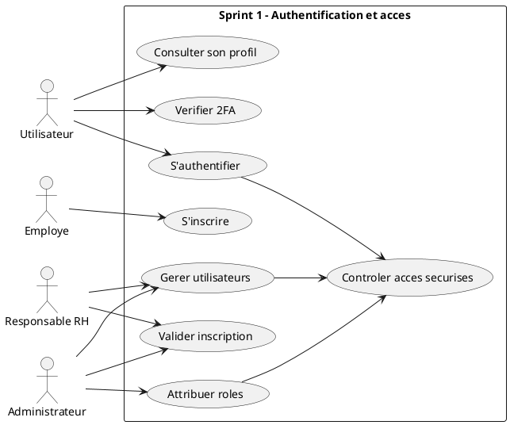
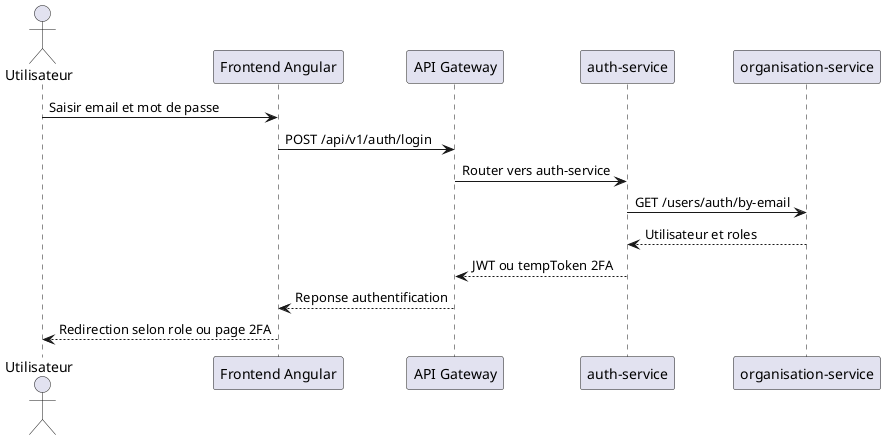
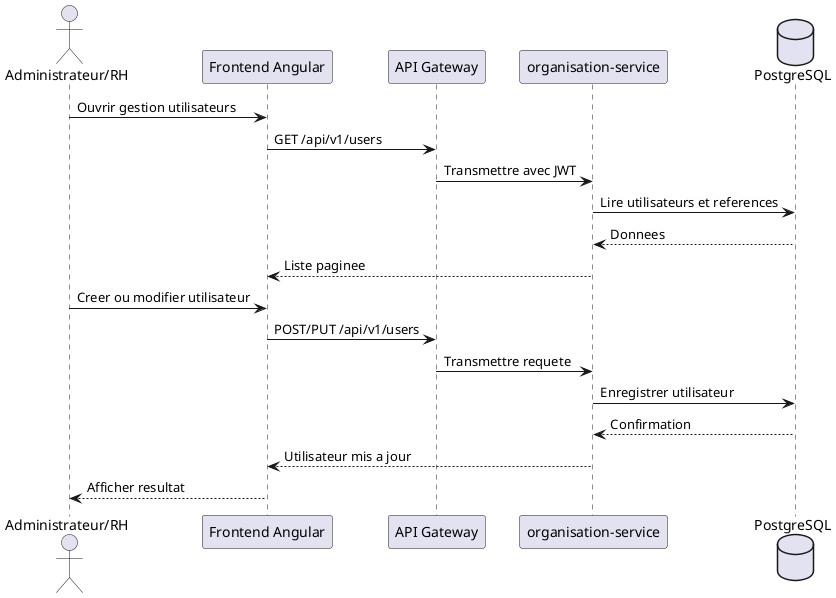
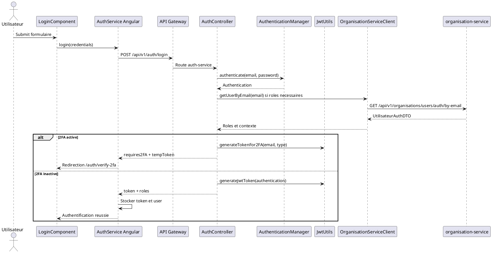
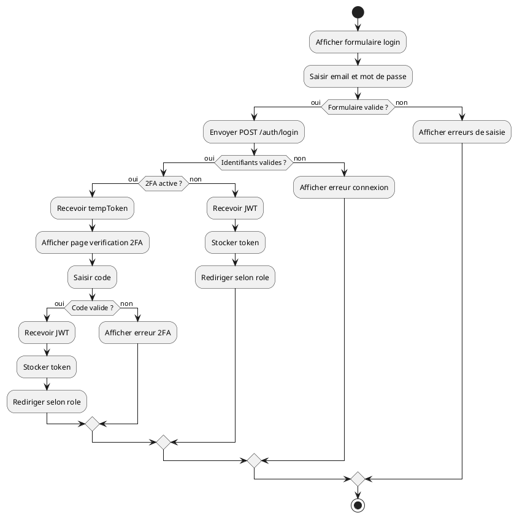
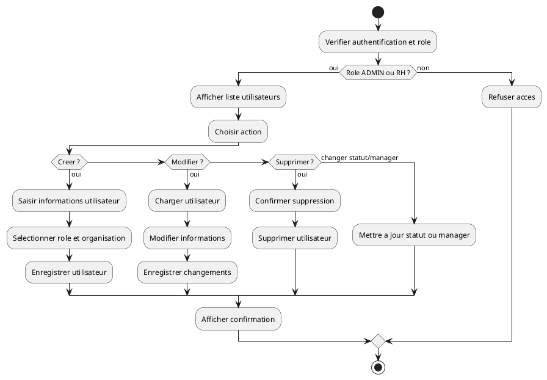

# Chapitre 3 : Sprint 1 - Authentification et Gestion des Acces

## A. Introduction du Chapitre 3

Le Sprint 1 du projet WEENTIME constitue une etape fondamentale dans la construction de la plateforme. Il porte sur la mise en place du socle de securite applicative, notamment l'authentification, la gestion des utilisateurs, l'attribution des roles et le controle des acces. Ces fonctionnalites conditionnent l'acces aux autres modules du systeme, car chaque action realisee dans l'application depend de l'identite de l'utilisateur et de ses droits.

Dans ce sprint, le travail s'articule autour de trois blocs principaux : le service d'authentification `auth-service`, le service d'organisation `organisation-service` et le frontend Angular. Le Spring Cloud Gateway joue egalement un role central, car il filtre les requetes et route les appels vers les microservices concernes. L'analyse ci-dessous repose uniquement sur les fichiers presents dans le depot WEENTIME.

## B. Specification des besoins du Sprint 1

### Objectif du sprint

L'objectif du Sprint 1 est de permettre aux utilisateurs d'acceder a WEENTIME de maniere securisee, de gerer les comptes, de leur associer des roles et de proteger les routes frontend et backend selon les droits attribues.

### Acteurs concernes

| Acteur | Role dans le Sprint 1 |
|---|---|
| Administrateur | Gere les utilisateurs, les roles et les acces globaux |
| Responsable RH | Consulte et gere des utilisateurs selon les droits confirmes |
| Manager | Accede aux espaces autorises par son role |
| Employe | S'inscrit, se connecte et accede a son espace |
| Systeme | Verifie les jetons JWT, applique les guards et filtres de securite |

### Fonctionnalites couvertes

| Fonctionnalite | Statut | Preuves |
|---|---|---|
| Connexion par email et mot de passe | realise | `AuthController.java`, `LoginComponent`, `AuthService` |
| Generation et validation JWT | realise | `JwtUtils.java`, `JwtGlobalFilter.java`, `AuthTokenFilter.java` |
| Inscription utilisateur | realise | `AuthController.java`, `UtilisateurController.java`, `RegisterComponent` |
| Verification 2FA | realise | `Verify2faRequest.java`, `TwoFactorService.java`, `Verify2faComponent` |
| Activation/desactivation 2FA | realise | `AuthController.java`, `TwoFactorService.java` |
| Gestion utilisateurs | realise | `UserController.java`, `AdminUsersComponent`, `UserService` |
| Attribution de roles | realise | `RoleController.java`, `RoleServiceImpl.java`, `AdminRolesComponent` |
| Protection des routes Angular | realise | `auth.guard.ts`, `role.guard.ts`, `admin.guard.ts` |
| Interception HTTP et ajout du token | realise | `auth.interceptor.ts`, `api-error.interceptor.ts` |
| Notifications liees aux comptes | realise | `UtilisateurServiceImpl.java`, `Notification.java`, `V10__add_notifications.sql` |
| Methode d'authentification externe | non confirmé dans le dépôt | Aucun fichier de configuration externe detecte |

### Contraintes principales

| Contrainte | Description |
|---|---|
| Securite stateless | Les services utilisent des jetons JWT et une politique sans session serveur |
| Controle par role | Les endpoints sensibles utilisent `@PreAuthorize` ou des guards Angular |
| Passage par le gateway | Les appels frontend passent par `http://localhost:8322/api/v1` |
| Persistance | Les utilisateurs, roles et informations d'organisation sont stockes dans PostgreSQL |
| Validation frontend | Les formulaires Angular valident email, mot de passe, code entreprise et code 2FA |

## C. Backlog du Sprint 1

| ID | Fonctionnalite | User Story | Priorite | Statut |
|---|---|---|---|---|
| S1-US01 | Authentification | En tant qu'utilisateur, je veux me connecter avec email et mot de passe | Haute | realise |
| S1-US02 | Jeton JWT | En tant que systeme, je veux generer et verifier un token JWT | Haute | realise |
| S1-US03 | Inscription | En tant qu'employe, je veux creer un compte avec un code entreprise | Haute | realise |
| S1-US04 | Validation compte | En tant que RH/Admin, je veux valider ou rejeter une inscription | Haute | realise |
| S1-US05 | 2FA | En tant qu'utilisateur, je veux confirmer ma connexion par un second facteur | Moyenne | realise |
| S1-US06 | Gestion utilisateurs | En tant qu'Admin/RH, je veux creer, modifier et supprimer des utilisateurs | Haute | realise |
| S1-US07 | Gestion roles | En tant qu'Admin, je veux creer, modifier et supprimer des roles | Haute | realise |
| S1-US08 | Acces par role | En tant que systeme, je veux limiter les routes selon le role | Haute | realise |
| S1-US09 | Notifications compte | En tant qu'utilisateur/RH, je veux recevoir une notification liee au compte | Moyenne | realise |

## D. Tableau des taches du Sprint 1

| Tache | Description | Module concerne | Statut |
|---|---|---|---|
| Configurer JWT backend | Generation, validation et filtrage des tokens | `auth-service`, `gateway`, `organisation-service` | realise |
| Creer les endpoints d'authentification | Login, register, validate, verify-2fa | `auth-service` | realise |
| Relier auth et organisation | Recuperation utilisateur et roles via Feign | `auth-service`, `organisation-service` | realise |
| Implementer 2FA | OTP email, TOTP, codes de secours et verrouillage | `auth-service`, `organisation-service`, Redis | realise |
| Gerer les utilisateurs | CRUD, statut, manager, rattachement organisationnel | `organisation-service`, Angular admin | realise |
| Gerer les roles | CRUD roles et permissions | `organisation-service`, Angular admin | realise |
| Proteger le frontend | Guards et redirections selon role | Angular core | realise |
| Intercepter les requetes | Ajout du Bearer token et gestion 401/403 | Angular core | realise |
| Configurer le gateway | Routage auth/users/organisations et filtre global JWT | `gateway` | realise |
| Ajouter migrations utiles | 2FA, permissions roles, notifications | `organisation-service` | realise |

## E. Analyse

### Cas d'utilisation : S'authentifier

| Element | Description |
|---|---|
| Acteur principal | Utilisateur |
| Precondition | L'utilisateur possede un compte valide dans le systeme |
| Scenario nominal | L'utilisateur saisit son email et son mot de passe ; Angular envoie la demande a `/api/v1/auth/login` ; `auth-service` authentifie l'utilisateur ; un JWT est retourne ; Angular stocke le token et redirige selon le role |
| Scenarios alternatifs | Identifiants invalides : reponse 401 ; compte avec 2FA : emission d'un `tempToken` et redirection vers la verification 2FA ; serveur indisponible : message d'erreur |
| Post-condition | L'utilisateur est connecte et accede a son espace autorise |

### Cas d'utilisation : Gerer utilisateurs

| Element | Description |
|---|---|
| Acteur principal | Administrateur ou Responsable RH |
| Precondition | L'acteur est authentifie et possede un role autorise |
| Scenario nominal | L'acteur ouvre la page admin utilisateurs ; consulte la liste ; cree ou modifie un utilisateur ; choisit le role, le statut et les rattachements ; le backend enregistre les changements |
| Scenarios alternatifs | Email deja utilise ; role invalide ; entreprise obligatoire ; droits insuffisants ; manager non eligible |
| Post-condition | Le compte utilisateur est cree, mis a jour, supprime ou change de statut |

### Cas d'utilisation : Attribuer roles

| Element | Description |
|---|---|
| Acteur principal | Administrateur |
| Precondition | L'administrateur est authentifie avec le role `ADMIN` |
| Scenario nominal | L'administrateur consulte les roles ; cree, modifie ou supprime un role ; le service organisation persiste la modification |
| Scenarios alternatifs | Role deja existant ; role introuvable ; acces refuse pour un role non admin |
| Post-condition | Les roles disponibles sont mis a jour |

### Cas d'utilisation : Verification 2FA

| Element | Description |
|---|---|
| Acteur principal | Utilisateur |
| Precondition | Le compte a la 2FA active et le login initial a retourne un `tempToken` |
| Scenario nominal | L'utilisateur saisit le code ; Angular appelle `/api/v1/auth/verify-2fa` ; le backend valide le code OTP ou TOTP ; un JWT definitif est retourne |
| Scenarios alternatifs | Code invalide ; code expire ; trop de tentatives ; compte temporairement bloque ; code de secours accepte |
| Post-condition | L'utilisateur est authentifie ou reste bloque sur l'etape 2FA |

### Cas d'utilisation : Gestion des acces securises

| Element | Description |
|---|---|
| Acteur principal | Systeme |
| Precondition | Une requete cible une route protegee |
| Scenario nominal | Angular ajoute le token dans l'en-tete `Authorization` ; le gateway verifie le token ; le microservice applique ses regles de securite ; la route Angular est controlee par guard |
| Scenarios alternatifs | Token absent ; token invalide ; role non autorise ; session expiree avec redirection vers login |
| Post-condition | L'acces est accorde ou refuse selon le token et le role |

## F. Diagrammes a produire

### 1. Diagramme de cas d'utilisation du Sprint 1



### 2. Diagramme de sequence systeme : authentification



### 3. Diagramme de sequence systeme : gestion utilisateur



### 4. Diagramme de sequence detaille : login JWT



### 5. Diagramme d'activite : authentification



### 6. Diagramme d'activite : gestion utilisateur



## G. Conception

L'architecture technique du Sprint 1 repose sur une communication entre le frontend Angular, le Spring Cloud Gateway, le service d'authentification et le service d'organisation. Le frontend definit les routes publiques `/login`, `/register` et `/auth/verify-2fa`, puis protege l'espace `/app` avec `authGuard` et `roleGuard`. Les requetes HTTP sont enrichies par `authInterceptor`, qui ajoute le token JWT dans l'en-tete `Authorization`.

Le Spring Cloud Gateway, configure sur le port `8322`, route les appels `/api/v1/auth/**` vers `auth-service` et les appels `/api/v1/users/**` ou `/api/v1/organisations/**` vers `organisation-service`. Le filtre `JwtGlobalFilter` refuse les requetes protegees si le token est absent ou invalide.

Le service `auth-service` prend en charge la connexion, l'inscription, la generation du JWT, la validation du token et les operations 2FA. Il utilise `OrganisationServiceClient` pour recuperer les donnees utilisateur et les roles depuis `organisation-service`. Le service `organisation-service` porte le modele metier des utilisateurs, roles, entreprises, departements, equipes et notifications de base.

La persistance est assuree par PostgreSQL. Les migrations confirment l'existence de structures liees a la 2FA, aux permissions de roles et aux notifications.

## H. Realisation

### Backend controllers

| Fichier | Role |
|---|---|
| `AuthController.java` | Expose login, register, validate token, verify-2fa, setup/confirm/disable 2FA, create RH |
| `UserController.java` | Expose CRUD utilisateurs, roles simples, statuts, references organisationnelles |
| `UtilisateurController.java` | Gere utilisateurs organisationnels, inscription, validation, rejet, statut, manager, 2FA interne |
| `RoleController.java` | Expose CRUD des roles |

### Services backend

| Fichier | Role |
|---|---|
| `TwoFactorService.java` | Genere OTP, verifie TOTP, gere tentatives et verrouillage avec Redis |
| `EmailService.java` | Envoie le code OTP par email |
| `UserDetailsServiceImpl.java` | Charge l'utilisateur pour Spring Security |
| `UtilisateurServiceImpl.java` | Gere creation, inscription, validation, roles, rattachements, notifications |
| `RoleServiceImpl.java` | Gere creation, lecture, mise a jour et suppression des roles |

### Entities, DTO et repositories

| Element | Fichiers confirmes |
|---|---|
| Entites | `Utilisateur.java`, `Role.java`, `Entreprise.java`, `Departement.java`, `Equipe.java`, `Notification.java`, `Token.java`, `UserAuditLog.java` |
| DTO auth | `LoginRequest.java`, `JwtResponse.java`, `RegisterRequest.java`, `RegisterResponse.java`, `Verify2faRequest.java`, `UtilisateurAuthDTO.java` |
| DTO organisation | `UserManagementRequest.java`, `UtilisateurRequest.java`, `RoleRequest.java`, `UtilisateurResponse.java`, `RoleResponse.java`, `UserManagementResponse.java` |
| Repositories | `UtilisateurRepository.java`, `RoleRepository.java`, `EntrepriseRepository.java`, `DepartementRepository.java`, `EquipeRepository.java`, `NotificationRepository.java` |

### Frontend Angular

| Fichier | Role |
|---|---|
| `login.component.ts` | Formulaire de connexion et redirection selon le role |
| `register.component.ts` | Inscription avec code entreprise et donnees utilisateur |
| `verify-2fa.component.ts` | Saisie et verification du code 2FA |
| `auth.service.ts` | Appels login/register/verify2fa, stockage token et utilisateur |
| `admin-users.component.ts` | Interface de gestion des utilisateurs |
| `user.service.ts` | Appels API pour utilisateurs, roles, statuts et references |
| `admin-roles.component.ts` | Interface de gestion des roles |
| `role.service.ts` | Appels API CRUD roles |
| `auth.guard.ts` | Protection des routes authentifiees |
| `role.guard.ts` | Controle d'acces par role |
| `admin.guard.ts` | Controle d'acces admin |
| `auth.interceptor.ts` | Ajout du Bearer token et gestion 401 |
| `api-error.interceptor.ts` | Gestion des erreurs API |

### Paragraphes de realisation

La realisation du Sprint 1 commence par l'authentification. Le composant Angular `LoginComponent` collecte les identifiants et appelle `AuthService`, qui transmet la requete au backend via le gateway. Le `AuthController` utilise Spring Security pour authentifier l'utilisateur. Si l'authentification est valide, le service genere un token JWT contenant les informations principales, notamment l'identifiant utilisateur, l'entreprise et les roles.

La double authentification est confirmee dans le depot. Lorsqu'un compte possede la 2FA active, `auth-service` ne retourne pas directement un JWT final mais un `tempToken`. Le frontend redirige alors vers `Verify2faComponent`. Le code saisi est valide par `TwoFactorService`, qui prend en charge les codes OTP email, TOTP, les codes de secours et le verrouillage temporaire apres plusieurs echecs.

La gestion des utilisateurs est realisee dans `organisation-service`. Les controllers `UserController` et `UtilisateurController` exposent des operations de creation, modification, suppression, consultation, changement de statut, validation d'inscription et affectation manager. Le service `UtilisateurServiceImpl` applique les regles metier, encode les mots de passe et rattache les utilisateurs a une entreprise, un departement, une equipe et un role.

La gestion des roles est portee par `RoleController` et `RoleServiceImpl`. Les operations de creation, consultation, modification et suppression de roles sont exposees, avec des restrictions d'acces par annotations `@PreAuthorize`. Cote frontend, `AdminRolesComponent` et `RoleService` fournissent l'interface et les appels HTTP correspondants.

Enfin, les acces sont controles a plusieurs niveaux. Angular utilise `authGuard`, `roleGuard` et `adminGuard` pour limiter la navigation. Les requetes HTTP sont enrichies avec le token JWT par `authInterceptor`. Cote backend, le gateway applique `JwtGlobalFilter`, tandis que les microservices verifient egalement les autorisations par filtres et annotations de securite.

## I. Tests et validation

| Test | Objectif | Resultat attendu | Statut |
|---|---|---|---|
| Login correct | Verifier l'acces avec identifiants valides | JWT retourne ou demande 2FA | realise |
| Login incorrect | Refuser des identifiants invalides | Reponse 401 et message d'erreur | realise |
| Token JWT | Verifier la generation et validation du token | Token signe et accepte par gateway | realise |
| Acces selon role | Proteger les espaces admin/rh/manager/employee | Redirection ou refus selon role | realise |
| Creation utilisateur | Ajouter un compte via admin/RH | Utilisateur persiste et visible | realise |
| Attribution role | Associer un role metier a un utilisateur | Role sauvegarde et applique | realise |
| Verification 2FA | Valider un OTP/TOTP ou code de secours | JWT final retourne si code valide | realise |
| Trop de tentatives 2FA | Proteger contre les essais repetes | Compte temporairement bloque | realise |
| Inscription avec code entreprise | Associer l'utilisateur a une entreprise | Compte cree en statut attendu | realise |
| Methode externe d'authentification | Verifier une solution externe | non confirmé dans le dépôt | non confirmé dans le dépôt |

## J. Conclusion du chapitre

Le Sprint 1 a permis de mettre en place le socle de securite de WEENTIME. Les fonctionnalites d'authentification, d'inscription, de generation JWT, de verification 2FA, de gestion des utilisateurs et d'attribution des roles sont confirmees par le depot. Le frontend Angular, le gateway et les microservices Spring Boot cooperent pour assurer une separation claire entre interface, routage, securite et logique metier.

Cette base rend possible la suite du projet, car les prochains sprints peuvent s'appuyer sur des utilisateurs identifies, des roles definis et des routes protegees. Le Sprint 2 peut ainsi approfondir les fonctionnalites metier de l'organisation RH, de la presence ou des processus RH, tout en reutilisant le cadre d'acces securise etabli dans ce sprint.

## K. Code LaTeX final

```latex
\chapter{Sprint 1 : Authentification et Gestion des Accès}

\section*{Introduction}
\addcontentsline{toc}{section}{Introduction}

Le Sprint 1 constitue une étape essentielle dans le développement de WEENTIME. Il met en place le socle de sécurité de l'application, à travers l'authentification, la gestion des utilisateurs, l'attribution des rôles et le contrôle des accès. Ces fonctionnalités sont indispensables car elles conditionnent l'accès aux autres modules de la plateforme.

Ce sprint s'appuie principalement sur le frontend Angular, le Spring Cloud Gateway, le service \texttt{auth-service} et le service \texttt{organisation-service}. L'analyse présentée dans ce chapitre repose uniquement sur les éléments confirmés dans le dépôt du projet.

\section{Spécification des besoins}

L'objectif du Sprint 1 est de permettre aux utilisateurs de s'inscrire, de se connecter, de recevoir un jeton JWT, d'utiliser une vérification 2FA lorsque celle-ci est activée, et d'accéder aux fonctionnalités selon leur rôle.

\begin{table}[H]
\centering
\begin{tabular}{|p{4cm}|p{8cm}|}
\hline
\textbf{Acteur} & \textbf{Rôle} \\
\hline
Administrateur & Gestion des utilisateurs, des rôles et des accès globaux \\
\hline
Responsable RH & Gestion des utilisateurs autorisés et validation des inscriptions \\
\hline
Manager & Accès aux espaces autorisés par son rôle \\
\hline
Employé & Inscription, connexion et accès à son espace \\
\hline
Système & Vérification JWT, guards Angular et filtres de sécurité \\
\hline
\end{tabular}
\caption{Acteurs du Sprint 1}
\end{table}

\subsection{Diagramme de cas d’utilisation du sprint 1}

\begin{verbatim}
@startuml
left to right direction
actor "Utilisateur" as User
actor "Employe" as Emp
actor "Responsable RH" as RH
actor "Administrateur" as Admin
rectangle "Sprint 1" {
  usecase "S'authentifier" as UC_LOGIN
  usecase "S'inscrire" as UC_REGISTER
  usecase "Verifier 2FA" as UC_2FA
  usecase "Gerer utilisateurs" as UC_USERS
  usecase "Attribuer roles" as UC_ROLES
  usecase "Controler acces" as UC_ACCESS
}
User --> UC_LOGIN
Emp --> UC_REGISTER
User --> UC_2FA
RH --> UC_USERS
Admin --> UC_USERS
Admin --> UC_ROLES
UC_LOGIN --> UC_ACCESS
@enduml
\end{verbatim}

\subsection{Backlog du sprint 1}

\begin{table}[H]
\centering
\begin{tabular}{|p{2cm}|p{3cm}|p{5cm}|p{2cm}|p{2cm}|}
\hline
\textbf{ID} & \textbf{Fonctionnalité} & \textbf{User Story} & \textbf{Priorité} & \textbf{Statut} \\
\hline
S1-US01 & Authentification & Se connecter avec email et mot de passe & Haute & réalisé \\
\hline
S1-US02 & JWT & Générer et vérifier un jeton JWT & Haute & réalisé \\
\hline
S1-US03 & Inscription & Créer un compte avec code entreprise & Haute & réalisé \\
\hline
S1-US04 & 2FA & Confirmer la connexion par second facteur & Moyenne & réalisé \\
\hline
S1-US05 & Utilisateurs & Créer, modifier et supprimer des utilisateurs & Haute & réalisé \\
\hline
S1-US06 & Rôles & Attribuer et gérer les rôles & Haute & réalisé \\
\hline
S1-US07 & Accès & Protéger les routes selon le rôle & Haute & réalisé \\
\hline
\end{tabular}
\caption{Backlog du Sprint 1}
\end{table}

\section{Analyse}

\subsection{Raffinement des cas d’utilisation}

Le cas d'utilisation \og S'authentifier \fg{} concerne tout utilisateur possédant un compte. Le scénario nominal consiste à saisir l'email et le mot de passe, puis à recevoir un jeton JWT ou une demande de vérification 2FA. En cas d'identifiants invalides, l'accès est refusé.

Le cas d'utilisation \og Gérer utilisateurs \fg{} concerne l'administrateur et le responsable RH. Il couvre la consultation, la création, la modification, la suppression, le changement de statut et l'affectation organisationnelle des utilisateurs.

Le cas d'utilisation \og Attribuer rôles \fg{} est principalement porté par l'administrateur. Le système permet la consultation, la création, la modification et la suppression de rôles confirmées dans le service organisation.

Le cas d'utilisation \og Vérifier 2FA \fg{} est confirmé dans le dépôt. Il intervient lorsqu'un utilisateur possède la double authentification active. Le système valide un code OTP, TOTP ou un code de secours avant de délivrer le JWT final.

\subsection{Diagrammes de séquences système}

\begin{verbatim}
@startuml
actor "Utilisateur" as U
participant "Frontend Angular" as FE
participant "API Gateway" as GW
participant "auth-service" as AUTH
participant "organisation-service" as ORG
U -> FE: Saisir identifiants
FE -> GW: POST /api/v1/auth/login
GW -> AUTH: Router requete
AUTH -> ORG: Charger utilisateur
ORG --> AUTH: Utilisateur et roles
AUTH --> FE: JWT ou tempToken 2FA
FE --> U: Redirection selon role
@enduml
\end{verbatim}

\begin{verbatim}
@startuml
actor "Admin/RH" as A
participant "Frontend Angular" as FE
participant "API Gateway" as GW
participant "organisation-service" as ORG
database "PostgreSQL" as DB
A -> FE: Ouvrir gestion utilisateurs
FE -> GW: GET /api/v1/users
GW -> ORG: Transmettre avec JWT
ORG -> DB: Lire utilisateurs
DB --> ORG: Donnees
ORG --> FE: Liste
A -> FE: Creer ou modifier
FE -> GW: POST/PUT /api/v1/users
GW -> ORG: Transmettre
ORG -> DB: Enregistrer
ORG --> FE: Resultat
@enduml
\end{verbatim}

\section{Conception}

\subsection{Diagrammes de séquence détaillés}

\begin{verbatim}
@startuml
actor "Utilisateur" as U
participant "LoginComponent" as LC
participant "AuthService" as AS
participant "Gateway" as GW
participant "AuthController" as AC
participant "AuthenticationManager" as AM
participant "JwtUtils" as JWT
U -> LC: Valider formulaire
LC -> AS: login()
AS -> GW: POST /auth/login
GW -> AC: Route auth-service
AC -> AM: authenticate()
AM --> AC: Authentication
alt 2FA active
  AC -> JWT: generateTokenFor2FA()
  AC --> AS: tempToken
else 2FA inactive
  AC -> JWT: generateJwtToken()
  AC --> AS: JWT
end
AS --> LC: Resultat
@enduml
\end{verbatim}

\subsection{Diagrammes d’activités}

\begin{verbatim}
@startuml
start
:Afficher login;
:Saisir identifiants;
if (Identifiants valides ?) then (oui)
  if (2FA active ?) then (oui)
    :Verifier code;
    if (Code valide ?) then (oui)
      :Recevoir JWT;
    else (non)
      :Afficher erreur;
    endif
  else (non)
    :Recevoir JWT;
  endif
  :Rediriger selon role;
else (non)
  :Refuser connexion;
endif
stop
@enduml
\end{verbatim}

\begin{verbatim}
@startuml
start
:Verifier role ADMIN ou RH;
if (Autorise ?) then (oui)
  :Afficher utilisateurs;
  :Choisir action;
  :Creer, modifier ou supprimer;
  :Enregistrer en base;
  :Afficher confirmation;
else (non)
  :Refuser acces;
endif
stop
@enduml
\end{verbatim}

L'architecture technique du Sprint 1 repose sur Angular, le Gateway, \texttt{auth-service}, \texttt{organisation-service}, PostgreSQL, JWT, les guards Angular et les interceptors HTTP. Le frontend protège les routes avec \texttt{authGuard}, \texttt{roleGuard} et \texttt{adminGuard}. Les requêtes sont enrichies par \texttt{authInterceptor}. Le Gateway applique un filtre JWT global avant de transmettre les appels aux microservices.

\section{Réalisation}

La réalisation backend s'appuie sur \texttt{AuthController}, \texttt{JwtUtils}, \texttt{AuthTokenFilter}, \texttt{WebSecurityConfig}, \texttt{TwoFactorService}, \texttt{EmailService} et \texttt{OrganisationServiceClient}. Le service organisation regroupe \texttt{UserController}, \texttt{UtilisateurController}, \texttt{RoleController}, \texttt{UtilisateurServiceImpl}, \texttt{RoleServiceImpl}, les entités \texttt{Utilisateur}, \texttt{Role}, \texttt{Entreprise}, \texttt{Departement}, \texttt{Equipe} et \texttt{Notification}.

La réalisation frontend s'appuie sur \texttt{LoginComponent}, \texttt{RegisterComponent}, \texttt{Verify2faComponent}, \texttt{AuthService}, \texttt{AdminUsersComponent}, \texttt{UserService}, \texttt{AdminRolesComponent}, \texttt{RoleService}, les guards et les interceptors Angular.

\section{Tests et validation}

\begin{table}[H]
\centering
\begin{tabular}{|p{4cm}|p{5cm}|p{4cm}|p{2cm}|}
\hline
\textbf{Test} & \textbf{Objectif} & \textbf{Résultat attendu} & \textbf{Statut} \\
\hline
Login correct & Vérifier les identifiants valides & JWT ou 2FA demandé & réalisé \\
\hline
Login incorrect & Refuser un mauvais mot de passe & Réponse 401 & réalisé \\
\hline
Token JWT & Valider le token & Accès autorisé & réalisé \\
\hline
Accès selon rôle & Contrôler les routes & Redirection ou refus & réalisé \\
\hline
Création utilisateur & Ajouter un compte & Compte enregistré & réalisé \\
\hline
Attribution rôle & Affecter un rôle & Rôle appliqué & réalisé \\
\hline
2FA & Valider un OTP/TOTP & JWT final retourné & réalisé \\
\hline
\end{tabular}
\caption{Tests et validation du Sprint 1}
\end{table}

\section*{Conclusion}
\addcontentsline{toc}{section}{Conclusion}

Le Sprint 1 a permis d'établir la base sécurisée de WEENTIME. L'authentification, la génération JWT, la vérification 2FA, la gestion des utilisateurs, l'attribution des rôles et la protection des accès sont confirmées par les fichiers du dépôt. Cette base prépare les prochains sprints, qui pourront développer les fonctionnalités métier en s'appuyant sur des utilisateurs identifiés et des droits clairement contrôlés.
```

## Liste des fichiers utilises comme preuves

| Fichier | Information utilisee |
|---|---|
| `weentime-backend/services/auth-service/src/main/java/com/weentime/weentimeapp/controller/AuthController.java` | Login, register, validate token, verify-2fa, setup/confirm/disable 2FA |
| `weentime-backend/services/auth-service/src/main/java/com/weentime/weentimeapp/security/JwtUtils.java` | Generation et validation JWT |
| `weentime-backend/services/auth-service/src/main/java/com/weentime/weentimeapp/security/AuthTokenFilter.java` | Filtrage JWT cote auth-service |
| `weentime-backend/services/auth-service/src/main/java/com/weentime/weentimeapp/security/WebSecurityConfig.java` | Configuration Spring Security stateless |
| `weentime-backend/services/auth-service/src/main/java/com/weentime/weentimeapp/security/services/TwoFactorService.java` | OTP, TOTP, backup codes, verrouillage |
| `weentime-backend/services/auth-service/src/main/java/com/weentime/weentimeapp/security/services/EmailService.java` | Envoi OTP email |
| `weentime-backend/services/auth-service/src/main/java/com/weentime/weentimeapp/client/OrganisationServiceClient.java` | Appels Feign vers organisation-service |
| `weentime-backend/services/auth-service/src/main/java/com/weentime/weentimeapp/dto` | DTO auth : login, register, JWT, 2FA |
| `weentime-backend/services/organisation-service/src/main/java/com/weentime/weentimeproject/controller/UserController.java` | CRUD utilisateurs admin/RH |
| `weentime-backend/services/organisation-service/src/main/java/com/weentime/weentimeproject/controller/UtilisateurController.java` | Inscription, validation, statut, manager, 2FA interne |
| `weentime-backend/services/organisation-service/src/main/java/com/weentime/weentimeproject/controller/RoleController.java` | CRUD roles |
| `weentime-backend/services/organisation-service/src/main/java/com/weentime/weentimeproject/service/impl/UtilisateurServiceImpl.java` | Logique metier utilisateurs, roles, notifications |
| `weentime-backend/services/organisation-service/src/main/java/com/weentime/weentimeproject/service/impl/RoleServiceImpl.java` | Logique metier roles |
| `weentime-backend/services/organisation-service/src/main/java/com/weentime/weentimeproject/entity` | Entites utilisateur, role, entreprise, departement, equipe, notification |
| `weentime-backend/services/organisation-service/src/main/java/com/weentime/weentimeproject/repository` | Repositories utilisateurs, roles et organisation |
| `weentime-backend/services/gateway/src/main/java/com/weentime/gateway/security/JwtGlobalFilter.java` | Controle JWT global dans le gateway |
| `weentime-backend/services/gateway/src/main/resources/application.yml` | Routes auth, users, organisations |
| `weentime-backend/services/auth-service/src/main/resources/application.yml` | Port, Redis, mail, JWT, organisation-service |
| `weentime-backend/services/organisation-service/src/main/resources/application.yml` | Port, datasource PostgreSQL, JWT, Flyway |
| `weentime-backend/services/organisation-service/src/main/resources/db/migration/V4__add_2fa_support.sql` | Migration 2FA |
| `weentime-backend/services/organisation-service/src/main/resources/db/migration/V9__add_role_permissions.sql` | Permissions des roles |
| `weentime-backend/services/organisation-service/src/main/resources/db/migration/V10__add_notifications.sql` | Notifications de base |
| `weentime-frontend/angular-weentime/src/app/core/services/auth.service.ts` | Auth Angular, token, profil, roles |
| `weentime-frontend/angular-weentime/src/app/features/auth/login/login.component.ts` | Page login |
| `weentime-frontend/angular-weentime/src/app/features/auth/register/register.component.ts` | Page inscription |
| `weentime-frontend/angular-weentime/src/app/features/auth/verify-2fa/verify-2fa.component.ts` | Page 2FA |
| `weentime-frontend/angular-weentime/src/app/features/admin/users/admin-users.component.ts` | Interface admin utilisateurs |
| `weentime-frontend/angular-weentime/src/app/features/admin/users/user.service.ts` | API Angular utilisateurs |
| `weentime-frontend/angular-weentime/src/app/features/admin/roles/admin-roles.component.ts` | Interface admin roles |
| `weentime-frontend/angular-weentime/src/app/features/admin/roles/role.service.ts` | API Angular roles |
| `weentime-frontend/angular-weentime/src/app/core/guards` | Guards auth, role et admin |
| `weentime-frontend/angular-weentime/src/app/core/interceptors` | Interceptors auth, erreurs et chargement |
| `weentime-frontend/angular-weentime/src/app/app.routes.ts` | Routes login/register/verify-2fa/app |
| `weentime-frontend/angular-weentime/src/app/app.config.ts` | Interceptors Angular enregistres |
