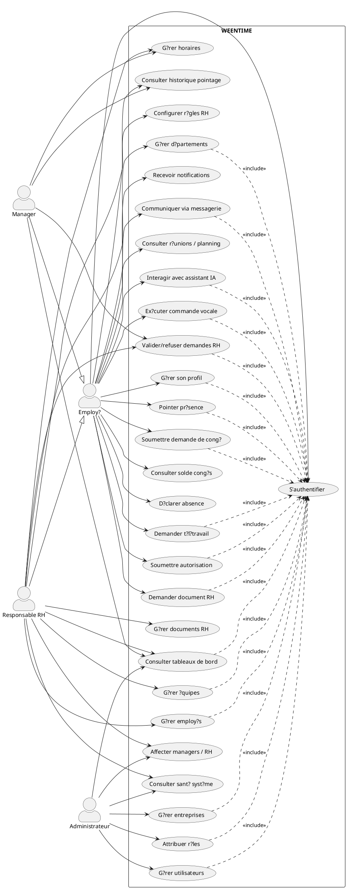

# 5. Diagrammes UML globaux ? WEENTIME

## 5.1 Diagramme de cas d'utilisation global

Le diagramme de cas d'utilisation global repr?sente les interactions fonctionnelles entre les quatre acteurs m?tier et la plateforme WEENTIME. Les composants techniques internes, notamment l'Assistant IA, le module vocal, FastAPI, Whisper et Ollama, ne sont pas mod?lis?s comme acteurs ; ils apparaissent uniquement comme m?canismes internes permettant d'ex?cuter certains cas d'utilisation.

## 5.2 Diagramme de classes global

Le diagramme de classes global regroupe les principales entit?s m?tier observ?es dans les microservices Spring Boot ainsi que les composants internes du service AI FastAPI. Les classes du module IA ne repr?sentent pas des acteurs externes ; elles mod?lisent l'orchestration interne du chatbot et de la voix.

```plantuml
@startuml weentime_global_class_diagram
skinparam packageStyle rectangle
skinparam classAttributeIconSize 0
hide circle

package "Organisation" {
  class Entreprise {
    +id : Long
    +nom : String
    +adresse : String
    +email : String
    +siret : String
    +siteWeb : String
    +telephone : String
    +codeInvitation : String
    +maxUsers : Integer
    +currentUsers : Integer
    +secteur : String
    +createdAt : LocalDateTime
    +updatedAt : LocalDateTime
  }

  class Utilisateur {
    +id : Long
    +nom : String
    +prenom : String
    +email : String
    +motDePasse : String
    +telephone : String
    +poste : String
    +avatarUrl : String
    +statut : StatutUtilisateurEnum
    +dateCreation : LocalDateTime
    +dateModification : LocalDateTime
  }

  class Role {
    +id : Long
    +nom : RoleNom
    +description : String
  }

  class Departement {
    +id : Long
    +nom : String
    +description : String
    +codeInterne : String
  }

  class Equipe {
    +id : Long
    +nom : String
    +description : String
    +effectifMaximum : Integer
    +estActive : Boolean
    +createdAt : LocalDateTime
  }

  class "Notification" as OrgNotification {
    +id : Long
    +title : String
    +message : String
    +type : NotificationType
    +isRead : Boolean
    +createdAt : LocalDateTime
    +readAt : LocalDateTime
    +actionUrl : String
  }

  class UserAuditLog {
    +id : Long
    +action : String
    +performedBy : String
    +targetUser : String
    +details : String
    +createdAt : LocalDateTime
  }
}

package "RH" {
  abstract class Demande {
    +id : Long
    +utilisateurId : Long
    +managerId : Long
    +entrepriseId : Long
    +motif : String
    +commentaire : String
    +statut : StatutDemandeEnum
    +typeDemande : TypeDemandeEnum
    +dateCreation : LocalDateTime
    +dateDecision : LocalDateTime
    +commentaireValidateur : String
    +version : Long
  }

  class Conge {
    +dateDebut : LocalDate
    +dateFin : LocalDate
    +nombreJours : Integer
    +typeCongeId : Long
    +justificatifFourni : Boolean
  }

  class Autorisation {
    +typeAutorisation : TypeAutorisation
    +heureDebut : LocalTime
    +heureFin : LocalTime
    +duree : Integer
  }

  class Teletravail {
    +dateDebut : LocalDate
    +dateFin : LocalDate
    +nombreJours : Double
    +adresse : String
    +etapeActuelle : String
    +commentaireManager : String
    +commentaireRH : String
  }

  class Document {
    +typeDocument : TypeDocument
    +moisConcerne : String
    +documentUrl : String
    +generatedByAI : boolean
    +contenuIA : String
    +commentaireRH : String
    +aiModelUsed : String
    +tokensUsed : Integer
  }

  class TypeConge {
    +id : Long
    +entrepriseId : Long
    +libelle : String
    +nombreJoursMax : Integer
    +decompteJours : Boolean
    +requireJustificatif : Boolean
  }

  class SoldeConge {
    +id : Long
    +utilisateurId : Long
    +entrepriseId : Long
    +typeCongeId : Long
    +annee : Integer
    +joursAcquis : Double
    +joursUtilises : Double
    +joursRestants : Double
    +joursEnAttente : Double
  }

  class TypeAutorisation {
    +id : Long
    +entrepriseId : Long
    +libelle : String
    +maxHeuresMois : Integer
    +requireJustificatif : Boolean
  }

  class TypeDocument {
    +id : Long
    +entrepriseId : Long
    +libelle : String
    +code : String
    +categorie : String
    +modeGeneration : String
    +contentTemplate : String
    +aiPromptTemplate : String
  }

  class Reunion {
    +id : Long
    +titre : String
    +description : String
    +dateReunion : LocalDate
    +heureDebut : LocalTime
    +heureFin : LocalTime
    +type : ReunionType
    +statut : ReunionStatut
    +organisateurId : Long
    +entrepriseId : Long
  }

  class ParticipantReunion {
    +id : ParticipantReunionId
    +utilisateurId : Long
    +reponse : RSVPResponse
    +present : boolean
    +rappelMinutes : Integer
  }
}

package "Pr?sence" {
  class AttendanceSession {
    +id : Long
    +utilisateurId : Long
    +date : LocalDate
    +checkInTime : LocalDateTime
    +checkOutTime : LocalDateTime
    +duration : Long
    +status : AttendanceSessionStatus
    +source : PresenceSource
    +lateArrival : Boolean
    +dailyStatus : AttendanceDayStatus
  }

  class "Presence" as PresencePointage {
    +id : Long
    +utilisateurId : Long
    +date : LocalDate
    +heureEntree : LocalDateTime
    +heureSortie : LocalDateTime
    +totalHeuresTravaillees : BigDecimal
    +status : PresenceStatus
    +source : PresenceSource
    +localisation : String
  }

  class WorkSchedule {
    +id : Long
    +utilisateurId : Long
    +heureDebut : LocalTime
    +heureFin : LocalTime
    +toleranceRetardMinutes : Integer
  }

  class HoraireModele {
    +id : Long
    +nom : String
    +type : TypeHoraireModele
    +heuresHebdo : Double
    +isDefaut : Boolean
    +statut : StatutHoraireModele
    +entrepriseId : Long
  }

  class HoraireJour {
    +id : Long
    +jourSemaine : DayOfWeek
    +estTravaille : Boolean
  }

  class HorairePlage {
    +id : Long
    +type : TypePlageHoraire
    +heureDebut : LocalTime
    +heureFin : LocalTime
    +ordre : Integer
  }

  class AffectationHoraire {
    +id : Long
    +cibleType : CibleType
    +cibleId : Long
    +dateDebut : LocalDate
    +dateFin : LocalDate
    +motif : String
    +priorite : Integer
    +entrepriseId : Long
  }

  class Overtime {
    +id : Long
    +utilisateurId : Long
    +date : LocalDate
    +heuresSupplementaires : BigDecimal
    +approuvee : Boolean
  }
}

package "Communication" {
  class CommChannel {
    +id : UUID
    +entrepriseId : Long
    +type : ChannelType
    +visibility : ChannelVisibility
    +slug : String
    +name : String
    +description : String
    +equipeId : Long
    +isPrivate : boolean
    +isArchived : boolean
    +createdBy : Long
  }

  class CommChannelMember {
    +id : CommChannelMemberId
    +entrepriseId : Long
    +role : ChannelMemberRole
    +notificationLevel : String
    +lastReadMessageId : UUID
    +lastReadAt : Instant
    +isMuted : boolean
    +isPinned : boolean
  }

  class CommMessage {
    +id : UUID
    +entrepriseId : Long
    +channelId : UUID
    +senderId : Long
    +parentMessageId : UUID
    +type : MessageType
    +body : String
    +richBody : String
    +status : MessageStatus
    +createdAt : Instant
  }

  class CommReaction {
    +id : CommReactionId
    +entrepriseId : Long
    +createdAt : Instant
  }

  class CommAttachment {
    +id : UUID
    +entrepriseId : Long
    +uploaderId : Long
    +messageId : UUID
    +fileName : String
    +contentType : String
    +fileSize : Long
    +storagePath : String
  }

  class CommAuditLog {
    +id : UUID
    +entrepriseId : Long
    +entityType : String
    +entityId : String
    +action : String
    +actorId : Long
    +createdAt : Instant
  }
}

package "IA et Vocal" {
  class WorkflowOrchestrator
  class RouterAgent
  class ToolRegistry
  class RegisteredTool
  class PolicyRetriever
  class ChromaPolicyRetriever
  class PolicySource
  class PolicyCitation
  class SpeechToTextService
  class VoiceProcessingResult
  class TextToSpeechService
  class VoiceRoleRouter
  class VoiceSummaryBuilder
  class SessionState
}

Entreprise "1" o-- "0..*" Departement
Entreprise "1" o-- "0..*" Utilisateur
Departement "1" o-- "0..*" Equipe
Departement "1" o-- "0..*" Utilisateur
Equipe "1" o-- "0..*" Utilisateur
Utilisateur "0..1" --> "0..*" Utilisateur : manager
Utilisateur "*" -- "*" Role
Utilisateur "1" -- "0..*" OrgNotification
Utilisateur "1" -- "0..*" UserAuditLog

Demande <|-- Conge
Demande <|-- Autorisation
Demande <|-- Teletravail
Demande <|-- Document
TypeConge "1" -- "0..*" Conge
TypeConge "1" -- "0..*" SoldeConge
Utilisateur "1" -- "0..*" SoldeConge
TypeAutorisation "1" -- "0..*" Autorisation
TypeDocument "1" -- "0..*" Document
Reunion "1" o-- "0..*" ParticipantReunion

Utilisateur "1" -- "0..*" AttendanceSession
Utilisateur "1" -- "0..*" PresencePointage
Utilisateur "1" -- "0..*" WorkSchedule
HoraireModele "1" o-- "1..*" HoraireJour
HoraireJour "1" o-- "0..*" HorairePlage
HoraireModele "1" -- "0..*" AffectationHoraire
Utilisateur "1" -- "0..*" Overtime

CommChannel "1" o-- "0..*" CommChannelMember
CommChannel "1" o-- "0..*" CommMessage
CommMessage "1" o-- "0..*" CommReaction
CommMessage "1" o-- "0..*" CommAttachment
CommChannelMember "*" --> "1" Utilisateur
CommMessage "*" --> "1" Utilisateur : senderId
CommAuditLog "*" --> "1" Utilisateur : actorId

WorkflowOrchestrator --> RouterAgent
WorkflowOrchestrator --> ToolRegistry
RouterAgent --> RegisteredTool : s?lectionne
ToolRegistry --> RegisteredTool : contient
WorkflowOrchestrator --> PolicyRetriever
PolicyRetriever --> PolicySource
PolicyRetriever --> PolicyCitation
ChromaPolicyRetriever --|> PolicyRetriever
SpeechToTextService --> VoiceProcessingResult
VoiceRoleRouter --> VoiceSummaryBuilder
WorkflowOrchestrator --> SessionState
TextToSpeechService --> VoiceRoleRouter : r?ponse vocale
@enduml
```

## 5.3 Notes de lecture

- La classe `Demande` est la base m?tier des demandes RH sp?cialis?es : cong?, autorisation, t?l?travail et document.
- Le module communication poss?de ses propres entit?s, pr?fix?es `Comm`, afin d'?viter les collisions avec les notifications organisationnelles et RH.
- Les entit?s `Presence` existent dans deux services ; le diagramme global distingue la pr?sence de pointage du service pr?sence avec l'alias `PresencePointage`.
- Les classes IA/vocal sont des classes internes Python observ?es dans le service FastAPI ; elles expliquent l'orchestration mais ne remplacent pas les entit?s m?tier Spring Boot.
