# 6. Diagrammes UML par sprint ? WEENTIME

## Sprint 0 ? Analyse et sp?cification

### Cas d'utilisation ? Sprint 0

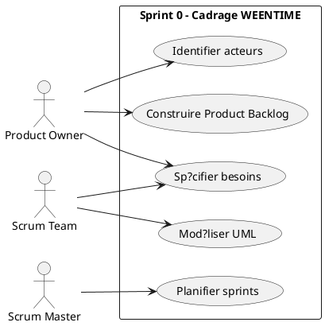

### Classes ? Sprint 0

```plantuml
@startuml sprint0_class
skinparam packageStyle rectangle
title Sprint 0 - Aucun mod?le persistant introduit
note "Le Sprint 0 correspond ? l'analyse, la sp?cification et la planification.
Il ne cr?e pas d'entit? applicative persistante dans le code WEENTIME.
Les classes m?tier r?elles apparaissent ? partir du Sprint 1." as Sprint0Note
@enduml
```

### S?quence ? Analyse du besoin

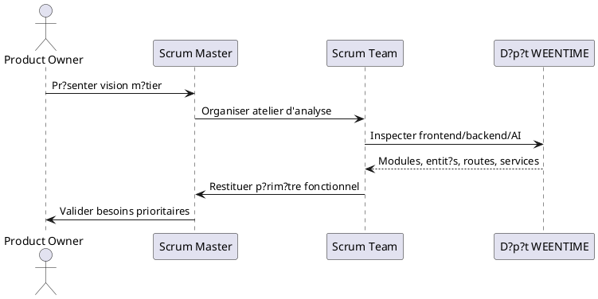

### S?quence ? Construction du backlog

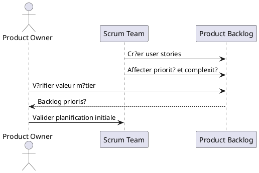

### Activit? ? Sprint 0

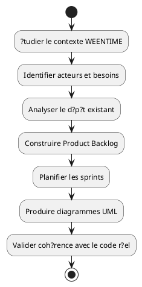

## Sprint 1 ? Authentification, r?les et organisation

### Cas d'utilisation ? Sprint 1

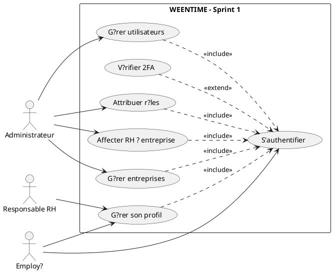

### Classes ? Sprint 1

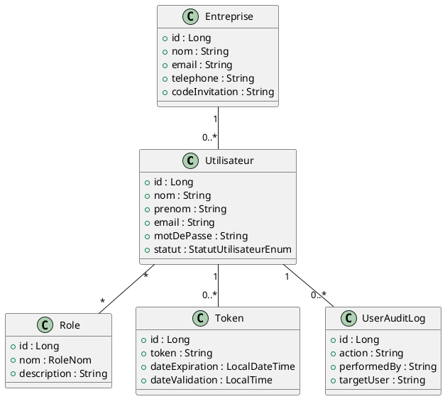

### S?quence ? Authentification JWT

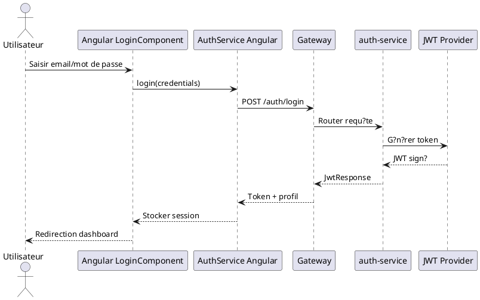

### S?quence ? Cr?ation utilisateur et r?le

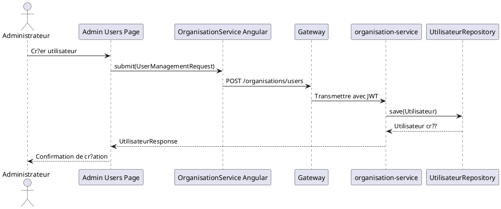

### Activit? ? Connexion s?curis?e

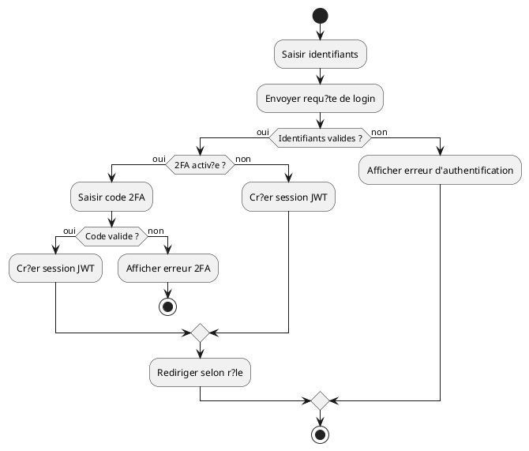

## Sprint 2 ? Structure RH, pointage et horaires

### Cas d'utilisation ? Sprint 2

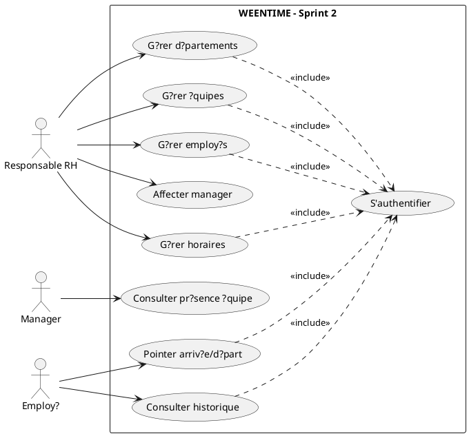

### Classes ? Sprint 2

```plantuml
@startuml sprint2_class
class Departement { +id : Long; +nom : String; +codeInterne : String }
class Equipe { +id : Long; +nom : String; +effectifMaximum : Integer; +estActive : Boolean }
class Utilisateur { +id : Long; +nom : String; +prenom : String; +poste : String }
class AttendanceSession { +id : Long; +date : LocalDate; +checkInTime : LocalDateTime; +checkOutTime : LocalDateTime; +status : AttendanceSessionStatus }
class Presence { +id : Long; +date : LocalDate; +heureEntree : LocalDateTime; +heureSortie : LocalDateTime; +totalHeuresTravaillees : BigDecimal }
class HoraireModele { +id : Long; +nom : String; +type : TypeHoraireModele; +heuresHebdo : Double; +statut : StatutHoraireModele }
class AffectationHoraire { +id : Long; +cibleType : CibleType; +cibleId : Long; +dateDebut : LocalDate; +dateFin : LocalDate }
Departement "1" o-- "0..*" Equipe
Equipe "1" o-- "0..*" Utilisateur
Utilisateur "1" -- "0..*" AttendanceSession
Utilisateur "1" -- "0..*" Presence
HoraireModele "1" -- "0..*" AffectationHoraire
@enduml
```

### S?quence ? Pointage arriv?e/d?part

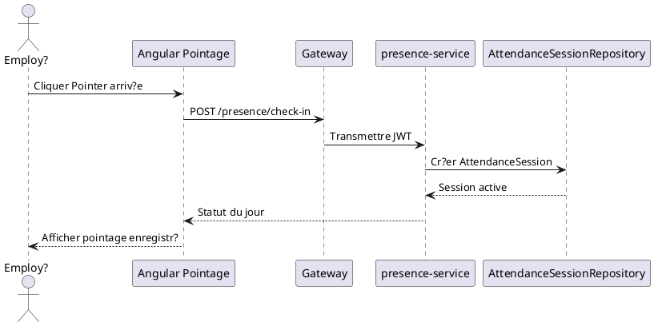

### S?quence ? Cr?ation d'horaire RH

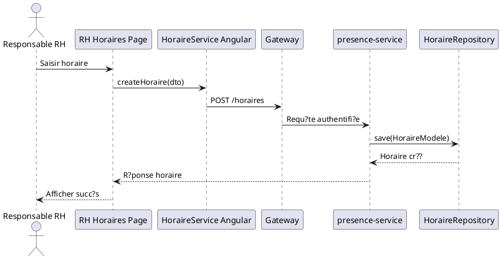

### Activit? ? Gestion du pointage

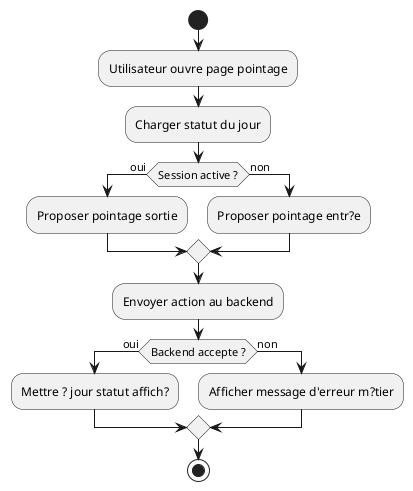

## Sprint 3 ? Demandes RH et validations

### Cas d'utilisation ? Sprint 3

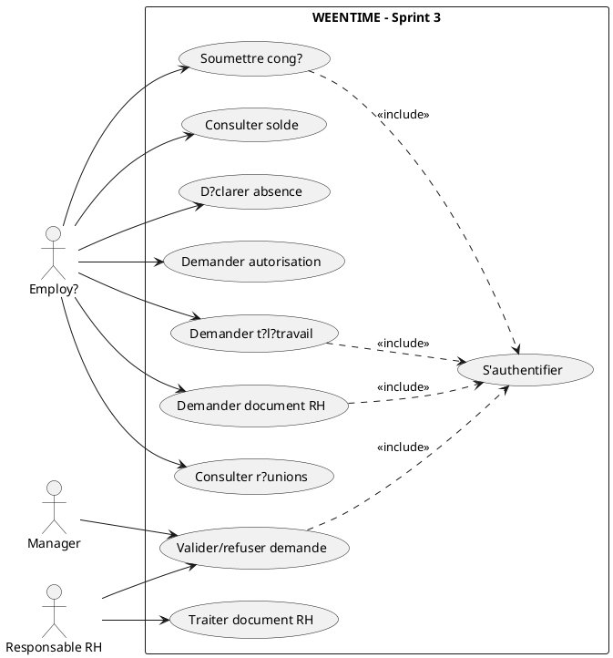

### Classes ? Sprint 3

```plantuml
@startuml sprint3_class
abstract class Demande { +id : Long; +utilisateurId : Long; +managerId : Long; +entrepriseId : Long; +statut : StatutDemandeEnum; +dateCreation : LocalDateTime; +dateDecision : LocalDateTime }
class Conge { +dateDebut : LocalDate; +dateFin : LocalDate; +nombreJours : Integer; +typeCongeId : Long }
class Autorisation { +heureDebut : LocalTime; +heureFin : LocalTime; +duree : Integer }
class Teletravail { +dateDebut : LocalDate; +dateFin : LocalDate; +nombreJours : Double; +adresse : String }
class Document { +typeDocument : TypeDocument; +documentUrl : String; +generatedByAI : boolean }
class SoldeConge { +joursAcquis : Double; +joursUtilises : Double; +joursRestants : Double; +joursEnAttente : Double }
class TypeConge { +libelle : String; +nombreJoursMax : Integer; +requireJustificatif : Boolean }
class Reunion { +titre : String; +dateReunion : LocalDate; +heureDebut : LocalTime; +heureFin : LocalTime; +statut : ReunionStatut }
Demande <|-- Conge
Demande <|-- Autorisation
Demande <|-- Teletravail
Demande <|-- Document
TypeConge "1" -- "0..*" Conge
TypeConge "1" -- "0..*" SoldeConge
@enduml
```

### S?quence ? Soumission cong?

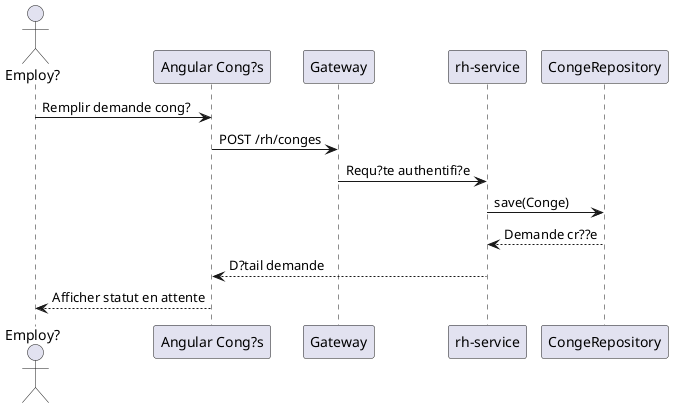

### S?quence ? Validation demande

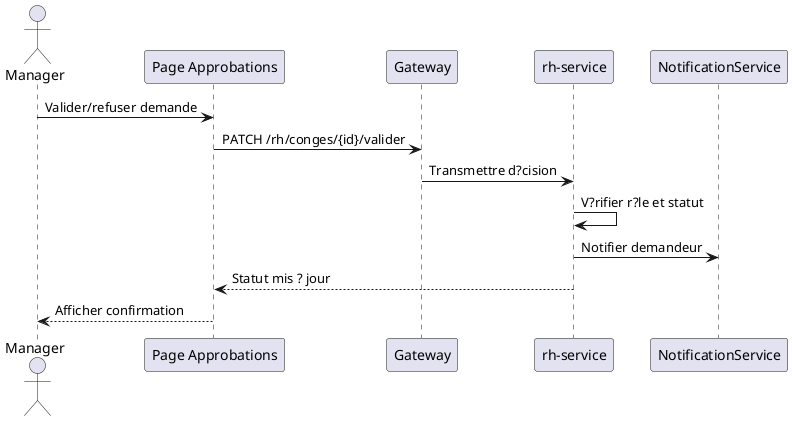

### Activit? ? Traitement d'une demande RH

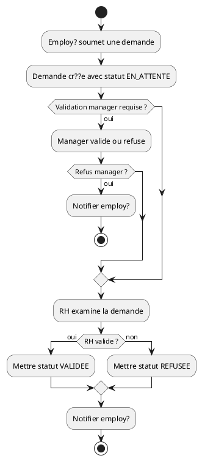

## Sprint 4 ? Dashboards, notifications et communication

### Cas d'utilisation ? Sprint 4

```plantuml
@startuml sprint4_use_case
left to right direction
actor "Employ?" as Employe
actor "Manager" as Manager
actor "Responsable RH" as RH
actor "Administrateur" as Admin
rectangle "WEENTIME - Sprint 4" {
  usecase "Consulter dashboard" as Dash
  usecase "Recevoir notifications" as Notif
  usecase "Consulter messages" as MsgRead
  usecase "Envoyer message" as MsgSend
  usecase "G?rer channels" as Channel
  usecase "Consulter statistiques" as Stats
  usecase "Consulter audit" as Audit
  usecase "S'authentifier" as Auth
}
Employe --> Dash
Employe --> Notif
Employe --> MsgRead
Employe --> MsgSend
Manager --> Stats
RH --> Stats
Admin --> Stats
Admin --> Audit
RH --> Channel
Dash ..> Auth : <<include>>
MsgRead ..> Auth : <<include>>
MsgSend ..> Auth : <<include>>
Stats ..> Auth : <<include>>
@enduml
```

### Classes ? Sprint 4

```plantuml
@startuml sprint4_class
class CommChannel { +id : UUID; +entrepriseId : Long; +type : ChannelType; +name : String; +isPrivate : boolean; +isArchived : boolean }
class CommChannelMember { +role : ChannelMemberRole; +notificationLevel : String; +lastReadAt : Instant; +isMuted : boolean }
class CommMessage { +id : UUID; +senderId : Long; +body : String; +type : MessageType; +status : MessageStatus; +createdAt : Instant }
class CommReaction { +emoji : String; +createdAt : Instant }
class CommAttachment { +fileName : String; +contentType : String; +fileSize : Long; +storagePath : String }
class CommNotificationEvent { +eventType : String; +recipientId : Long; +status : NotificationEventStatus; +createdAt : Instant }
class CommAuditLog { +entityType : String; +action : String; +actorId : Long; +createdAt : Instant }
CommChannel "1" o-- "0..*" CommChannelMember
CommChannel "1" o-- "0..*" CommMessage
CommMessage "1" o-- "0..*" CommReaction
CommMessage "1" o-- "0..*" CommAttachment
CommMessage "1" -- "0..*" CommNotificationEvent
CommAuditLog ..> CommChannel
CommAuditLog ..> CommMessage
@enduml
```

### S?quence ? Notification temps r?el

```plantuml
@startuml sprint4_seq_notification
participant "rh-service" as RhSvc
participant "organisation-service" as OrgSvc
participant "communication-service" as CommSvc
participant "Redis / WebSocket" as Realtime
participant "Angular NotificationBell" as UI
RhSvc -> OrgSvc : D?clencher notification m?tier
OrgSvc -> CommSvc : Dispatcher ?v?nement notification
CommSvc -> Realtime : Publier ?v?nement temps r?el
Realtime -> UI : Push notification
UI -> UI : Mettre ? jour compteur
@enduml
```

### S?quence ? Envoi message

```plantuml
@startuml sprint4_seq_message
actor "Employ?" as Emp
participant "MessageComposer" as UI
participant "CommunicationApiService" as Api
participant "Gateway" as Gateway
participant "communication-service" as CommSvc
participant "CommMessageRepository" as Repo
Emp -> UI : Saisir message
UI -> Api : sendMessage(channelId, body)
Api -> Gateway : POST /communication/channels/{id}/messages
Gateway -> CommSvc : Requ?te authentifi?e
CommSvc -> Repo : save(CommMessage)
Repo --> CommSvc : Message cr??
CommSvc --> UI : MessageResponse
UI --> Emp : Afficher message envoy?
@enduml
```

### Activit? ? Consultation dashboard

```plantuml
@startuml sprint4_activity_dashboard
start
:Utilisateur ouvre dashboard;
:Identifier r?le courant;
if (Administrateur ?) then (oui)
  :Charger indicateurs plateforme;
elseif (RH ?) then (oui)
  :Charger backlog et stats RH;
elseif (Manager ?) then (oui)
  :Charger ?quipe et approbations;
else (Employ?)
  :Charger r?sum? personnel;
endif
:Afficher notifications et actions rapides;
stop
@enduml
```

## Sprint 5 ? Assistant IA, vocal et observabilit?

### Cas d'utilisation ? Sprint 5

```plantuml
@startuml sprint5_use_case
left to right direction
actor "Employ?" as Employe
actor "Manager" as Manager
actor "Responsable RH" as RH
actor "Administrateur" as Admin
rectangle "WEENTIME - Sprint 5" {
  usecase "Interagir avec assistant IA" as Chat
  usecase "Ex?cuter commande vocale" as Voice
  usecase "Demander r?sum? r?le" as Digest
  usecase "Poser question politique RH" as Rag
  usecase "Confirmer action sensible" as Confirm
  usecase "Consulter diagnostic IA" as Monitor
  usecase "S'authentifier" as Auth
}
Employe --> Chat
Employe --> Voice
Employe --> Digest
Employe --> Rag
Manager --> Chat
RH --> Chat
Admin --> Monitor
Chat ..> Auth : <<include>>
Voice ..> Auth : <<include>>
Confirm ..> Auth : <<include>>
Voice ..> Chat : <<include>>
Chat ..> Confirm : <<extend>>
Chat ..> Rag : <<extend>>
@enduml
```

### Classes ? Sprint 5

```plantuml
@startuml sprint5_class
class WorkflowOrchestrator { +process() }
class RouterAgent { +route() }
class ToolRegistry { +register(); +execute() }
class RegisteredTool { +name : str; +type : str; +allowed_roles : set }
class PolicyRetriever { +search() }
class PolicyCitation { +source_id : str; +title : str; +page : int }
class SpeechToTextService { +transcribe() }
class VoiceProcessingResult { +transcript : str; +language : str; +status : str }
class TextToSpeechService { +synthesize() }
class VoiceRoleRouter { +route_voice() }
class SessionState { +pendingIntent : str; +language : str; +role : str }
WorkflowOrchestrator --> RouterAgent
WorkflowOrchestrator --> ToolRegistry
WorkflowOrchestrator --> SessionState
RouterAgent --> RegisteredTool
ToolRegistry o-- RegisteredTool
WorkflowOrchestrator --> PolicyRetriever
PolicyRetriever --> PolicyCitation
SpeechToTextService --> VoiceProcessingResult
VoiceRoleRouter --> WorkflowOrchestrator
TextToSpeechService --> VoiceRoleRouter
@enduml
```

### S?quence ? Chatbot avec ToolRegistry

```plantuml
@startuml sprint5_seq_chat_tool
actor "Responsable RH" as RH
participant "Angular ChatWidget" as UI
participant "FastAPI /v2/chat" as ChatAPI
participant "WorkflowOrchestrator" as Orchestrator
participant "RouterAgent" as Router
participant "ToolRegistry" as Tools
participant "Backend Spring" as Backend
participant "ResponseGuard" as Guard
RH -> UI : Demander action RH
UI -> ChatAPI : POST /v2/chat + contexte page/r?le
ChatAPI -> Orchestrator : process(message, context)
Orchestrator -> Router : d?terminer intention
Router --> Orchestrator : intent + agent
Orchestrator -> Tools : pr?parer outil autoris?
Tools -> Backend : appel API m?tier si lecture ou ex?cution confirm?e
Backend --> Tools : r?sultat autoritaire
Tools --> Orchestrator : ToolResult
Orchestrator -> Guard : valider r?ponse
Guard --> ChatAPI : r?ponse s?re
ChatAPI --> UI : message / confirmation
@enduml
```

### S?quence ? Pipeline vocal STT/TTS

```plantuml
@startuml sprint5_seq_voice
actor "Employ?" as Emp
participant "Angular Voice UI" as UI
participant "FastAPI /v2/voice" as VoiceAPI
participant "SpeechToTextService" as STT
participant "WorkflowOrchestrator" as Orchestrator
participant "TextToSpeechService" as TTS
Emp -> UI : Enregistrer commande vocale
UI -> VoiceAPI : Envoyer audio finalis?
VoiceAPI -> STT : transcrire audio
STT --> VoiceAPI : transcript + langue
VoiceAPI -> Orchestrator : traiter transcript
Orchestrator --> VoiceAPI : r?ponse textuelle s?re
VoiceAPI -> TTS : synth?se si disponible
TTS --> VoiceAPI : audio ou indisponible
VoiceAPI --> UI : texte + m?tadonn?es audio
@enduml
```

### Activit? ? Traitement IA s?curis?

```plantuml
@startuml sprint5_activity_ai
start
:Recevoir message ou transcript vocal;
:Construire contexte v?rifi?;
:D?tecter langue et normaliser;
:Router intention selon r?le et page;
if (Question politique ?) then (oui)
  :Chercher sources RAG approuv?es;
  if (Citation disponible ?) then (oui)
    :Composer r?ponse cit?e;
  else (non)
    :Retourner indisponible;
  endif
else (non)
  :S?lectionner outil ToolRegistry;
  if (Action ?criture ?) then (oui)
    :Cr?er confirmation;
  else (lecture)
    :Appeler backend;
  endif
endif
:Option reformulation LLM non autoritaire;
:Valider avec ResponseGuard;
:Retourner r?ponse finale;
stop
@enduml
```
