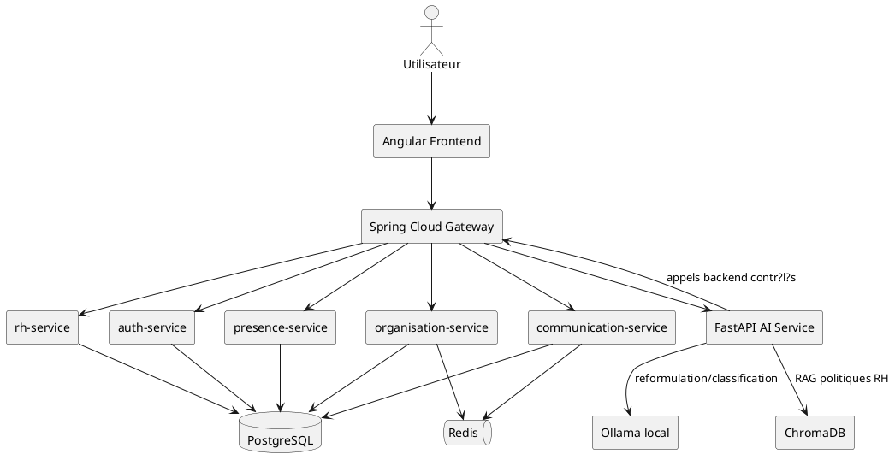

# 8. Environnement de d?veloppement

## 8.1 Environnement mat?riel

Les caract?ristiques exactes du poste de d?veloppement ne sont pas toutes stock?es dans le d?p?t. Le tableau ci-dessous peut ?tre compl?t? lors de la mise en page finale du rapport.

| ?l?ment | Caract?ristique |
|---|---|
| PC | Ordinateur portable de d?veloppement |
| Processeur | ? compl?ter selon la machine utilis?e |
| M?moire RAM | ? compl?ter selon la machine utilis?e |
| Syst?me d'exploitation | Windows |
| GPU | Optionnel ; le service AI est pr?vu pour fonctionner en mode CPU local |
| Stockage | ? compl?ter selon la machine utilis?e |

## 8.2 Environnement logiciel

| Outil | Usage dans le projet |
|---|---|
| Visual Studio Code | ?dition frontend, Python/FastAPI, scripts et documentation |
| IntelliJ IDEA / Spring Tool Suite | D?veloppement et ex?cution des microservices Spring Boot |
| Postman | Test manuel des APIs REST |
| Git | Gestion de versions locale |
| GitHub | H?bergement et collaboration autour du d?p?t |
| Docker / Docker Compose | Lancement local de composants tels que PostgreSQL, Redis et certains services |
| PostgreSQL | Syst?me de gestion de base de donn?es principal |
| pgAdmin | Administration visuelle PostgreSQL si utilis? localement |
| Node.js / npm | Ex?cution de l'application Angular et gestion des d?pendances frontend |
| Angular CLI | Build, test et d?veloppement de l'application Angular |
| Java 17 | Langage et runtime des microservices Spring Boot |
| Maven | Gestion des d?pendances et build backend |
| Python 3.11 | Runtime du service AI FastAPI |
| FastAPI / Uvicorn | Exposition des endpoints chatbot, vocal et health AI |
| Redis | Cache, temps r?el et m?canismes d'?v?nements selon modules |
| PlantUML / draw.io | Mod?lisation UML et figures du rapport |
| LaTeX / Overleaf | R?daction et mise en forme finale du rapport PFE |
| Jira Software | Pilotage agile et suivi Scrum, si utilis? dans l'organisation du projet |
| Braintrust | Observabilit? et ?valuation des interactions IA |

## 8.3 Technologies utilis?es

| Couche | Technologies d?tect?es |
|---|---|
| Frontend | Angular 21, TypeScript 5.9, RxJS, Angular Router, Angular Material/CDK, TailwindCSS, STOMP/SockJS |
| Backend | Java 17, Spring Boot, Spring Security, Spring Data JPA, Spring Cloud Gateway, Eureka, Config Server, OpenFeign, Resilience4j |
| Base de donn?es | PostgreSQL, Flyway, H2 pour tests |
| Communication temps r?el | WebSocket, STOMP, Redis event publisher/subscriber |
| AI Service | Python, FastAPI, Pydantic, httpx, ToolRegistry, ResponseGuard |
| STT/TTS | faster-whisper, ctranslate2, webrtcvad, pydub, imageio-ffmpeg, Coqui TTS |
| RAG | ChromaDB, retriever local par mots-cl?s, citations de sources approuv?es |
| LLM local | Ollama, qwen2.5:3b, fallback phi3 selon configuration |
| Observabilit? | Braintrust, m?triques internes, health deep |
| Tests | Pytest c?t? AI, tests Spring Boot, Angular build/test tooling |
| DevOps | Docker Compose, Maven, npm scripts, GitHub |

## 8.4 Architecture technique synth?tique

