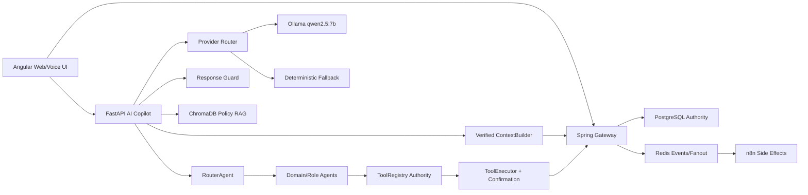

# WeenTime AI Hybrid Architecture Plan

## Executive Summary

WeenTime is an AI-powered collaborative HR SaaS with Angular frontend, Spring Boot microservices, FastAPI AI service, PostgreSQL, and realtime communication. The repository already contains a modern AI v2 foundation next to the legacy deterministic assistant: JWT-derived context, RouterAgent, domain agents, role copilots, ToolRegistry, ToolExecutor, confirmation flow, policy retrieval, insight tools, Braintrust tracing, STT, and TTS.

The current AI service is not yet an LLM-native copilot. It is mainly deterministic routing plus backend tools. That is a good safety baseline for HR. The next evolution should be hybrid and local-first: add a provider router and local Ollama provider for explain/summarize/clarify/draft only, while keeping all HR actions behind ToolRegistry, backend authorization, tenant checks, and confirmation.

Recommended strategy: architecture safety first. Do not introduce LangGraph, n8n business mutations, or autonomous LLM tool execution yet. Stabilize context/security/config drift, add a Response Guard, then add Ollama as an optional provider with deterministic fallback.

## Current Architecture

### Frontend

- Angular application under `weentime-frontend/angular-weentime`.
- Central API builder exists in `src/app/core/services/api-config.service.ts`.
- AI chat and voice integrations exist in:
  - `src/app/core/services/ai-copilot.service.ts`
  - `src/app/shared/chat-widget/*`
- Communication module uses gateway REST and websocket paths.
- Environment files still contain localhost defaults and older gateway references. This is acceptable for local dev but must be normalized before production.

### Backend

- Spring Boot microservices under `weentime-backend/services/*`.
- Gateway config inspected at `weentime-backend/services/gateway/src/main/resources/application.yml`.
- Gateway in this repository is configured on port `8322` with service ports `8190`, `8192`, `8193`, `8194`.
- Backend service boundaries:
  - `auth-service`: authentication and JWT issuance.
  - `organisation-service`: users, roles, enterprises, departments, teams, RH ownership.
  - `rh-service`: leave, documents, telework, authorizations, RH workflows.
  - `presence-service`: check-in/check-out, personal/team/company/global presence.
  - `communication-service`: channels, messages, websocket realtime, partial Redis readiness.
- PostgreSQL remains authority for business data.
- Redis exists partially in communication-service as conditional realtime pub/sub, not as system-wide event bus yet.

### AI Service

- FastAPI service under `ai-service`.
- Legacy system remains:
  - `main.py`
  - `agents/*`
  - `tools/hr_tools.py`
  - legacy workflow/decision logic.
- Modern v2 system exists:
  - `app/core/copilot_engine.py`
  - `app/context/*`
  - `app/agents/*`
  - `app/tools/*`
  - `app/memory/*`
  - `app/policy/*`
  - `app/insights/*`
  - `app/observability/*`
- Modern endpoints include `/v2/chat`, `/v2/chat/confirm`, `/v2/voice`, and `/health/deep`.
- STT uses `faster-whisper`, default `STT_MODEL=base`.
- TTS uses Coqui `TTS`, default `tts_models/fr/css10/vits`.
- Braintrust SDK is present and optional.
- AI service requirements currently do not include Ollama client libraries, ChromaDB, LangGraph, or Redis.

## Current AI Runtime Facts

- Chat/copilot behavior is deterministic/tool-oriented, not model-driven.
- RouterAgent selects agents using deterministic multilingual rules and confidence scores.
- ToolRegistry owns tool access validation by role and permissions.
- ToolExecutor enforces confirmation for write tools.
- BackendClient forwards JWT to the Spring gateway and normalizes `/api/v1` paths.
- ContextBuilder parses JWT and optionally checks backend `/users/me`.
- Local policy retrieval is tenant-scoped and source-approved, but keyword/local-file based, not vector RAG.
- CommunicationAgent exists but is a placeholder and not ready for real communication tasks.
- Manager/RH flows still depend partly on legacy HR tools for approvals and request workflows.

## Important Configuration Drift

The inspected gateway uses:

- Gateway: `http://localhost:8322`
- Organisation: `http://localhost:8190`
- RH: `http://localhost:8192`
- Presence: `http://localhost:8193`
- Communication: `http://localhost:8194`

The AI `BackendClient` default still points to:

- `http://localhost:8222/api/v1`

This must be treated as a P0/P1 drift risk. The safest fix is not to hardcode a new value in code, but to standardize `BACKEND_BASE_URL` and frontend environments per deployment profile.

## Target Architecture



### Target Principles

- Backend remains business authority.
- One user equals one role only.
- AI never trusts frontend `user_id`, role, tenant, or permissions.
- LLM never directly executes business actions.
- LLM can explain, summarize, clarify, reformulate, and draft suggestions.
- All actions go through ToolRegistry, ToolExecutor, backend authorization, tenant checks, and confirmation.
- RAG is only for approved policy/FAQ/doc citations, not live HR state.
- Redis supports realtime/events/cache, not authority data.
- n8n handles non-critical side effects only.
- LangGraph is introduced later after safety boundaries are stable.

## Recommended Order

### Phase 0 - Repository Audit

- Freeze current architecture facts and config drift.
- Capture dirty worktree and local profiles.
- Run baseline import/tests/builds where feasible.

### Phase 1 - Gateway and Security Stabilization

- Standardize gateway base URL across AI and frontend config.
- Verify JWT secrets/claims and role mapping across services.
- Harden CORS and websocket paths.
- Confirm one-role-only invariant in organisation-service and admin tools.

### Phase 2 - AI Safety Foundation

- Harden ContextBuilder and backend profile validation.
- Audit ToolRegistry definitions for roles, confirmation, and permissions.
- Persist confirmation state and add idempotency strategy.
- Add Response Guard skeleton before any LLM provider.

### Phase 3 - Provider Router and Ollama Local

- Add provider abstraction and disabled-provider mode.
- Add Ollama local provider with `qwen2.5:7b` first.
- Add CPU-first timeout and fallback to `qwen2.5:3b`.
- Restrict LLM output to non-authoritative response drafting.

### Phase 4 - Response Guard and Deterministic Fallback

- Guard against fake HR values, fake statuses, fake balances, unsupported tool calls, missing citations, and secrets leakage.
- On provider failure, timeout, or guard rejection, return deterministic agent response.

### Phase 5 - Agent Modernization

- Modernize ManagerAgent and RHAgent approvals first.
- Implement CommunicationAgent tools.
- Keep LegacyAgent as fallback until test coverage proves replacement.

### Phase 6 - Redis Event Bus

- Expand communication-service Redis pattern into a shared event envelope.
- Add notification/presence fanout gradually.
- Keep PostgreSQL as source of truth.

### Phase 7 - Communication and Notification Integration

- Use backend events to notify users and channels.
- Keep frontend websocket lifecycle quiet and bounded.

### Phase 8 - n8n Automation

- Add backend-owned webhooks for non-critical side effects.
- Do not let n8n mutate HR authority data directly.

### Phase 9 - Local RAG with ChromaDB

- Add ChromaDB for tenant-scoped approved HR policy and FAQ.
- Require citations for policy answers.

### Phase 10 - LangGraph Readiness Later

- Add graph adapter only after provider router, guard, ToolRegistry, and tests are stable.
- ToolRegistry remains authority even inside LangGraph.

### Phase 11 - Regression and Production Readiness

- Full test suite, frontend build, backend compile, browser validation, voice flows, websocket flows, observability checks.

## What To Do Now

1. Fix configuration drift around gateway base URL and service ports.
2. Harden JWT verification and canonical user context.
3. Audit every ToolDefinition for role, confirmation, idempotency, and permission safety.
4. Add Response Guard before adding Ollama.
5. Modernize Manager/RH approval agents and CommunicationAgent.

## What To Avoid Now

- Do not add LangGraph as the runtime orchestrator yet.
- Do not let n8n approve/refuse/mutate HR authority data.
- Do not use RAG for live leave balance, pointage status, request status, approvals, or current user data.
- Do not let an LLM call backend endpoints directly.
- Do not add cloud provider fallback by default.
- Do not rewrite the whole AI service in one step.

## Risks

| Risk | Impact | Mitigation |
| --- | --- | --- |
| Gateway port drift `8322` vs AI default `8222` | AI tools call wrong backend | Standardize `BACKEND_BASE_URL` per profile and add health assertions |
| JWT parsed but not cryptographically verified in AI | Spoofed claims if AI exposed directly | Add signature verification or backend token introspection |
| Legacy tools still used for Manager/RH flows | Inconsistent permissions/errors | Modernize approvals with verified endpoints |
| LLM hallucination if added too early | Fake HR answers/actions | Add Response Guard before provider |
| n8n misuse | Business authority bypass | Only backend-authenticated event/webhook side effects |
| Redis misuse | Data inconsistency | Redis as fanout/cache only, never authority |
| ChromaDB policy drift | Wrong policy answers | Approved sources, tenant scoping, citations, sync jobs |

## Validation Commands

### AI service

```powershell
cd C:\Users\DELL\Documents\GitHub\weentime_project\ai-service
python -c "import main; print('ok')"
python -m pytest tests -v
```

### Frontend

```powershell
cd C:\Users\DELL\Documents\GitHub\weentime_project\weentime-frontend\angular-weentime
npm run build
npx tsc --noEmit -p tsconfig.app.json
```

### Gateway

```powershell
cd C:\Users\DELL\Documents\GitHub\weentime_project\weentime-backend\services\gateway
.\mvnw.cmd clean compile -DskipTests
```

### Service-specific backend examples

```powershell
cd C:\Users\DELL\Documents\GitHub\weentime_project\weentime-backend\services\organisation-service
.\mvnw.cmd clean compile -DskipTests

cd C:\Users\DELL\Documents\GitHub\weentime_project\weentime-backend\services\rh-service
.\mvnw.cmd clean compile -DskipTests

cd C:\Users\DELL\Documents\GitHub\weentime_project\weentime-backend\services\presence-service
.\mvnw.cmd clean compile -DskipTests

cd C:\Users\DELL\Documents\GitHub\weentime_project\weentime-backend\services\communication-service
.\mvnw.cmd clean compile -DskipTests
```

## Final Decision

### 1. What should be implemented first?

Implement gateway/config/JWT context stabilization and Response Guard foundation before adding any LLM provider. This prevents the future LLM from amplifying existing integration drift.

### 2. What must wait?

LangGraph, autonomous workflows, n8n business mutations, cloud provider fallback, production Redis scaling, and ChromaDB ingestion automation must wait until ToolRegistry, ContextBuilder, response guard, and tests are stable.

### 3. What is dangerous right now?

The dangerous paths are direct LLM tool execution, using RAG for live HR data, trusting frontend identity fields, bypassing backend roles, and allowing n8n to mutate authority data.

### 4. Which agents should be modernized first?

Modernize RouterAgent precision, ManagerAgent approvals, RHAgent approvals/document processing, CommunicationAgent, and PolicyAgent. Attendance/Leave/Document/Telework/Authorization are further along and should be hardened, not rewritten.

### 5. Where Redis fits?

Redis fits as realtime fanout, notification/presence event bus, optional short-lived cache, and n8n bridge queue. It must not become the authority database.

### 6. Where n8n fits?

n8n fits for onboarding automation, reminders, daily standup notifications, weekly RH digest, and non-critical side effects triggered by backend events. It must not approve leave, mutate HR authority data directly, issue JWTs, or replace backend business logic.

### 7. When should LangGraph be introduced?

Introduce LangGraph only after provider router, response guard, ToolRegistry contracts, persistent confirmation, and regression tests are stable. LangGraph should orchestrate plans; ToolRegistry remains the authority.

### 8. Which model should be used first on CPU?

Use `qwen2.5:7b` first through local Ollama. If latency is too high, fallback to `qwen2.5:3b`. Consider `qwen3:8b` only after hardware testing proves acceptable latency.

### 9. What is the safest PFE demo path?

Use deterministic tools for real HR actions, add Ollama only for explanation/summarization/clarification, keep voice STT/TTS, show policy answers with citations, and demonstrate Redis only through communication/realtime if stable.

### 10. What is the SaaS production evolution path?

Move from local-first to hybrid-ready: verified JWT context, hardened ToolRegistry, response guard, persistent memory/confirmation, tenant-scoped ChromaDB RAG, Redis event bus, observability/evals, then optional cloud provider fallback disabled by default.
