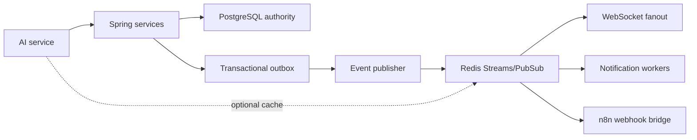
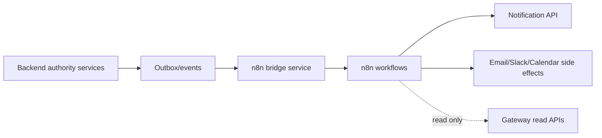

# Redis and n8n Plan

## Executive Summary

Redis and n8n should be introduced as infrastructure around the existing Spring/FastAPI architecture, not as replacements for backend business logic. PostgreSQL remains the authority database. Spring services remain the business authority. AI remains a client of backend tools through JWT-forwarding ToolRegistry.

Redis should support realtime fanout, notifications, presence updates, short-lived cache, and optional queue bridge events. n8n should handle non-critical automations such as reminders, onboarding side effects, and digest notifications.

## Current Repository State

- `communication-service` already contains conditional Redis realtime classes:
  - `RedisRealtimeConfig`
  - `RedisRealtimeEventPublisher`
  - `RedisRealtimeSubscriber`
- Redis is not yet a shared platform event bus.
- AI service has no Redis dependency in `requirements.txt`.
- n8n is not currently integrated.
- No ChromaDB/LangGraph/Ollama runtime exists in requirements.

## Redis Principles

Redis is allowed for:

- WebSocket fanout.
- Notification delivery hints.
- Presence/realtime ephemeral state.
- Short-lived cache for non-authority summaries.
- Queue bridge for n8n side effects.
- Pub/sub between instances.

Redis is not allowed for:

- Leave balance authority.
- Attendance authority.
- Request approval authority.
- User/role authority.
- Tenant or permission authority.
- Permanent audit log authority.

## Redis Architecture



### Recommended Redis Components

- Redis Pub/Sub for low-latency websocket fanout where message loss is acceptable.
- Redis Streams for durable-ish event delivery to notification/n8n bridges.
- Redis cache for short TTL read summaries only.
- Optional distributed locks only for idempotency around non-authority side effects.

### Event Envelope

Every Redis event should use a stable envelope:

```json
{
  "eventId": "uuid",
  "eventType": "leave.request.created",
  "version": 1,
  "tenantId": 42,
  "actorUserId": 1001,
  "targetUserIds": [1002],
  "aggregateType": "LEAVE_REQUEST",
  "aggregateId": "123",
  "occurredAt": "2026-05-13T12:00:00Z",
  "sourceService": "rh-service",
  "traceId": "request-id",
  "payload": {}
}
```

### Event Types

Initial event types:

- `presence.checked_in`
- `presence.checked_out`
- `leave.request.created`
- `leave.request.manager_approved`
- `leave.request.rh_approved`
- `leave.request.rejected`
- `document.request.created`
- `document.ready`
- `telework.request.created`
- `authorization.request.created`
- `communication.message.created`
- `notification.created`
- `user.created`
- `user.role_changed`

## Redis Rollout Tasks

### REDIS-01 - Standardize communication-service Redis config

**Goal:** Make existing Redis realtime config production-safe and profile-driven.

**Impacted files:**

- `weentime-backend/services/communication-service/src/main/java/com/weentime/communication/config/RedisRealtimeConfig.java`
- communication service config files.

**Steps:**

1. Verify `communication.redis.enabled` default is false for local if Redis absent.
2. Add health check when Redis enabled.
3. Add bounded logging on Redis publish failure.
4. Keep fallback local websocket publish.

**Tests:**

```powershell
cd C:\Users\DELL\Documents\GitHub\weentime_project\weentime-backend\services\communication-service
.\mvnw.cmd clean compile -DskipTests
```

**Risk:** Startup failure if Redis unavailable.

**Rollback:** Set `communication.redis.enabled=false`.

**Commit message:** `chore(communication): harden redis realtime config`

### REDIS-02 - Define shared event envelope

**Goal:** Create shared event envelope in backend services without changing behavior.

**Impacted files:**

- backend common package if available, otherwise service-local event DTOs.
- communication/rh/presence notification publishers.

**Steps:**

1. Add versioned envelope DTO.
2. Include tenantId, actorUserId, aggregate, traceId.
3. Add tests for serialization.

**Tests:**

```powershell
cd C:\Users\DELL\Documents\GitHub\weentime_project\weentime-backend\services\rh-service
.\mvnw.cmd clean compile -DskipTests
```

**Risk:** Divergent DTO copies between services.

**Rollback:** Keep service-local DTO until shared library exists.

**Commit message:** `feat(events): add shared event envelope`

### REDIS-03 - Add RH/presence event publishing

**Goal:** Publish non-authority events after successful DB commits.

**Impacted files:**

- `rh-service` request lifecycle services.
- `presence-service` pointage services.

**Steps:**

1. Use transactional outbox or after-commit publisher.
2. Publish only after successful mutation.
3. Include tenant and actor.
4. Do not consume events for authority decisions yet.

**Tests:**

```powershell
cd C:\Users\DELL\Documents\GitHub\weentime_project\weentime-backend\services\rh-service
.\mvnw.cmd clean compile -DskipTests

cd C:\Users\DELL\Documents\GitHub\weentime_project\weentime-backend\services\presence-service
.\mvnw.cmd clean compile -DskipTests
```

**Risk:** Events emitted before transaction commit.

**Rollback:** Disable event publishing profile flag.

**Commit message:** `feat(events): publish hr and presence events`

## n8n Principles

n8n is allowed for:

- Onboarding checklists.
- Reminder notifications.
- Daily standup notifications.
- Weekly RH digest generation.
- Non-critical side effects triggered by backend events.
- Calling backend read APIs using service credentials only where explicitly allowed.

n8n is not allowed to:

- Approve, reject, or mutate HR authority data directly.
- Issue JWTs.
- Bypass gateway/backend security.
- Replace Spring business logic.
- Write directly to PostgreSQL.
- Create fake AI answers or fake HR values.
- Call AI tools as an authority actor.

## n8n Architecture



## n8n Webhook Model

Use a backend-owned bridge rather than exposing n8n directly to every service:

- Backend publishes event to Redis Stream/outbox.
- Bridge validates event type and tenant scope.
- Bridge signs webhook payload to n8n.
- n8n performs side effect.
- n8n posts result to a non-authority audit endpoint if needed.

### Webhook Payload

```json
{
  "eventId": "uuid",
  "eventType": "leave.request.created",
  "tenantId": 42,
  "actorUserId": 1001,
  "aggregateType": "LEAVE_REQUEST",
  "aggregateId": "123",
  "occurredAt": "2026-05-13T12:00:00Z",
  "traceId": "request-id",
  "safePayload": {
    "notificationTitle": "New leave request",
    "recipientRole": "MANAGER"
  }
}
```

Do not include JWTs, passwords, raw documents, or sensitive medical details in n8n payloads.

## n8n Rollout Tasks

### N8N-01 - Webhook bridge design

**Goal:** Define a small bridge service/module contract before adding workflows.

**Impacted files:**

- Planning docs or backend notification service.

**Steps:**

1. Define signed webhook payload.
2. Define allowed event types.
3. Define retry/dead-letter behavior.
4. Define secret management.

**Tests:**

- Unit tests for signature generation/verification when implemented.

**Risk:** Overexposing internal events.

**Rollback:** Keep n8n disabled.

**Commit message:** `docs(n8n): define automation webhook bridge`

### N8N-02 - Reminder workflow MVP

**Goal:** Trigger reminder notifications without authority mutations.

**Impacted files:**

- n8n workflow export.
- backend notification endpoint if needed.

**Steps:**

1. Listen to `leave.request.created` or scheduled pending approvals.
2. Send reminder to manager/RH through notification API.
3. Do not approve/reject.

**Tests:**

- Manual webhook replay in local dev.
- Backend notification compile if endpoint changed.

**Risk:** Notification spam.

**Rollback:** Disable workflow.

**Commit message:** `feat(n8n): add pending approval reminder workflow`

### N8N-03 - Weekly RH digest

**Goal:** Generate digest notification from backend read APIs.

**Impacted files:**

- n8n workflow export.
- optional backend read summary endpoint.

**Steps:**

1. Schedule weekly workflow.
2. Call backend read-only stats endpoint through gateway.
3. Send digest notification/email.
4. Log workflow result.

**Tests:**

- Manual n8n execution with test tenant.

**Risk:** Cross-tenant digest if service credentials are not scoped.

**Rollback:** Disable workflow.

**Commit message:** `feat(n8n): add weekly rh digest workflow`

## Safe Rollout Order

1. Stabilize communication-service Redis profile.
2. Add shared event envelope.
3. Add event publishing after DB commit.
4. Add notification fanout consumers.
5. Add n8n bridge in disabled mode.
6. Add one reminder workflow.
7. Add weekly digest workflow.
8. Add monitoring and dead-letter handling.

## Validation Commands

```powershell
cd C:\Users\DELL\Documents\GitHub\weentime_project\weentime-backend\services\communication-service
.\mvnw.cmd clean compile -DskipTests

cd C:\Users\DELL\Documents\GitHub\weentime_project\weentime-backend\services\rh-service
.\mvnw.cmd clean compile -DskipTests

cd C:\Users\DELL\Documents\GitHub\weentime_project\weentime-backend\services\presence-service
.\mvnw.cmd clean compile -DskipTests

cd C:\Users\DELL\Documents\GitHub\weentime_project\weentime-backend\services\organisation-service
.\mvnw.cmd clean compile -DskipTests
```
